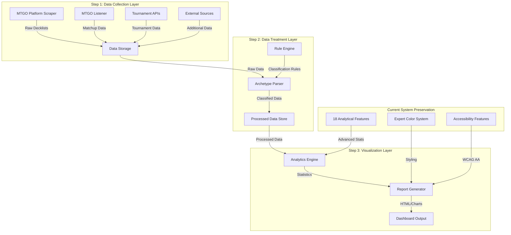

# Design Document

## Overview

This design document outlines the systematic reproduction and consolidation of the original multi-repository MTG analytics workflow into a unified, autonomous pipeline. The system will maintain the current high-quality Manalytics report format while ensuring complete fidelity to the original workflow's data collection and processing capabilities.

The design follows a step-by-step approach: reproduce each component of the original workflow, validate outputs against originals, then consolidate into a maintainable system that preserves all existing analytical features.

## Architecture

### High-Level Architecture



### Component Mapping: Original → Current Implementation

| Original Component | Current Implementation | Status | Documentation Required |
|-------------------|----------------------|---------|----------------------|
| fbettega/mtg_decklist_scrapper | FbettegaIntegrator + MTGOClient | ✅ Partial | Process comparison needed |
| MTG_decklistcache | Local data storage | ✅ Implemented | Data structure mapping |
| MTGO-listener + MTGOSDK | Not implemented | ❌ Missing | Full workflow documentation |
| MTGOArchetypeParser | ArchetypeEngine + MTGOClassifier | ✅ Partial | Rule comparison needed |
| MTGOFormatData | Internal rule definitions | ⚠️ Incomplete | Rule migration required |
| R-Meta-Analysis | AdvancedMetagameAnalyzer | ✅ Enhanced | Algorithm comparison |

## Components and Interfaces

### 1. Data Collection Components

#### 1.1 MTGO Platform Scraper (fbettega reproduction)
```python
class MTGOPlatformScraper:
    """Reproduces fbettega/mtg_decklist_scrapper functionality"""

    def discover_tournaments(self, format_name: str, date_range: tuple) -> List[TournamentURL]:
        """Discover tournament URLs from MTGO listing pages"""

    def scrape_tournament_data(self, tournament_url: str) -> TournamentData:
        """Extract tournament data and decklists"""

    def validate_against_original(self, our_data: TournamentData, original_data: TournamentData) -> ValidationReport:
        """Compare outputs with original fbettega scraper"""
```

#### 1.2 MTGO Listener (NEW - Missing Component)
```python
class MTGOListener:
    """Reproduces Jiliac/MTGO-listener functionality using MTGOSDK patterns"""

    def listen_for_matchups(self) -> AsyncIterator[MatchupData]:
        """Listen for real-time matchup data from MTGO client"""

    def process_matchup_data(self, matchup: MatchupData) -> ProcessedMatchup:
        """Process and validate matchup information"""

    def integrate_with_tournament_data(self, matchups: List[ProcessedMatchup], tournaments: List[TournamentData]) -> CombinedData:
        """Merge matchup data with tournament data as in original workflow"""
```

#### 1.3 Data Storage Layer
```python
class DataStorage:
    """Reproduces MTG_decklistcache and MTGODecklistCache functionality"""

    def store_raw_data(self, data: TournamentData, source: str) -> StorageResult:
        """Store raw data with original structure compatibility"""

    def combine_data_sources(self, sources: List[str]) -> CombinedDataset:
        """Merge data exactly as done in Jiliac/MTGODecklistCache"""

    def validate_data_structure(self, stored_data: Any) -> ValidationReport:
        """Ensure data structure matches original cache format"""
```

### 2. Data Treatment Components

#### 2.1 Archetype Parser (Enhanced)
```python
class ArchetypeParser:
    """Enhanced version preserving MTGOArchetypeParser logic"""

    def parse_decklist(self, decklist: Decklist, format_rules: FormatRules) -> ArchetypeClassification:
        """Parse using exact MTGOArchetypeParser logic"""

    def apply_format_rules(self, decklist: Decklist, format_name: str) -> RuleApplication:
        """Apply MTGOFormatData rules with local implementation"""

    def handle_unknown_conditions(self, condition: str) -> ConditionResult:
        """Handle unknown conditions with same fallback as original"""

    def validate_classification(self, our_result: ArchetypeClassification, original_result: ArchetypeClassification) -> ValidationReport:
        """Compare classification results with original parser"""
```

#### 2.2 Rule Engine (NEW - Consolidated)
```python
class RuleEngine:
    """Internal implementation of MTGOFormatData rules"""

    def load_format_rules(self, format_name: str) -> FormatRules:
        """Load rules from internal definitions (migrated from MTGOFormatData)"""

    def update_rules(self, format_name: str, new_rules: Dict) -> UpdateResult:
        """Update rules while maintaining backward compatibility"""

    def validate_rules_compatibility(self, format_name: str) -> ValidationReport:
        """Ensure rules produce same results as original MTGOFormatData"""
```

### 3. Visualization Components (Enhanced Preservation)

#### 3.1 Analytics Engine (Preserve Current Excellence)
```python
class AdvancedAnalyticsEngine:
    """Preserve current 18 analytical features while adding R-Meta-Analysis compatibility"""

    def calculate_advanced_metrics(self, data: ProcessedData) -> AdvancedMetrics:
        """Maintain current advanced analytics (Shannon, Simpson, etc.)"""

    def generate_r_meta_analysis(self, data: ProcessedData) -> RMetaAnalysis:
        """Generate R-Meta-Analysis compatible outputs"""

    def preserve_current_features(self) -> List[str]:
        """Ensure all 18 current analytical features are maintained"""
```

#### 3.2 Report Generator (Preserve Current Quality)
```python
class ReportGenerator:
    """Preserve current high-quality dashboard format"""

    def generate_dashboard(self, analytics: AdvancedMetrics) -> DashboardHTML:
        """Generate dashboard maintaining current professional format"""

    def apply_expert_color_system(self, visualizations: List[Chart]) -> StyledCharts:
        """Apply current expert color system (MTGGoldfish/17lands standard)"""

    def ensure_accessibility(self, dashboard: DashboardHTML) -> AccessibleDashboard:
        """Maintain WCAG AA compliance and daltonism support"""

    def generate_archetype_pages(self, archetypes: List[Archetype]) -> List[ArchetypePage]:
        """Generate individual archetype analysis pages"""
```

## Data Models

### Core Data Models

#### Tournament Data Model
```python
@dataclass
class TournamentData:
    """Unified tournament data structure compatible with original workflow"""
    id: str
    name: str
    date: datetime
    format: str
    source: str  # fbettega, mtgo, melee, etc.
    decklists: List[Decklist]
    metadata: Dict[str, Any]

    # Original workflow compatibility
    fbettega_source: Optional[str] = None
    mtgo_listener_data: Optional[MatchupData] = None
    original_structure: Optional[Dict] = None  # For validation
```

#### Decklist Model
```python
@dataclass
class Decklist:
    """Decklist structure compatible with original parsers"""
    player: str
    archetype: Optional[str] = None
    archetype_confidence: Optional[float] = None
    cards: List[Card]
    colors: List[str]
    placement: Optional[int] = None

    # Original workflow compatibility
    mtgo_archetype_parser_result: Optional[Dict] = None
    mtgo_format_data_rules_applied: Optional[List[str]] = None
```

#### Analytics Data Model
```python
@dataclass
class AnalyticsResult:
    """Analytics results preserving current features while adding original compatibility"""

    # Current Manalytics features (preserve all 18)
    advanced_metrics: AdvancedMetrics
    expert_color_mapping: Dict[str, str]
    accessibility_features: AccessibilityData

    # Original workflow compatibility
    r_meta_analysis_compatible: RMetaAnalysisData
    shannon_diversity: float
    simpson_index: float
    matchup_matrix: MatchupMatrix

    # Dashboard generation data
    dashboard_data: DashboardData
    archetype_pages_data: List[ArchetypePageData]
```

## Error Handling

### Validation and Error Recovery

#### 1. Data Collection Error Handling
```python
class DataCollectionErrorHandler:
    """Handle errors in data collection with graceful degradation"""

    def handle_api_403_error(self, source: str, error: APIError) -> RecoveryAction:
        """Handle 403 errors with retry mechanisms and alternative sources"""

    def handle_empty_dataset(self, source: str) -> FallbackAction:
        """Handle empty datasets gracefully without pipeline crashes"""

    def validate_data_completeness(self, data: TournamentData) -> ValidationResult:
        """Validate data completeness before processing"""
```

#### 2. Processing Error Handling
```python
class ProcessingErrorHandler:
    """Handle processing errors while maintaining data integrity"""

    def handle_unknown_archetype_conditions(self, condition: str) -> ConditionHandling:
        """Handle unknown conditions with local rule definitions"""

    def handle_empty_dataframes(self, operation: str) -> DataFrameHandling:
        """Prevent max() iterable errors and similar DataFrame issues"""

    def provide_diagnostic_information(self, error: Exception) -> DiagnosticReport:
        """Provide detailed diagnostic information for troubleshooting"""
```

## Testing Strategy

### Validation Against Original Workflow

#### 1. Step-by-Step Validation
```python
class WorkflowValidator:
    """Validate each step against original workflow outputs"""

    def validate_step1_data_collection(self, our_data: List[TournamentData], original_data: List[TournamentData]) -> ValidationReport:
        """Compare data collection results with original fbettega outputs"""

    def validate_step2_data_treatment(self, our_classifications: List[ArchetypeClassification], original_classifications: List[ArchetypeClassification]) -> ValidationReport:
        """Compare archetype classification with original MTGOArchetypeParser results"""

    def validate_step3_visualization(self, our_analysis: AnalyticsResult, original_analysis: RMetaAnalysisResult) -> ValidationReport:
        """Compare analysis outputs with original R-Meta-Analysis results"""
```

#### 2. Integration Testing
```python
class IntegrationTester:
    """Test complete pipeline integration"""

    def test_end_to_end_pipeline(self, test_data: TestDataset) -> PipelineTestResult:
        """Test complete pipeline from data collection to report generation"""

    def test_current_features_preservation(self) -> FeatureTestResult:
        """Ensure all current Manalytics features are preserved"""

    def test_report_quality_maintenance(self) -> QualityTestResult:
        """Ensure report quality matches current standards"""
```

## Implementation Phases

### Phase 1: Step 1 Data Collection Reproduction
1. **Implement MTGO Platform Scraper** - Reproduce fbettega/mtg_decklist_scrapper
2. **Implement MTGO Listener** - Add missing Jiliac/MTGO-listener functionality
3. **Enhance Data Storage** - Ensure compatibility with original cache structures
4. **Validate Data Collection** - Compare outputs with original workflow

### Phase 2: Step 2 Data Treatment Reproduction
1. **Enhance Archetype Parser** - Ensure exact MTGOArchetypeParser logic
2. **Implement Rule Engine** - Migrate MTGOFormatData rules internally
3. **Handle Unknown Conditions** - Implement missing rule definitions
4. **Validate Classification** - Compare results with original parsers

### Phase 3: Step 3 Visualization Enhancement
1. **Preserve Current Analytics** - Maintain all 18 analytical features
2. **Add R-Meta-Analysis Compatibility** - Ensure original algorithm compatibility
3. **Maintain Report Quality** - Preserve current dashboard excellence
4. **Validate Final Output** - Ensure reports match current quality standards

### Phase 4: System Consolidation
1. **Remove External Dependencies** - Ensure complete system independence
2. **Optimize Performance** - Maintain current ~30s generation time
3. **Comprehensive Testing** - Full end-to-end validation
4. **Documentation** - Complete handoff documentation

## Performance Considerations

### Current Performance Preservation
- **Maintain ~30s pipeline execution time**
- **Preserve current memory efficiency**
- **Keep current parallel processing capabilities**
- **Maintain current caching mechanisms**

### Optimization Opportunities
- **Add caching for static data** (archetype rules, tournament metadata)
- **Implement parallel scraping** where not already present
- **Optimize DataFrame operations** for better vectorization
- **Add circuit breakers** for external API calls

## Security and Reliability

### Data Integrity
- **Validate all data inputs** before processing
- **Implement data lineage tracking** for audit trails
- **Add data quality checks** at each pipeline stage
- **Ensure backward compatibility** with existing data formats

### System Reliability
- **Implement circuit breakers** for external dependencies
- **Add health checks** for all system components
- **Implement graceful degradation** for partial failures
- **Add comprehensive logging** for troubleshooting

## Documentation Requirements

### Process Documentation
- **Side-by-side comparison** of original process vs current implementation
- **Detailed code analysis** of original repositories vs current code
- **Workflow reproduction guide** with step-by-step validation
- **Troubleshooting guide** for common issues and solutions

### Technical Documentation
- **API documentation** for all internal components
- **Data model documentation** with original compatibility notes
- **Configuration guide** for system setup and maintenance
- **Handoff documentation** for new team members
