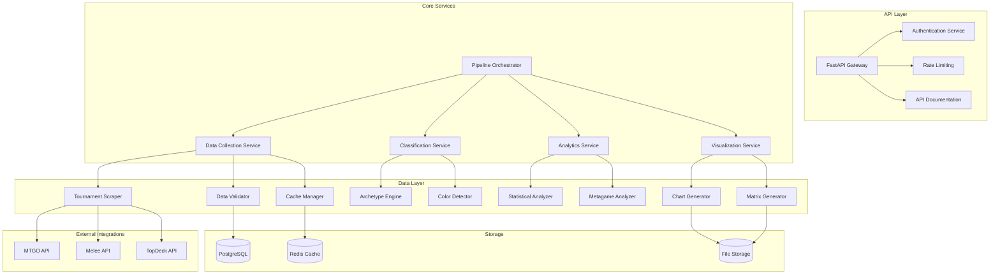

# Design Document

## Overview

This design document outlines the comprehensive refactoring of the Manalytics system to address critical issues identified in the current implementation while establishing a foundation for a scalable SaaS platform. The design focuses on eliminating external dependencies, fixing critical bugs, optimizing performance, and creating a modular architecture that can evolve into a multi-tenant service.

## Architecture

### Current State Analysis

The existing system has several architectural strengths but suffers from critical issues:

**Strengths:**
- Functional pipeline generating 13 visualizations in ~30 seconds
- Processing 5,521 decks with duplicate removal (4,845 duplicates handled)
- Advanced analytics with 18 features and R-Meta-Analysis integration
- Professional color system with accessibility compliance (WCAG AA)
- Structured modular design with clear separation of concerns

**Critical Issues:**
- Monolithic orchestrator.py (5,361 lines) creating maintenance bottlenecks
- External dependencies on MTGODecklistCache, MTGOFormatData, and Aliquanto3 R-Meta-Analysis
- Critical bugs: League Analysis "max() iterable argument is empty" error
- Performance bottlenecks preventing sub-20s target achievement
- Insufficient error handling and monitoring for production use

### Target Architecture



## Components and Interfaces

### 1. Pipeline Orchestrator (Refactored)

**Current Issue:** Monolithic 5,361-line file
**Solution:** Break into focused services with clear interfaces

```python
class PipelineOrchestrator:
    """Lightweight orchestrator coordinating services"""

    def __init__(self):
        self.data_service = DataCollectionService()
        self.classification_service = ClassificationService()
        self.analytics_service = AnalyticsService()
        self.visualization_service = VisualizationService()
        self.monitor = PipelineMonitor()

    async def run_analysis(self, request: AnalysisRequest) -> AnalysisResult:
        """Main pipeline execution with monitoring and error handling"""
        with self.monitor.track_pipeline():
            # Data collection with retry logic
            raw_data = await self.data_service.collect_tournaments(
                format=request.format,
                start_date=request.start_date,
                end_date=request.end_date
            )

            # Classification with fallback mechanisms
            classified_data = await self.classification_service.classify_decks(
                raw_data, request.format
            )

            # Analytics with statistical validation
            analytics = await self.analytics_service.analyze_metagame(
                classified_data
            )

            # Visualization generation
            visualizations = await self.visualization_service.generate_charts(
                analytics
            )

            return AnalysisResult(
                analytics=analytics,
                visualizations=visualizations,
                metadata=self._generate_metadata(request)
            )
```

### 2. Data Collection Service

**Purpose:** Replace external MTGODecklistCache dependency
**Key Features:** Robust scraping with circuit breakers and caching

```python
class DataCollectionService:
    """Autonomous data collection replacing external dependencies"""

    def __init__(self):
        self.scrapers = {
            'mtgo': MTGOScraper(),
            'melee': MeleeScraper(),
            'topdeck': TopDeckScraper()
        }
        self.cache = CacheManager()
        self.validator = DataValidator()
        self.circuit_breaker = CircuitBreaker()

    async def collect_tournaments(
        self,
        format: str,
        start_date: str,
        end_date: str
    ) -> List[Tournament]:
        """Collect tournament data with fallback mechanisms"""

        # Check cache first
        cache_key = f"{format}_{start_date}_{end_date}"
        cached_data = await self.cache.get(cache_key)
        if cached_data and self._is_cache_valid(cached_data):
            return cached_data

        # Collect from multiple sources with circuit breaker protection
        tournaments = []
        for source_name, scraper in self.scrapers.items():
            try:
                with self.circuit_breaker.protect(source_name):
                    source_tournaments = await scraper.fetch_tournaments(
                        format, start_date, end_date
                    )
                    tournaments.extend(source_tournaments)
            except CircuitBreakerOpenError:
                logger.warning(f"Circuit breaker open for {source_name}")
                continue
            except Exception as e:
                logger.error(f"Scraper {source_name} failed: {e}")
                continue

        # Validate and deduplicate
        validated_tournaments = self.validator.validate_tournaments(tournaments)
        deduplicated = self._remove_duplicates(validated_tournaments)

        # Cache results
        await self.cache.set(cache_key, deduplicated, ttl=3600)

        return deduplicated
```

### 3. Classification Service

**Purpose:** Replace MTGOFormatData dependency with internal engine
**Key Features:** Local rule engine with configurable archetype definitions

```python
class ClassificationService:
    """Internal archetype classification engine"""

    def __init__(self):
        self.archetype_engine = InternalArchetypeEngine()
        self.color_detector = ColorDetector()
        self.fallback_classifier = MLArchetypeClassifier()
        self.rule_manager = ArchetypeRuleManager()

    async def classify_decks(
        self,
        tournaments: List[Tournament],
        format: str
    ) -> List[ClassifiedTournament]:
        """Classify all decks with multiple classification strategies"""

        # Load format-specific rules
        rules = await self.rule_manager.get_rules(format)

        classified_tournaments = []
        for tournament in tournaments:
            classified_decks = []

            for deck in tournament.decks:
                try:
                    # Primary classification using rule engine
                    archetype = self.archetype_engine.classify(deck, rules)

                    if not archetype or archetype.confidence < 0.8:
                        # Fallback to ML classifier
                        archetype = await self.fallback_classifier.classify(deck)

                    # Add color information
                    colors = self.color_detector.detect_colors(deck)

                    classified_deck = ClassifiedDeck(
                        original_deck=deck,
                        archetype=archetype.name,
                        archetype_with_colors=f"{colors} {archetype.name}",
                        confidence=archetype.confidence,
                        classification_method=archetype.method
                    )
                    classified_decks.append(classified_deck)

                except Exception as e:
                    logger.error(f"Classification failed for deck: {e}")
                    # Create unclassified entry
                    classified_decks.append(
                        ClassifiedDeck.create_unclassified(deck)
                    )

            classified_tournaments.append(
                ClassifiedTournament(
                    original_tournament=tournament,
                    classified_decks=classified_decks
                )
            )

        return classified_tournaments
```

### 4. Analytics Service

**Purpose:** Advanced statistical analysis with R-Meta-Analysis methodology
**Key Features:** Bayesian statistics, confidence intervals, temporal analysis

```python
class AnalyticsService:
    """Advanced metagame analytics with statistical rigor"""

    def __init__(self):
        self.statistical_analyzer = StatisticalAnalyzer()
        self.metagame_analyzer = MetagameAnalyzer()
        self.temporal_analyzer = TemporalAnalyzer()
        self.matchup_analyzer = MatchupAnalyzer()

    async def analyze_metagame(
        self,
        classified_tournaments: List[ClassifiedTournament]
    ) -> MetagameAnalysis:
        """Comprehensive metagame analysis"""

        # Convert to analysis-ready format
        analysis_data = self._prepare_analysis_data(classified_tournaments)

        # Core statistical analysis
        archetype_stats = self.statistical_analyzer.calculate_archetype_stats(
            analysis_data
        )

        # Matchup matrix with confidence intervals
        matchup_matrix = self.matchup_analyzer.generate_matchup_matrix(
            analysis_data, confidence_level=0.95
        )

        # Temporal trends analysis
        temporal_trends = self.temporal_analyzer.analyze_trends(
            analysis_data
        )

        # Meta share vs performance analysis
        performance_analysis = self.metagame_analyzer.analyze_performance_vs_share(
            archetype_stats
        )

        return MetagameAnalysis(
            archetype_statistics=archetype_stats,
            matchup_matrix=matchup_matrix,
            temporal_trends=temporal_trends,
            performance_analysis=performance_analysis,
            metadata=self._generate_analysis_metadata(analysis_data)
        )
```

### 5. Visualization Service

**Purpose:** Generate professional-grade visualizations
**Key Features:** Consistent color system, accessibility compliance, interactive charts

```python
class VisualizationService:
    """Professional visualization generation"""

    def __init__(self):
        self.chart_generator = MetagameChartsGenerator()
        self.matrix_generator = MatchupMatrixGenerator()
        self.color_manager = ColorManager()
        self.accessibility_validator = AccessibilityValidator()

    async def generate_charts(
        self,
        analysis: MetagameAnalysis
    ) -> VisualizationSet:
        """Generate complete set of visualizations"""

        # Ensure consistent color scheme
        color_palette = self.color_manager.get_archetype_colors(
            analysis.archetype_statistics.keys()
        )

        visualizations = {}

        # Core metagame charts
        visualizations['metagame_pie'] = self.chart_generator.create_pie_chart(
            analysis.archetype_statistics, colors=color_palette
        )

        visualizations['winrate_confidence'] = self.chart_generator.create_confidence_chart(
            analysis.archetype_statistics
        )

        # Matchup matrix
        visualizations['matchup_matrix'] = self.matrix_generator.create_heatmap(
            analysis.matchup_matrix
        )

        # Temporal analysis
        visualizations['temporal_evolution'] = self.chart_generator.create_temporal_chart(
            analysis.temporal_trends
        )

        # Performance vs popularity
        visualizations['bubble_chart'] = self.chart_generator.create_bubble_chart(
            analysis.performance_analysis
        )

        # Validate accessibility
        for name, chart in visualizations.items():
            self.accessibility_validator.validate_chart(chart)

        return VisualizationSet(
            charts=visualizations,
            color_palette=color_palette,
            accessibility_report=self._generate_accessibility_report()
        )
```

## Data Models

### Core Data Structures

```python
@dataclass
class Tournament:
    """Core tournament data structure"""
    id: str
    name: str
    format: str
    date: datetime
    source: str
    decks: List[Deck]
    metadata: Dict[str, Any]

@dataclass
class Deck:
    """Individual deck representation"""
    player: str
    mainboard: List[Card]
    sideboard: List[Card]
    wins: int
    losses: int
    draws: int = 0

@dataclass
class ClassifiedDeck:
    """Deck with archetype classification"""
    original_deck: Deck
    archetype: str
    archetype_with_colors: str
    confidence: float
    classification_method: str
    colors: List[str]

@dataclass
class ArchetypeStatistics:
    """Statistical analysis for an archetype"""
    name: str
    total_decks: int
    total_matches: int
    wins: int
    losses: int
    draws: int
    win_rate: float
    confidence_interval: Tuple[float, float]
    meta_share: float
    performance_tier: str

@dataclass
class MatchupMatrix:
    """Matchup analysis between archetypes"""
    matrix: pd.DataFrame
    confidence_intervals: pd.DataFrame
    sample_sizes: pd.DataFrame
    statistical_significance: pd.DataFrame
```

## Error Handling

### Circuit Breaker Pattern

```python
class CircuitBreaker:
    """Circuit breaker for external service calls"""

    def __init__(self, failure_threshold: int = 5, timeout: int = 60):
        self.failure_threshold = failure_threshold
        self.timeout = timeout
        self.failure_count = 0
        self.last_failure_time = None
        self.state = CircuitState.CLOSED

    async def call(self, func, *args, **kwargs):
        """Execute function with circuit breaker protection"""
        if self.state == CircuitState.OPEN:
            if self._should_attempt_reset():
                self.state = CircuitState.HALF_OPEN
            else:
                raise CircuitBreakerOpenError()

        try:
            result = await func(*args, **kwargs)
            self._on_success()
            return result
        except Exception as e:
            self._on_failure()
            raise e
```

### Graceful Degradation

```python
class GracefulDegradationManager:
    """Manage system behavior when components fail"""

    async def handle_scraper_failure(self, failed_scrapers: List[str]):
        """Handle scraper failures with fallback strategies"""
        if len(failed_scrapers) == len(self.scrapers):
            # All scrapers failed - use cached data
            return await self.cache_manager.get_latest_cached_data()

        # Partial failure - continue with available scrapers
        logger.warning(f"Scrapers failed: {failed_scrapers}")
        return await self.collect_from_available_scrapers()

    async def handle_classification_failure(self, deck: Deck):
        """Handle classification failures"""
        # Try fallback classifier
        try:
            return await self.fallback_classifier.classify(deck)
        except Exception:
            # Return unclassified with metadata
            return ClassifiedDeck.create_unclassified(
                deck, reason="classification_failed"
            )
```

## Testing Strategy

### Test Architecture

```python
# Unit Tests
class TestArchetypeEngine(unittest.TestCase):
    """Test archetype classification logic"""

    def test_classify_known_archetype(self):
        """Test classification of well-known archetype"""
        deck = self.create_test_deck("izzet_prowess")
        result = self.engine.classify(deck, "standard")
        self.assertEqual(result.archetype, "Izzet Prowess")
        self.assertGreater(result.confidence, 0.9)

    def test_classify_unknown_archetype(self):
        """Test handling of unknown archetypes"""
        deck = self.create_random_deck()
        result = self.engine.classify(deck, "standard")
        self.assertIn(result.archetype, ["Unclassified", "Other"])

# Integration Tests
class TestPipelineIntegration(unittest.TestCase):
    """Test complete pipeline integration"""

    async def test_full_pipeline_execution(self):
        """Test complete pipeline from scraping to visualization"""
        request = AnalysisRequest(
            format="Standard",
            start_date="2025-01-01",
            end_date="2025-01-07"
        )

        result = await self.orchestrator.run_analysis(request)

        self.assertIsNotNone(result.analytics)
        self.assertGreater(len(result.visualizations.charts), 10)
        self.assertLess(result.execution_time, 20)  # Performance requirement

# Performance Tests
class TestPerformance(unittest.TestCase):
    """Test performance requirements"""

    def test_pipeline_performance(self):
        """Ensure pipeline completes within 20 seconds"""
        start_time = time.time()
        result = self.run_pipeline()
        execution_time = time.time() - start_time

        self.assertLess(execution_time, 20)
        self.assertGreater(len(result.tournaments), 0)
```

### Test Data Strategy

```python
class TestDataManager:
    """Manage test data for consistent testing"""

    @staticmethod
    def create_standard_test_dataset():
        """Create realistic test dataset for Standard format"""
        return [
            Tournament(
                id="test_tournament_1",
                name="Test Standard Tournament",
                format="Standard",
                date=datetime.now(),
                source="test",
                decks=[
                    TestDataManager.create_izzet_prowess_deck(),
                    TestDataManager.create_mono_red_aggro_deck(),
                    TestDataManager.create_control_deck(),
                ]
            )
        ]

    @staticmethod
    def create_izzet_prowess_deck():
        """Create realistic Izzet Prowess deck for testing"""
        return Deck(
            player="TestPlayer1",
            mainboard=[
                Card("Lightning Bolt", 4),
                Card("Monastery Swiftspear", 4),
                Card("Dragon Rage Channeler", 4),
                # ... complete realistic decklist
            ],
            sideboard=[
                Card("Pyroblast", 2),
                # ... realistic sideboard
            ],
            wins=4,
            losses=0
        )
```

This design addresses all the critical requirements while establishing a foundation for future SaaS evolution. The modular architecture enables independent testing and deployment of components, while the comprehensive error handling ensures production reliability.
