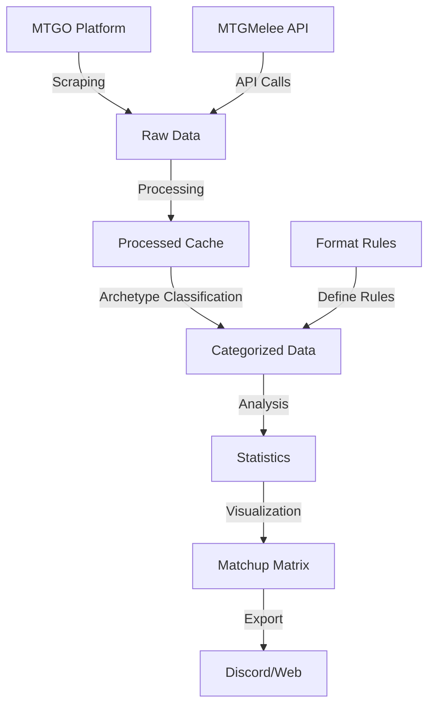

# Design Document: MTG Analytics Pipeline

## Overview

Ce document présente la conception détaillée du pipeline unifié pour l'analyse des tournois Magic: The Gathering. Le système vise à consolider six repositories GitHub existants en une structure cohérente et extensible, tout en préservant la fonctionnalité originale. Le pipeline comprend trois phases principales : collecte de données, traitement/catégorisation, et visualisation.

## Architecture

### Structure Globale

Le système est organisé selon une architecture modulaire à trois niveaux, correspondant aux trois phases du pipeline:

```
manalytics-unified/
├── data-collection/
│   ├── scraper/               # mtg_decklist_scrapper
│   │   ├── mtgo/             # Code original MTGO
│   │   └── mtgmelee/         # Extension API MTGMelee
│   ├── raw-cache/            # MTG_decklistcache
│   └── processed-cache/      # MTGODecklistCache
├── data-treatment/
│   ├── parser/               # MTGOArchetypeParser
│   └── format-rules/         # MTGOFormatData
├── visualization/
│   └── r-analysis/           # R-Meta-Analysis
├── config/
├── data/
└── README.md
```

### Flux de Données

Le flux de données à travers le système suit le chemin suivant:

1. **Collecte**: Les données sont extraites des plateformes MTGO et MTGMelee
2. **Stockage Brut**: Les données sont stockées dans leur format d'origine
3. **Traitement Initial**: Les données sont normalisées et structurées
4. **Catégorisation**: Les decks sont classifiés par archétypes selon les règles définies
5. **Analyse**: Les données catégorisées sont analysées pour extraire des statistiques
6. **Visualisation**: Des représentations graphiques sont générées pour interprétation



## Components and Interfaces

### 1. Module de Collecte de Données

#### 1.1 Scraper MTGO

**Responsabilités**:
- Extraire les données de tournois depuis la plateforme MTGO
- Gérer les erreurs de connexion et les tentatives de récupération
- Respecter les limites de taux pour éviter le blocage

**Interfaces**:
- `MTGOScraper`: Classe principale pour le scraping MTGO
  - `scrape_tournament(url)`: Extrait les données d'un tournoi spécifique
  - `scrape_recent_tournaments(days)`: Extrait les tournois des X derniers jours
  - `get_tournament_urls()`: Récupère les URLs des tournois disponibles

#### 1.2 Client API MTGMelee

**Responsabilités**:
- Se connecter à l'API MTGMelee avec authentification
- Récupérer les données de tournois via les endpoints API
- Gérer les limites de taux et les erreurs d'API

**Interfaces**:
- `MTGMeleeClient`: Classe principale pour l'interaction avec l'API
  - `authenticate()`: Établit une session authentifiée
  - `get_tournament(id)`: Récupère un tournoi spécifique
  - `get_recent_tournaments(days)`: Récupère les tournois récents
  - `get_tournament_decks(tournament_id)`: Récupère les decks d'un tournoi

#### 1.3 Gestionnaire de Cache

**Responsabilités**:
- Stocker les données brutes dans un format cohérent
- Éviter les duplications de données
- Gérer l'organisation des fichiers de cache

**Interfaces**:
- `CacheManager`: Classe pour la gestion du cache
  - `store_tournament(source, tournament_data)`: Stocke les données d'un tournoi
  - `get_tournament(source, tournament_id)`: Récupère les données d'un tournoi
  - `list_tournaments(source, filters)`: Liste les tournois disponibles

### 2. Module de Traitement des Données

#### 2.1 Adaptateur MTGOArchetypeParser

**Responsabilités**:
- Intégrer le code existant de MTGOArchetypeParser
- Adapter les entrées/sorties au nouveau système
- Gérer le processus de catégorisation

**Interfaces**:
- `ArchetypeParser`: Classe principale pour la catégorisation
  - `parse_deck(deck_data)`: Catégorise un deck individuel
  - `parse_tournament(tournament_data)`: Catégorise tous les decks d'un tournoi
  - `get_archetype_statistics(tournament_data)`: Génère des statistiques par archétype

#### 2.2 Gestionnaire de Règles de Format

**Responsabilités**:
- Charger et appliquer les règles de MTGOFormatData
- Permettre la mise à jour des règles
- Gérer les différentes versions de règles par format

**Interfaces**:
- `FormatRulesManager`: Classe pour la gestion des règles
  - `load_rules(format)`: Charge les règles pour un format spécifique
  - `update_rules(format, rules)`: Met à jour les règles d'un format
  - `get_supported_formats()`: Liste les formats supportés

### 3. Module de Visualisation

#### 3.1 Adaptateur R-Meta-Analysis

**Responsabilités**:
- Intégrer les scripts R existants
- Adapter les entrées/sorties au nouveau système
- Gérer la génération des visualisations

**Interfaces**:
- `VisualizationEngine`: Classe principale pour la visualisation
  - `generate_matchup_matrix(data)`: Génère une matrice de matchups
  - `generate_metagame_chart(data)`: Génère un graphique de métagame
  - `export_visualization(viz, format)`: Exporte une visualisation dans un format spécifique

#### 3.2 Exportateur de Visualisations

**Responsabilités**:
- Formater les visualisations pour différentes plateformes
- Gérer les options d'exportation
- Optimiser la qualité des images

**Interfaces**:
- `VisualizationExporter`: Classe pour l'exportation
  - `export_for_discord(viz)`: Formate pour Discord
  - `export_for_web(viz)`: Formate pour le web
  - `batch_export(visualizations, target)`: Exporte plusieurs visualisations

## Data Models

### 1. Modèle de Tournoi

```json
{
  "tournament_id": "string",
  "source": "MTGO|MTGMelee",
  "name": "string",
  "format": "Standard|Modern|Legacy|etc",
  "date": "ISO-8601 date",
  "url": "string",
  "decks": [
    {
      "deck_id": "string",
      "player_name": "string",
      "rank": "number",
      "mainboard": [
        {
          "card_name": "string",
          "quantity": "number"
        }
      ],
      "sideboard": [
        {
          "card_name": "string",
          "quantity": "number"
        }
      ],
      "matches": [
        {
          "opponent_id": "string",
          "result": "win|loss|draw",
          "round": "number"
        }
      ]
    }
  ]
}
```

### 2. Modèle de Deck Catégorisé

```json
{
  "deck_id": "string",
  "player_name": "string",
  "rank": "number",
  "archetype": "string",
  "colors": ["W", "U", "B", "R", "G"],
  "mainboard": [...],
  "sideboard": [...],
  "matches": [...],
  "key_cards": [
    {
      "card_name": "string",
      "relevance_score": "number"
    }
  ]
}
```

### 3. Modèle de Statistiques de Métagame

```json
{
  "format": "string",
  "date_range": {
    "start": "ISO-8601 date",
    "end": "ISO-8601 date"
  },
  "total_decks": "number",
  "total_matches": "number",
  "archetypes": [
    {
      "name": "string",
      "count": "number",
      "percentage": "number",
      "win_rate": "number",
      "matchups": [
        {
          "opponent_archetype": "string",
          "matches": "number",
          "wins": "number",
          "losses": "number",
          "draws": "number",
          "win_rate": "number"
        }
      ]
    }
  ]
}
```

## Error Handling

### Stratégie Globale

Le système implémente une stratégie d'erreur à plusieurs niveaux:

1. **Détection**: Identification rapide des erreurs via validation et assertions
2. **Journalisation**: Enregistrement détaillé des erreurs avec contexte
3. **Récupération**: Mécanismes pour continuer l'opération malgré les erreurs
4. **Notification**: Alertes pour les erreurs critiques nécessitant intervention

### Gestion des Erreurs Spécifiques

#### Erreurs de Collecte de Données

- **Erreurs de Connexion**: Tentatives multiples avec backoff exponentiel
- **Changements de Structure**: Détection des modifications de HTML/API avec alertes
- **Limites de Taux**: Respect des limites avec attente intelligente

#### Erreurs de Traitement

- **Données Malformées**: Validation stricte avec rejet des données invalides
- **Règles Manquantes**: Utilisation de règles par défaut avec marquage pour révision
- **Incohérences**: Détection et journalisation des anomalies statistiques

#### Erreurs de Visualisation

- **Échecs R**: Capture des erreurs R avec messages explicites
- **Données Insuffisantes**: Détection des ensembles de données trop petits pour analyse
- **Erreurs d'Exportation**: Formats alternatifs en cas d'échec du format principal

## Testing Strategy

### Tests Unitaires

- **Scraper MTGO**: Tests avec données HTML mockées
- **Client MTGMelee**: Tests avec réponses API mockées
- **Parseur d'Archétypes**: Tests avec decks connus et classifications attendues

### Tests d'Intégration

- **Pipeline Complet**: Tests de bout en bout avec données réduites
- **Interfaces de Modules**: Tests des interactions entre modules

### Tests de Validation

- **Validation de Données**: Vérification de l'intégrité et du format des données
- **Cohérence des Résultats**: Comparaison avec résultats historiques connus

### Tests de Performance

- **Charge**: Tests avec volumes importants de données
- **Temps de Traitement**: Benchmarks pour les opérations critiques

## Considérations de Sécurité

### Gestion des Identifiants

- Stockage sécurisé des clés API et identifiants
- Rotation régulière des clés
- Isolation des identifiants du code source

### Respect des Conditions d'Utilisation

- Conformité avec les conditions d'utilisation des plateformes
- Respect des limites de taux explicites et implicites
- Attribution appropriée des sources de données

### Protection des Données

- Anonymisation des données sensibles des joueurs si nécessaire
- Sécurisation du stockage local des données
- Contrôle d'accès aux données analytiques

## Plan d'Implémentation

L'implémentation suivra une approche progressive:

1. **Phase 1**: Consolidation des repositories et structure de base
   - Clonage des repositories
   - Mise en place de la structure de dossiers
   - Documentation initiale

2. **Phase 2**: Intégration du module de collecte
   - Adaptation du scraper MTGO
   - Développement du client MTGMelee
   - Mise en place du système de cache

3. **Phase 3**: Intégration du module de traitement
   - Adaptation de MTGOArchetypeParser
   - Configuration des règles de format
   - Tests de catégorisation

4. **Phase 4**: Intégration du module de visualisation
   - Adaptation des scripts R
   - Développement des fonctions d'exportation
   - Tests de génération de visualisations

5. **Phase 5**: Tests complets et documentation
   - Tests de bout en bout
   - Finalisation de la documentation
   - Optimisations de performance

## Extensibilité Future

Le système est conçu pour permettre les extensions suivantes:

1. **Sources de Données Additionnelles**: Structure modulaire pour ajouter de nouvelles sources
2. **Formats de Jeu**: Support facile pour nouveaux formats via le système de règles
3. **Visualisations Avancées**: Architecture permettant de nouveaux types de visualisations
4. **Interface Utilisateur**: Possibilité d'ajouter une interface web ou GUI
5. **API**: Potentiel pour exposer les données via une API REST