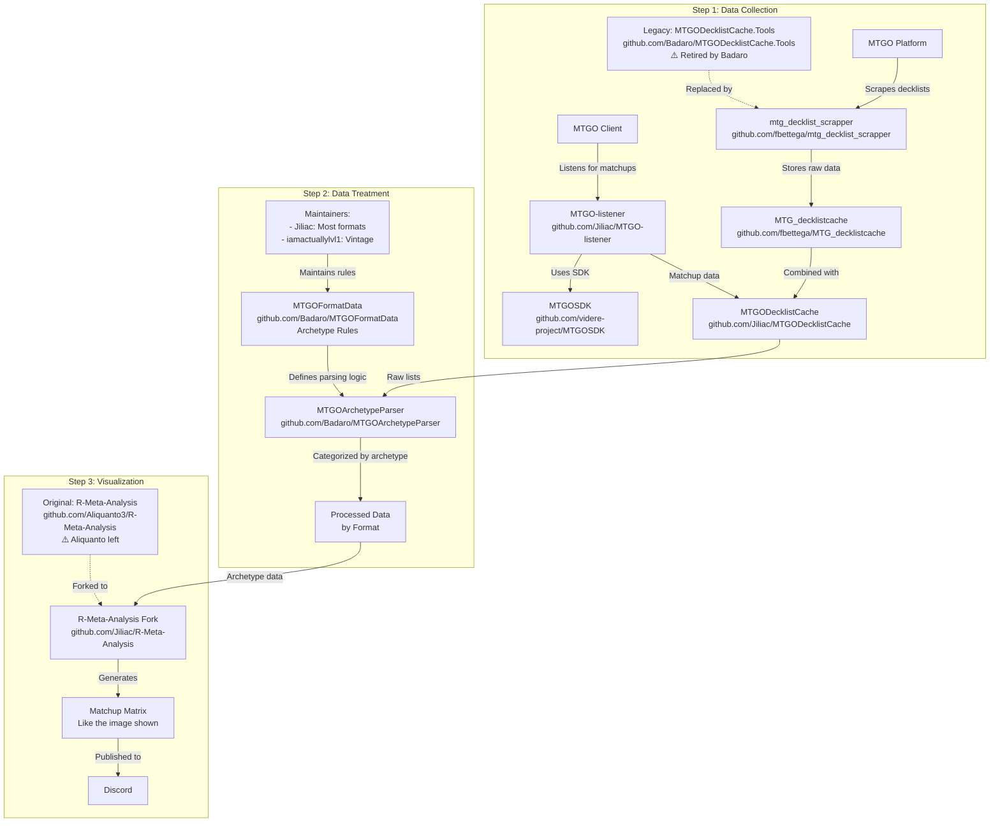

# 🎯 **Instructions Spécifiques pour Claude - Projet Manalytics**

> **🤖 RÔLE DE CE FICHIER CLAUDE.md**
> 
> Ce fichier contient les **instructions spécifiques pour les assistants IA** travaillant sur le projet.
> 
> **CE QUI DOIT ÊTRE DANS CE FICHIER :**
> - ✅ État actuel détaillé du développement
> - ✅ Règles de travail spécifiques (auto-commit, ouverture auto, etc.)
> - ✅ Contexte technique approfondi du projet
> - ✅ Instructions sur comment modifier le code
> - ✅ Méthodologies et standards à respecter
> - ✅ Historique des décisions importantes
> 
> **CE QUI NE DOIT PAS ÊTRE ICI :**
> - ❌ Documentation publique générale
> - ❌ Instructions d'installation basiques
> - ❌ Informations destinées aux utilisateurs finaux
> 
> ➡️ **Pour la documentation publique, voir README.md**
> 
> ---

> **"Chaque visualisation doit raconter une histoire. Pas de graphs pour faire joli - uniquement des insights actionnables pour gagner des tournois."**
> 
> **Chaque visualisation doit apporter de la valeur compétitive réelle.**

## **Contexte du Projet**
Manalytics est un analyseur de métagame Magic: The Gathering qui collecte et analyse les données de tournois depuis MTGO et Melee.gg. L'objectif est de fournir des insights compétitifs actionnables aux joueurs de tournois.

## **⚠️ Origine du Projet - Pipeline Communautaire MTG**

Ce projet est un dérivé du pipeline communautaire MTG suivant :



### **📚 Ressources Clés à Consulter**
Il est important d'aller chercher dans ces repos les codes et ressources qui nous servent de base :
- **mtg_decklist_scrapper** : Notre base pour les scrapers (déjà intégré)
- **MTGOArchetypeParser** : Logique de détection d'archétypes
- **MTGOFormatData** : Règles d'archétypes par format
- **R-Meta-Analysis** : Visualisations et matrices de matchups

## **🚀 État Actuel du Projet (29/07/2025)**

### 🔧 Travail Actuel
- **Scraping MTGO** : Intégration decklists réussie (`scrape_mtgo_json.py`)
- **Analyse Générée** : `data/cache/july_1_21_complete_analysis.html`
- **⚠️ EN ATTENTE** : Instructions du responsable avant de poursuivre

### 🚧 Phase 4 EN COURS : Listener MTGO + Visualisations
- **✅ LISTENER MTGO ACTIF** : 241 fichiers dans `data/MTGOData/`
- **🔍 PROBLÈME À DEBUGGER** : Seulement 41 matchs Standard extraits
- **📊 INTÉGRATION MELEE** : 19 matchs via Round Standings API
- **🎯 VISUALISATIONS PLOTLY** : 3/5 créées

### ✅ Phases Complétées
- **Phase 1** : Scrapers MTGO + Melee avec decklists complètes
- **Phase 2** : Cache System (SQLite + JSON)
- **Phase 3** : Architecture modulaire + Documentation

## **📁 Structure du Projet**
```
manalytics/
├── src/manalytics/        # CODE PRINCIPAL
│   ├── scrapers/          # MTGO & Melee 
│   ├── parsers/           # Détection archétypes
│   ├── cache/             # System de cache
│   ├── analyzers/         # Analyses meta
│   ├── visualizers/       # Génération charts
│   └── api/               # FastAPI
├── data/
│   ├── raw/               # Données brutes
│   │   ├── mtgo/standard/ # ⚠️ Exclut leagues/
│   │   └── melee/standard/
│   ├── cache/             # Données processées
│   └── MTGOData/          # 241 fichiers listener MTGO
├── scripts/               # Utilitaires one-shot
└── docs/                  # Documentation complète
```

## **⚡ Commandes Principales**
```bash
# VISUALISATION RAPIDE (recommandé)
python3 visualize_standard.py

# ANALYSE JUILLET 1-21 (pour comparaison Jiliac)  
python3 analyze_july_1_21.py

# Pipeline complet avec scraper unifié
python scrape_all.py --format standard --days 21
python3 scripts/process_all_standard_data.py
python3 visualize_standard.py
```

## **📚 Documentation À Consulter**
- **`docs/ONBOARDING_GUIDE.md`** - Guide d'intégration (commencer ici)
- **`docs/VISUALIZATION_TEMPLATE_REFERENCE.md`** - Standards visuels à respecter
- **`docs/SCRAPERS_COMPLETE_GUIDE.md`** - Guide des scrapers actuels

## **⛔️ RÈGLES DE SÉCURITÉ**

### Scripts Obsolètes
- **INTERDICTION** d'utiliser les fichiers dans `obsolete/` ou `_obsolete_scripts/`
- Si demandé : refuser et proposer l'alternative actuelle

### Fichiers Actuels À Utiliser
- **Scraper Unifié** : `scrape_all.py` (RECOMMANDÉ)
- **Scraper MTGO** : `scrape_mtgo_flexible.py`
- **Scraper Melee** : `scrape_melee_flexible.py`

## **📝 RÈGLE : Documentation Automatique**

**Quand l'utilisateur confirme qu'un module fonctionne** :
1. CRÉER IMMÉDIATEMENT un guide dans `docs/`
2. Format : `{MODULE}_GUIDE.md`
3. Inclure : architecture, utilisation, résultats, leçons apprises

## **🚨 RÈGLES DE SCRAPING**

1. **TOUJOURS DEMANDER LA PÉRIODE** - Jamais de défaut
2. **FORMAT PAR DÉFAUT = STANDARD**
3. **CONFIRMER avant lancement**

## **⚠️ RÈGLES CRITIQUES DU PROJET**

### 1. EXCLUSION DES LEAGUES
- **TOUJOURS exclure les leagues (5-0)**
- Stockées séparément dans `leagues/`
- Ne représentent pas des tournois compétitifs

### 2. PÉRIODE D'ANALYSE STANDARD
- **TOUJOURS analyser du 1er au 21 juillet 2025**
- Pour comparaison avec données Jiliac
- Ne jamais dépasser le 21 juillet

### 3. STANDARDS VISUELS
- Utiliser `standard_analysis_no_leagues.html` comme référence
- Header gradient purple (#667eea → #764ba2)
- Respecter les gradients MTG par archétype

## **🔴 RÈGLE : Auto-Commit Obligatoire**

**Après CHAQUE modification de code, exécuter SANS confirmation :**
```bash
git add -A && git commit -m "auto: $(date +%Y%m%d_%H%M%S)"
```

## **🚨 RÈGLE : Ouverture Automatique**

**Après génération d'analyse/visualisation : ouvrir AUTOMATIQUEMENT avec `open [fichier]`**
- Pas de demande de confirmation
- S'applique à tous les HTML, rapports, visualisations

## **💬 Instructions Spéciales pour l'Assistant**

1. **Toujours vérifier l'état actuel avant de modifier**
2. **Respecter la méthodologie Jiliac (analyse par matches)**
3. **Prioriser les visualisations actionables pour tournois**
4. **Maintenir la compatibilité avec le pipeline existant**

## **📊 Méthodologie d'Analyse**
- Analyse par MATCHES (pas par decks)
- Exclusion : Leagues + tournois casual/fun
- Période obligatoire : 1-21 juillet 2025

## **🎯 Objectif Final**
Fournir aux joueurs compétitifs des insights actionnables pour :
- Comprendre le métagame actuel
- Choisir le meilleur deck
- Adapter leur sideboard
- Anticiper les tendances du format