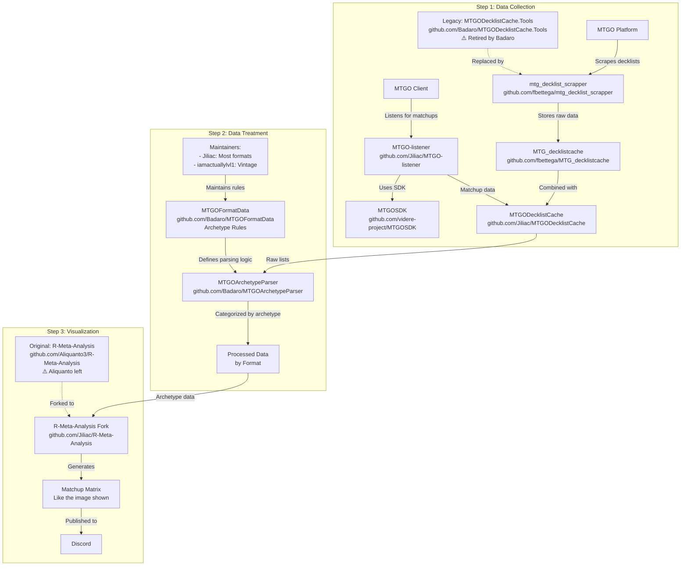

# 🎯 **Manalytics - Analyseur de Métagame Magic: The Gathering**

> **"Chaque visualisation doit raconter une histoire. Pas de graphs pour faire joli - uniquement des insights actionnables pour gagner des tournois."**
> 
> **Chaque visualisation doit apporter de la valeur compétitive réelle.**

## 📚 IMPORTANT : GUIDE D'INTÉGRATION OBLIGATOIRE

**TOUS LES NOUVEAUX DÉVELOPPEURS DOIVENT LIRE :**
- **[docs/ONBOARDING_GUIDE.md](docs/ONBOARDING_GUIDE.md)** - Guide d'intégration complet avec parcours de lecture structuré
- Ce guide contient l'ordre exact de lecture de TOUS les documents nécessaires
- Temps estimé : 2-3 heures pour tout comprendre
- **NE PAS COMMENCER À CODER SANS AVOIR LU CE GUIDE**

## **⚠️ IMPORTANT : Origine du Projet**

Ce projet est un dérivé du pipeline communautaire MTG suivant :



### **📚 Ressources Clés à Consulter**
Il est important d'aller chercher dans ces repos les codes et ressources qui nous servent de base :
- **mtg_decklist_scrapper** : Notre base pour les scrapers (déjà intégré)
- **MTGOArchetypeParser** : Logique de détection d'archétypes
- **MTGOFormatData** : Règles d'archétypes par format
- **R-Meta-Analysis** : Visualisations et matrices de matchups

## **Objectif Principal**
Collecter, analyser et visualiser les données de tournois Magic: The Gathering pour comprendre le métagame (les decks les plus joués et leurs performances).

## **🔄 Flux de Données**

```
1. SCRAPING
   ↓
MTGO & Melee → Tournois → data/raw/{platform}/{format}/
   ↓
2. TRAITEMENT
   ↓
Parser → Détection d'archétypes → Validation des decks
   ↓
3. STOCKAGE
   ↓
Fichiers JSON (données complètes)
   ↓
4. ANALYSE
   ↓
Meta % → Matchups → Visualisations
   ↓
5. API
   ↓
FastAPI → Frontend/Rapports
```

## **📦 Composants Principaux**

### 1. **Scrapers** (`scrapers/`)
- **MTGO** : Récupère les tournois depuis www.mtgo.com
- **Melee** : Récupère depuis melee.gg (avec authentification)
- Sauvegarde dans `data/raw/{platform}/{format}/`

### 2. **Parsers** (`src/parsers/`)
- **Archetype Engine** : Identifie le type de deck (Aggro Rouge, Control Bleu, etc.)
- **Decklist Parser** : Valide les listes (60 cartes main, 15 sideboard)
- **Color Identity** : Détermine les couleurs du deck

### 3. **Analyzers** (`src/analyzers/`)
- **Meta Analyzer** : Calcule le % de chaque archétype
- **Matchup Calculator** : Calcule les taux de victoire entre archétypes
- **Tournament Analyzer** : Analyse les performances

### 4. **Cache System** (`data/cache/`)
- SQLite légère pour metadata des tournois
- Fichiers JSON pour les données complètes des decklists
- Pas de base de données lourde nécessaire

### 5. **API** (`src/api/`)
- FastAPI avec authentification JWT
- Endpoints pour :
  - Récupérer les données de métagame
  - Analyser des decklists
  - Générer des visualisations
  - Gérer les utilisateurs

### 6. **Visualizations** (`src/visualizers/`)
- Heatmaps de matchups
- Graphiques de distribution du méta
- Évolution temporelle

## **🎮 Formats Supportés**
- Standard
- Modern
- Legacy
- Pioneer
- Pauper
- Vintage
- Commander (Melee)

## **📊 Ce que le projet analyse**
1. **Distribution du Métagame** : Quel % joue chaque deck
2. **Matchups** : Quel deck bat quel deck (⚠️ LIMITÉ SANS LISTENER)
3. **Tendances** : Évolution dans le temps
4. **Performance** : Top 8, win rates
5. **Innovation** : Nouveaux decks émergents

## **💡 Cas d'Usage**
- Joueurs compétitifs préparant des tournois
- Comprendre le métagame actuel
- Choisir le meilleur deck
- Adapter son sideboard
- Suivre l'évolution du format

C'est essentiellement un **outil d'intelligence compétitive** pour Magic: The Gathering !

## **🚀 État Actuel (28/07/2025)**

### 🚨 Session du 28/07 - Phase 4 : DONNÉES LISTENER MANQUANTES
- **🔴 CAUSE IDENTIFIÉE** : Le dossier `jiliaclistener/` est VIDE
  - 33 tournois MTGO scraped (juillet 1-21)
  - 0 matchs dans `data/MTGOData/`
  - 0 fichiers dans `jiliaclistener/`
  - Les "41 matchs" sont une erreur/cache obsolète
- **PROBLÈME FONDAMENTAL** :
  - Les scrapers MTGO actuels NE capturent PAS les matchs
  - Ils récupèrent seulement les decklists
  - Pour les matchs, il FAUT le MTGO Listener
- **SOLUTION REQUISE** :
  - Option 1: Implémenter MTGO-listener maintenant
  - Option 2: Obtenir les données listener de Jiliac
  - Option 3: Se contenter des 19 matchs Melee (insuffisant!)

### ✅ Session du 28/07 matin : Architecture Pipeline & Scrapers Flexibles
- **Clarification architecture** : Compréhension correcte du flux de données (scrapers → cache → analyse)
- **Nettoyage erreurs** : Suppression des imports erronés depuis jiliac_pipeline
- **Scrapers flexibles créés** :
  - `scrape_all.py` - Scraper unifié MTGO + Melee (RECOMMANDÉ)
  - `scrape_mtgo_flexible.py` - Support multi-formats et dates personnalisables
  - `scrape_melee_flexible.py` - Support multi-formats et dates personnalisables + Round Standings!
- **Documentation majeure** :
  - `docs/ONBOARDING_GUIDE.md` - Guide d'intégration complet pour nouveaux développeurs
  - `docs/MANALYTICS_COMPLETE_ARCHITECTURE.html` - Architecture complète avec diagrammes
  - `docs/SCRAPERS_COMPLETE_GUIDE.md` - Guide complet des scrapers
- **Scripts obsolètes archivés** : `scripts/_obsolete_scripts/`

### ✅ Phase 3 COMPLÈTE : Architecture & Documentation
- **Architecture modulaire** : Code réorganisé dans `src/manalytics/` (aligné avec Jiliac)
- **Visualisation de référence** : `data/cache/standard_analysis_no_leagues.html` 
- **Quick launcher** : `python3 visualize_standard.py` pour accès rapide
- **Documentation complète** : 20+ guides créés pour les équipes futures
- **Nettoyage scripts** : De 54 → 29 scripts (archivés dans `_archive_2025_07_27/`)

### 🚨 PHASE 4 BLOQUÉE : Investigation Problème Matchs MTGO
**PROBLÈME CRITIQUE** : 41 matchs sur 22 tournois = IMPOSSIBLE
- 🔴 **Investigation urgente** : Où sont les matchs MTGO?
- ❓ **Questions clés** :
  - Les 22 tournois existent-ils vraiment?
  - Le scraper MTGO capture-t-il les matchs?
  - Faut-il le MTGO Listener pour avoir les matchs?
- ⚠️ **Melee n'est PAS la solution** : 19 matchs ajoutés mais problème non résolu

### ✅ Phase 2 COMPLÈTE : Cache System
- Cache SQLite pour metadata + JSON pour decklists
- Parser d'archétypes : 44 règles Standard
- Performance : <500ms par tournoi

### ✅ Phase 1 COMPLÈTE : Scrapers
- MTGO + Melee avec decklists complètes

## **📁 Structure du Projet**
```
manalytics/
├── src/manalytics/        # CODE PRINCIPAL (organisé)
│   ├── scrapers/          # MTGO & Melee 
│   ├── parsers/           # Détection archétypes
│   ├── cache/             # System de cache
│   ├── analyzers/         # Analyses meta
│   ├── visualizers/       # Génération charts
│   ├── pipeline/          # Orchestration
│   └── api/               # FastAPI
├── data/
│   ├── raw/               # Données brutes
│   │   ├── mtgo/standard/ # ⚠️ Exclut leagues/
│   │   └── melee/standard/
│   └── cache/             # Données processées
│       └── standard_analysis_no_leagues.html  # 🎨 VISUALISATION DE RÉFÉRENCE
├── scripts/               # Utilitaires one-shot (29 scripts)
│   └── _archive_2025_07_27/  # Anciens scripts (54 archivés)
├── docs/                  # DOCUMENTATION COMPLÈTE
│   ├── PROJECT_COMPLETE_DOCUMENTATION.md  # 🎯 LIRE EN PREMIER
│   ├── DATA_FLOW_VISUALIZATION.html      # Flux interactif
│   └── FILE_DISCOVERY_PROCESS.html       # Comment on trouve les fichiers
└── visualize_standard.py  # 🚀 LANCEUR RAPIDE
```

## **🔧 Architecture Moderne (25/07/2025)**
- **CLI Principal** : `manalytics` - Point d'entrée unique
- **Orchestrateur** : `src/manalytics/orchestrator.py` - Coordonne tout
- **Scrapers** : Dans `src/manalytics/scrapers/` (MTGO + Melee)
- **Configuration** : `.env` + `src/manalytics/config.py`
- **Structure** : 100% professionnelle dans `src/manalytics/`

## **📊 Période d'Analyse OBLIGATOIRE : 1-21 Juillet 2025**
```
⚠️ TOUJOURS analyser du 1er au 21 juillet 2025
🎯 Pour permettre la comparaison avec Jiliac
🚫 JAMAIS au-delà du 21 juillet

Méthodologie: Par MATCHES (pas par decks)
Exclusions: Leagues + tournois casual/fun
```

## **⚡ Commandes Essentielles**
```bash
# VISUALISATION RAPIDE (recommandé)
python3 visualize_standard.py

# ANALYSE JUILLET 1-21 (pour comparaison Jiliac)  
python3 analyze_july_1_21.py

# Pipeline complet (avec nouveau scraper unifié)
python scrape_all.py --format standard --days 21  # Scrape MTGO + Melee
python3 scripts/process_all_standard_data.py      # Process cache
python3 visualize_standard.py                     # Generate viz

# Installation
make install-dev

# API
manalytics serve
```

## **📚 Documentation Critique**

### 🎯 À LIRE EN PREMIER
- **`docs/PROJECT_COMPLETE_DOCUMENTATION.md`** - Guide complet pour les équipes
- **`docs/VISUALIZATION_TEMPLATE_REFERENCE.md`** - Règles visuelles ABSOLUES
- **`docs/DATA_FLOW_VISUALIZATION.html`** - Flux de données interactif
- **`docs/FILE_DISCOVERY_PROCESS.html`** - Comment on trouve les fichiers

### 🔧 Guides Techniques
- `docs/MELEE_SCRAPING_GUIDE.md` - Scraping Melee avec auth
- `docs/MTGO_SCRAPING_GUIDE.md` - Scraping MTGO
- `docs/CACHE_SYSTEM_IMPLEMENTATION.md` - Architecture cache
- `docs/JILIAC_R_ARCHITECTURE_ANALYSIS.md` - Comparaison avec Jiliac

## ⛔️ RÈGLES CRITIQUES DE SÉCURITÉ ⛔️

### NE JAMAIS TOUCHER AU DOSSIER `obsolete/`
- **INTERDICTION ABSOLUE** d'exécuter tout fichier dans `obsolete/`
- **INTERDICTION** de lire ou analyser le code obsolète
- **INTERDICTION** d'importer ou référencer ces fichiers
- Si l'utilisateur demande d'utiliser un fichier obsolète : **REFUSER** et proposer l'alternative actuelle

### Fichiers Actuels à Utiliser
- **Scraper Unifié** : `scrape_all.py` (RECOMMANDÉ - lance MTGO + Melee)
- **Scraper MTGO** : `scrape_mtgo_flexible.py` (multi-formats, dates personnalisables)
- **Scraper Melee** : `scrape_melee_flexible.py` (multi-formats, dates personnalisables)
- **Validation** : `scripts/validate_against_decklistcache.py`
- **Test Auth** : `test_melee_auth_simple.py`
- **Scripts obsolètes** : Voir `scripts/_obsolete_scripts/` (NE PAS UTILISER)

## 📝 RÈGLE DE DOCUMENTATION

**Quand l'utilisateur confirme qu'un module fonctionne** ("c'est ok", "ça fonctionne", etc.) :
1. **CRÉER IMMÉDIATEMENT** un guide complet dans `docs/`
2. **Format** : `{MODULE}_SCRAPING_GUIDE.md` ou `{MODULE}_GUIDE.md`
3. **Contenu obligatoire** :
   - Vue d'ensemble avec résultats obtenus
   - Architecture détaillée du code
   - Guide d'utilisation complet
   - Points techniques importants
   - Leçons apprises
4. **Exemples créés** : `MELEE_SCRAPING_GUIDE.md`, `MTGO_SCRAPING_GUIDE.md`

## 🚨 RÈGLES DE SCRAPING OBLIGATOIRES

1. **TOUJOURS DEMANDER LA PÉRIODE** : Ne JAMAIS utiliser "7 jours" par défaut. Toujours demander à l'utilisateur quelle période scraper.
2. **FORMAT PAR DÉFAUT = STANDARD** : Sauf contre-ordre explicite, toujours scraper le format Standard uniquement.
3. **CONFIRMATION AVANT LANCEMENT** : Toujours confirmer la période et le format avant de lancer un scraping.

## ⚠️ RÈGLES ABSOLUES

### 1. EXCLUSION DES LEAGUES
**LES LEAGUES (5-0) SONT TOUJOURS EXCLUES**
- Stockées dans `leagues/` séparé
- Triple protection dans le code
- Ne représentent pas des tournois compétitifs

### 2. PÉRIODE D'ANALYSE
**TOUJOURS ANALYSER DU 1er AU 21 JUILLET 2025**
- Pour comparaison avec Jiliac
- Jamais au-delà du 21 juillet

### 3. TEMPLATE VISUEL
**UTILISER `standard_analysis_no_leagues.html` COMME RÉFÉRENCE**
- Header gradient purple (#667eea → #764ba2)
- Gradients MTG pour archétypes
- Voir `docs/VISUALIZATION_TEMPLATE_REFERENCE.md`

## 🔴 RÈGLE ABSOLUE : AUTO-COMMIT APRÈS CHAQUE MODIFICATION

**Après CHAQUE modification de code que tu effectues, execute immédiatement et sans confirmation :**
```bash
git add -A && git commit -m "auto: $(date +%Y%m%d_%H%M%S)"
```

Cette règle s'applique à TOUTES tes réponses contenant du code.
Aucune exception. Aucune demande de confirmation.

## 💬 CONTACT & SUPPORT

**Questions ou problèmes ?**
- Pas de GitHub issues pour l'instant
- Contacter directement via le chat
- Consulter la documentation complète dans `docs/`