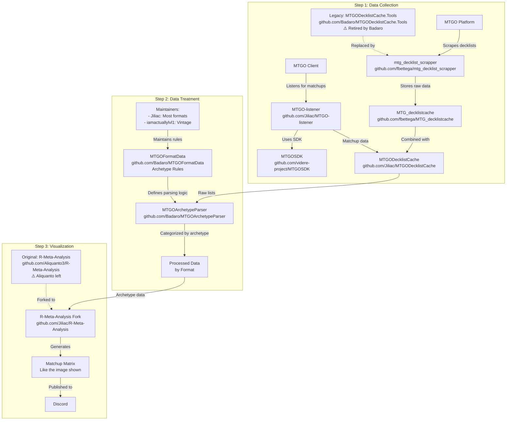

# 🎯 **Manalytics - Analyseur de Métagame Magic: The Gathering**

## **⚠️ IMPORTANT : Origine du Projet**

Ce projet est un dérivé du pipeline communautaire MTG suivant :



### **📚 Ressources Clés à Consulter**
Il est important d'aller chercher dans ces repos les codes et ressources qui nous servent de base :
- **mtg_decklist_scrapper** : Notre base pour les scrapers (déjà intégré)
- **MTGOArchetypeParser** : Logique de détection d'archétypes
- **MTGOFormatData** : Règles d'archétypes par format
- **R-Meta-Analysis** : Visualisations et matrices de matchups

## **Objectif Principal**
Collecter, analyser et visualiser les données de tournois Magic: The Gathering pour comprendre le métagame (les decks les plus joués et leurs performances).

## **🔄 Flux de Données**

```
1. SCRAPING
   ↓
MTGO & Melee → Tournois → data/raw/{platform}/{format}/
   ↓
2. TRAITEMENT
   ↓
Parser → Détection d'archétypes → Validation des decks
   ↓
3. STOCKAGE
   ↓
PostgreSQL Database
   ↓
4. ANALYSE
   ↓
Meta % → Matchups → Visualisations
   ↓
5. API
   ↓
FastAPI → Frontend/Rapports
```

## **📦 Composants Principaux**

### 1. **Scrapers** (`scrapers/`)
- **MTGO** : Récupère les tournois depuis www.mtgo.com
- **Melee** : Récupère depuis melee.gg (avec authentification)
- Sauvegarde dans `data/raw/{platform}/{format}/`

### 2. **Parsers** (`src/parsers/`)
- **Archetype Engine** : Identifie le type de deck (Aggro Rouge, Control Bleu, etc.)
- **Decklist Parser** : Valide les listes (60 cartes main, 15 sideboard)
- **Color Identity** : Détermine les couleurs du deck

### 3. **Analyzers** (`src/analyzers/`)
- **Meta Analyzer** : Calcule le % de chaque archétype
- **Matchup Calculator** : Calcule les taux de victoire entre archétypes
- **Tournament Analyzer** : Analyse les performances

### 4. **Database** (`database/`)
- PostgreSQL avec schéma complet
- Tables : tournaments, decklists, cards, matchups, etc.
- Support des migrations Alembic

### 5. **API** (`src/api/`)
- FastAPI avec authentification JWT
- Endpoints pour :
  - Récupérer les données de métagame
  - Analyser des decklists
  - Générer des visualisations
  - Gérer les utilisateurs

### 6. **Visualizations** (`src/visualizers/`)
- Heatmaps de matchups
- Graphiques de distribution du méta
- Évolution temporelle

## **🎮 Formats Supportés**
- Standard
- Modern
- Legacy
- Pioneer
- Pauper
- Vintage
- Commander (Melee)

## **📊 Ce que le projet analyse**
1. **Distribution du Métagame** : Quel % joue chaque deck
2. **Matchups** : Quel deck bat quel deck
3. **Tendances** : Évolution dans le temps
4. **Performance** : Top 8, win rates
5. **Innovation** : Nouveaux decks émergents

## **💡 Cas d'Usage**
- Joueurs compétitifs préparant des tournois
- Comprendre le métagame actuel
- Choisir le meilleur deck
- Adapter son sideboard
- Suivre l'évolution du format

C'est essentiellement un **outil d'intelligence compétitive** pour Magic: The Gathering !

## **🚀 État Actuel (25/07/2025)**
- ✅ **Migration professionnelle complétée** - Structure moderne `src/manalytics/`
- ✅ 27 tournois MTGO Standard scrapés (juillet 2025)
- ✅ 15 tournois Melee Standard scrapés - 5,362 decklists
- ✅ **CLI unifié** : `manalytics` avec orchestrateur central
- ✅ **Nouvelle architecture** : Tout dans `src/manalytics/` proprement organisé
- ✅ Scrapers Melee/MTGO 100% fonctionnels
- ✅ Configuration centralisée via `.env` et `config.py`
- ✅ Makefile professionnel avec commandes colorées
- ✅ pyproject.toml moderne (plus de requirements.txt)
- ⏳ Base de données PostgreSQL à connecter
- ⏳ Tests d'intégration à finaliser

## **📁 Structure des Données**
```
data/
├── raw/
│   ├── mtgo/
│   │   ├── standard/
│   │   │   ├── challenge/   # 26 challenges avec IDs uniques
│   │   │   └── *.json       # 1 RC Qualifier
│   │   └── modern/          # À scraper
│   └── melee/
│       └── standard/        # Tournois Melee
│           └── leagues/     # Leagues stockées séparément
└── processed/               # Non utilisé actuellement
```

## **🔧 Architecture Moderne (25/07/2025)**
- **CLI Principal** : `manalytics` - Point d'entrée unique
- **Orchestrateur** : `src/manalytics/orchestrator.py` - Coordonne tout
- **Scrapers** : Dans `src/manalytics/scrapers/` (MTGO + Melee)
- **Configuration** : `.env` + `src/manalytics/config.py`
- **Structure** : 100% professionnelle dans `src/manalytics/`

## **⚡ Commandes Utiles (NOUVEAU SYSTÈME)**
```bash
# Installation complète
make install-dev

# Vérifier le système
manalytics status

# Pipeline complet (scrape → parse → analyze → visualize)
manalytics pipeline --format standard --days 7

# Scraper seul
manalytics scrape --format standard --platform all --days 7

# Analyser les données existantes
manalytics analyze --format standard

# Lancer l'API
manalytics serve

# Ancienne méthode (si besoin)
python3 scripts/scrape_all_platforms.py --format standard --days 7

# Analyser les données existantes
python3 scripts/run_pipeline_with_existing_data.py --format standard --platform melee

# Voir les données disponibles
python3 -c "from src.utils.data_loader import DataLoader; dl = DataLoader(); print(dl.count_tournaments())"
```

## **📚 Documentation Importante**
- `docs/SCRAPING_BEST_PRACTICES.md` : **LEÇONS CRITIQUES** sur le scraping (notamment pourquoi on ne doit JAMAIS deviner les IDs MTGO)
- **`docs/MELEE_SCRAPING_GUIDE.md`** : Guide complet du scraping Melee avec authentification
- Les IDs MTGO ne sont PAS séquentiels - toujours parser la page de liste officielle
- Les tournois du même jour ont des IDs complètement différents (écarts de 5, 10, 17...)
- L'authentification Melee utilise des cookies valides 21 jours (pas de JWT)

## ⛔️ RÈGLES CRITIQUES DE SÉCURITÉ ⛔️

### NE JAMAIS TOUCHER AU DOSSIER `obsolete/`
- **INTERDICTION ABSOLUE** d'exécuter tout fichier dans `obsolete/`
- **INTERDICTION** de lire ou analyser le code obsolète
- **INTERDICTION** d'importer ou référencer ces fichiers
- Si l'utilisateur demande d'utiliser un fichier obsolète : **REFUSER** et proposer l'alternative actuelle

### Fichiers Actuels à Utiliser
- Scraper Melee : `scrape_melee_working_v2.py`
- Scraper MTGO : `scrape_mtgo_tournaments_enhanced.py`
- Test Auth : `test_melee_auth_simple.py`