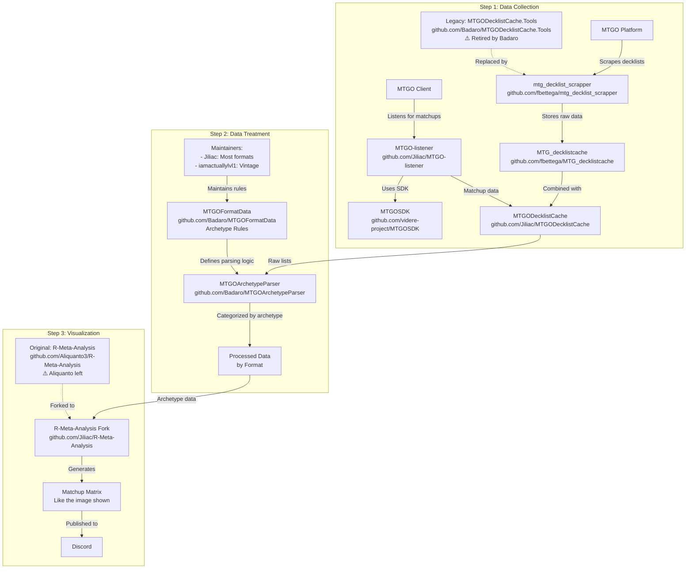

# 🎯 **Instructions Spécifiques pour Claude - Projet Manalytics**

> **🤖 RÔLE DE CE FICHIER CLAUDE.md**
> 
> Ce fichier contient les **instructions spécifiques pour les assistants IA** travaillant sur le projet.
> 
> **CE QUI DOIT ÊTRE DANS CE FICHIER :**
> - ✅ État actuel détaillé du développement
> - ✅ Règles de travail spécifiques (auto-commit, ouverture auto, etc.)
> - ✅ Contexte technique approfondi du projet
> - ✅ Instructions sur comment modifier le code
> - ✅ Méthodologies et standards à respecter
> - ✅ Historique des décisions importantes
> 
> **CE QUI NE DOIT PAS ÊTRE ICI :**
> - ❌ Documentation publique générale
> - ❌ Instructions d'installation basiques
> - ❌ Informations destinées aux utilisateurs finaux
> 
> ➡️ **Pour la documentation publique, voir README.md**
> 
> ---

> **"Chaque visualisation doit raconter une histoire. Pas de graphs pour faire joli - uniquement des insights actionnables pour gagner des tournois."**
> 
> **Chaque visualisation doit apporter de la valeur compétitive réelle.**

## **Contexte du Projet**
Manalytics est un analyseur de métagame Magic: The Gathering qui collecte et analyse les données de tournois depuis MTGO et Melee.gg. L'objectif est de fournir des insights compétitifs actionnables aux joueurs de tournois.

## **⚠️ Origine du Projet - Pipeline Communautaire MTG**

Ce projet est un dérivé du pipeline communautaire MTG suivant :



### **📚 Ressources Clés à Consulter**
Il est important d'aller chercher dans ces repos les codes et ressources qui nous servent de base :
- **mtg_decklist_scrapper** : Notre base pour les scrapers (déjà intégré)
- **MTGOArchetypeParser** : Logique de détection d'archétypes
- **MTGOFormatData** : Règles d'archétypes par format
- **R-Meta-Analysis** : Visualisations et matrices de matchups

## **🚀 État Actuel du Projet (29/07/2025)**

### ✅ IMPLÉMENTATION COMPLÈTE DE LA MÉTHODE JILIAC
- **✅ FORMULES EXACTES** : Reproduction fidèle de R-Meta-Analysis
- **✅ DOCUMENTATION RÉFÉRENCE** : `docs/JILIAC_METHOD_REFERENCE.md`
- **✅ CALCULS CENTRALISÉS** : Une seule source de vérité pour tous les calculs
- **✅ RÉSULTATS REPRODUCTIBLES** : Garantie de cohérence entre les sessions

### 🔧 État Technique
- **Scraping MTGO** : Intégration decklists réussie (`scrape_mtgo_json.py`)
- **Analyse Générée** : `data/cache/july_1_21_jiliac_method.html`
- **LISTENER MTGO** : 241 fichiers dans `data/MTGOData/`
- **MATCHS ANALYSÉS** : 1,167 matchs Standard extraits
- **INTÉGRATION MELEE** : 19 matchs via Round Standings API

### 🚧 Découverte Critique
- **PROBLÈME IDENTIFIÉ** : Les matchups détaillés nécessaires pour R-Meta-Analysis ne sont pas générés
- **SOURCE MANQUANTE** : MTGOArchetypeParser ne génère PAS les matchups contrairement à ce qu'on pensait
- **IMPACT** : Nos résultats diffèrent (29% vs 20.4% pour Izzet Cauldron)
- **DOCUMENTATION** : 
  - `docs/JILIAC_DATA_SOURCE_MYSTERY.md` - Investigation sur la source des matchups
  - `docs/JILIAC_ALL_CALCULATION_METHODS.md` - 264+ combinaisons de calculs possibles
  - `docs/JILIAC_PIPELINE_COMPLETE_ANALYSIS.md` - Analyse complète du pipeline

### ✅ Phases Complétées
- **Phase 1** : Scrapers MTGO + Melee avec decklists complètes
- **Phase 2** : Cache System (SQLite + JSON)
- **Phase 3** : Architecture modulaire + Documentation
- **Phase 4** : Méthode Jiliac complète avec documentation
- **Phase 5** : Analyse complète du pipeline communautaire MTG

### 🔴 Phase En Cours
- **Phase 6** : Reconstruction des matchups depuis listener + scrapers
  - Comprendre comment Jiliac obtient ses données de matchups
  - Implémenter la fusion listener + decklists + archétypes
  - Reproduire exactement les 6 visualisations standards

## **📁 Structure du Projet**
```
manalytics/
├── src/manalytics/        # CODE PRINCIPAL
│   ├── scrapers/          # MTGO & Melee 
│   ├── parsers/           # Détection archétypes
│   ├── cache/             # System de cache
│   ├── analyzers/         # Analyses meta
│   ├── visualizers/       # Génération charts
│   └── api/               # FastAPI
├── data/
│   ├── raw/               # Données brutes
│   │   ├── mtgo/standard/ # ⚠️ Exclut leagues/
│   │   └── melee/standard/
│   ├── cache/             # Données processées
│   └── MTGOData/          # 241 fichiers listener MTGO
├── scripts/               # Utilitaires one-shot
└── docs/                  # Documentation complète
```

## **⚡ Commandes Principales**
```bash
# VISUALISATION RAPIDE (recommandé)
python3 visualize_standard.py

# ANALYSE JUILLET 1-21 (avec méthode Jiliac exacte)  
python3 analyze_july_jiliac_method.py

# Pipeline complet avec scraper unifié
python scrape_all.py --format standard --days 21
python3 scripts/process_all_standard_data.py
python3 visualize_standard.py
```

## **📚 Documentation À Consulter**
- **`docs/JILIAC_METHOD_REFERENCE.md`** - **MÉTHODE DE CALCUL OBLIGATOIRE**
- **`docs/ONBOARDING_GUIDE.md`** - Guide d'intégration (commencer ici)
- **`docs/VISUALIZATION_TEMPLATE_REFERENCE.md`** - Standards visuels à respecter
- **`docs/SCRAPERS_COMPLETE_GUIDE.md`** - Guide des scrapers actuels
- **`docs/JILIAC_DATA_SOURCE_MYSTERY.md`** - Investigation sur la source des matchups
- **`docs/JILIAC_ALL_CALCULATION_METHODS.md`** - 264+ combinaisons de calculs de Jiliac
- **`docs/JILIAC_PIPELINE_COMPLETE_ANALYSIS.md`** - Analyse complète du pipeline communautaire
- **`docs/PHASE_1_OBJECTIF_VISUALISATIONS_JILIAC.md`** - Les 6 visualisations à reproduire exactement

## **⛔️ RÈGLES DE SÉCURITÉ**

### Scripts Obsolètes
- **INTERDICTION** d'utiliser les fichiers dans `obsolete/` ou `_obsolete_scripts/`
- Si demandé : refuser et proposer l'alternative actuelle

### Fichiers Actuels À Utiliser
- **Scraper Unifié** : `scrape_all.py` (RECOMMANDÉ)
- **Scraper MTGO** : `scrape_mtgo_flexible.py`
- **Scraper Melee** : `scrape_melee_flexible.py`

## **📝 RÈGLE : Documentation Automatique**

**Quand l'utilisateur confirme qu'un module fonctionne** :
1. CRÉER IMMÉDIATEMENT un guide dans `docs/`
2. Format : `{MODULE}_GUIDE.md`
3. Inclure : architecture, utilisation, résultats, leçons apprises

## **🚨 RÈGLES DE SCRAPING**

1. **TOUJOURS DEMANDER LA PÉRIODE** - Jamais de défaut
2. **FORMAT PAR DÉFAUT = STANDARD**
3. **CONFIRMER avant lancement**

## **⚠️ RÈGLES CRITIQUES DU PROJET**

### 1. EXCLUSION DES LEAGUES
- **TOUJOURS exclure les leagues (5-0)**
- Stockées séparément dans `leagues/`
- Ne représentent pas des tournois compétitifs

### 2. PÉRIODE D'ANALYSE STANDARD
- **TOUJOURS analyser du 1er au 21 juillet 2025**
- Pour comparaison avec données Jiliac
- Ne jamais dépasser le 21 juillet

### 3. STANDARDS VISUELS
- Utiliser `standard_analysis_no_leagues.html` comme référence
- Header gradient purple (#667eea → #764ba2)
- Respecter les gradients MTG par archétype

## **🔴 RÈGLE : Auto-Commit Obligatoire**

**Après CHAQUE modification de code, exécuter SANS confirmation :**
```bash
git add -A && git commit -m "auto: $(date +%Y%m%d_%H%M%S)"
```

## **🚨 RÈGLE : Ouverture Automatique**

**OUVRIR AUTOMATIQUEMENT TOUT FICHIER CRÉÉ OU MODIFIÉ :**
- Après génération d'analyse/visualisation : `open [fichier]`
- Après création de TOUT nouveau fichier : `open [fichier]`
- Après modification importante d'un fichier : `open [fichier]`
- **AUCUNE EXCEPTION - AUCUNE DEMANDE - OUVRE DIRECT !**
- S'applique à : HTML, MD, JSON, PY, TXT, TOUT !

## **🔴 RÈGLE ABSOLUE : Méthode de Calcul Unique**

**TOUJOURS UTILISER LA MÉTHODE DE RÉFÉRENCE JILIAC :**
- **Document de référence** : `docs/JILIAC_METHOD_REFERENCE.md`
- **INTERDICTION** de créer d'autres méthodes de calcul
- **OBLIGATION** d'utiliser les formules exactes du document
- **EXCEPTION UNIQUE** : Si l'utilisateur demande explicitement une autre méthode pour tester
- **Script de référence** : `analyze_july_jiliac_method.py`

## **💬 Instructions Spéciales pour l'Assistant**

1. **Toujours vérifier l'état actuel avant de modifier**
2. **Respecter la méthodologie Jiliac (analyse par matches)**
3. **Prioriser les visualisations actionables pour tournois**
4. **Maintenir la compatibilité avec le pipeline existant**
5. **UTILISER UNIQUEMENT docs/JILIAC_METHOD_REFERENCE.md pour les calculs**

## **📊 Méthodologie d'Analyse**
- Analyse par MATCHES (pas par decks)
- Exclusion : Leagues + tournois casual/fun
- Période obligatoire : 1-21 juillet 2025

## **🎯 Objectif Final**
Fournir aux joueurs compétitifs des insights actionnables pour :
- Comprendre le métagame actuel
- Choisir le meilleur deck
- Adapter leur sideboard
- Anticiper les tendances du format