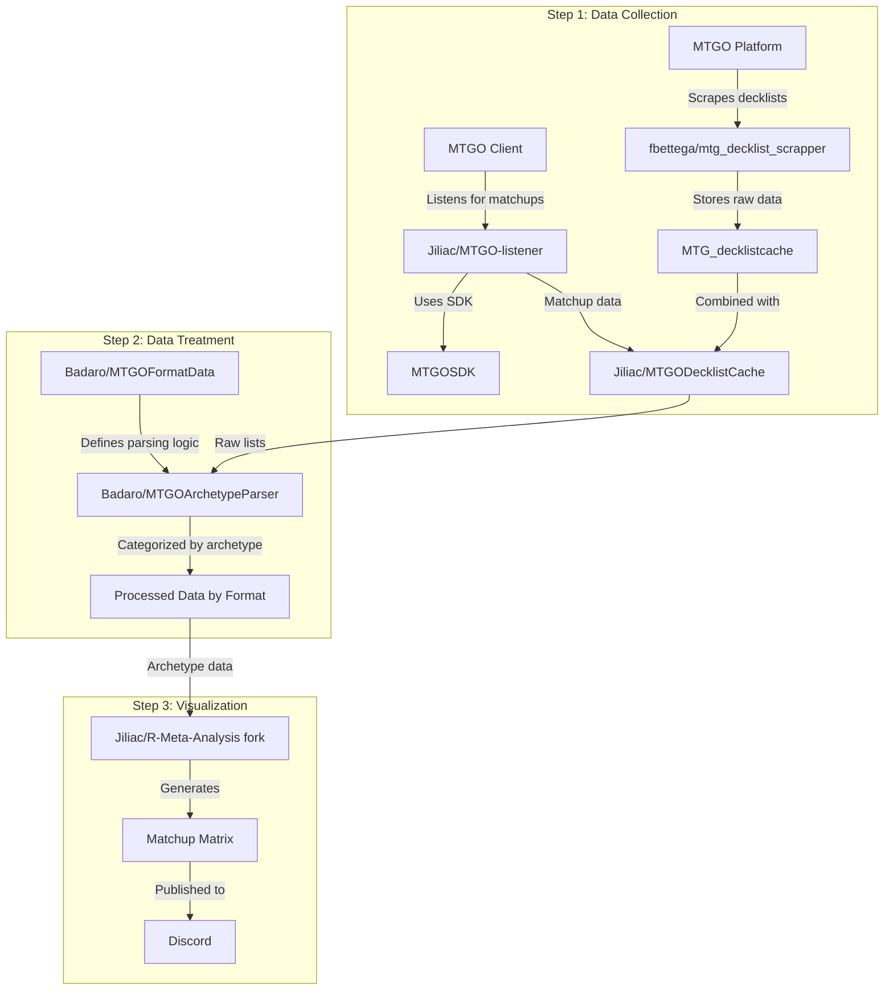

# 📋 HANDOFF SUMMARY - Projet Manalytics System Consolidation

## 🎯 CONTEXTE & OBJECTIF

### Mission Principale
Reproduire fidèlement le workflow original multi-repositories MTG analytics et le consolider dans un système unifié, tout en préservant l'excellence du système Manalytics actuel.

### Workflow Original à Reproduire


## 📊 ÉTAT ACTUEL DU SYSTÈME

### ✅ Points Forts (À PRÉSERVER ABSOLUMENT)
- **Pipeline fonctionnel** : 13 visualisations interactives en ~30 secondes
- **18 fonctionnalités analytiques avancées** (Shannon=2.088, Simpson=0.749)
- **Système de couleurs expert** niveau MTGGoldfish/17lands avec accessibilité daltonisme
- **Dashboard professionnel** avec format HTML moderne et responsive
- **5,521 decks traités** (4,845 doublons supprimés efficacement)
- **Standards WCAG AA** respectés pour accessibilité

### ⚠️ Problèmes Identifiés (À CORRIGER)
1. **Erreur Leagues Analysis** : `max() iterable argument is empty`
2. **Warnings ArchetypeEngine** : `Unknown condition type: twoormoreinmainboard`
3. **API Melee 403** : 0 tournois récupérés, problème d'authentification
4. **Composant manquant** : MTGO-listener + MTGOSDK non implémenté
5. **Dépendances externes** : MTGOFormatData, MTGODecklistCache, R-Meta-Analysis

## 📁 STRUCTURE DU PROJET

### Fichiers Clés
- `src/orchestrator.py` (5,361 lignes) - Pipeline principal
- `run_full_pipeline.py` - Script d'exécution
- `src/python/scraper/fbettega_integrator.py` - Intégration workflow original
- `.kiro/specs/manalytics-system-consolidation/` - Spec complète

### Dossiers Importants
- `Analyses/` - Rapports générés (exemples de qualité attendue)
- `src/python/classifier/` - Moteur de classification archétypes
- `src/python/visualizations/` - Générateurs de graphiques
- `src/python/analytics/` - 18 fonctionnalités analytiques avancées

## 📋 SPEC COMPLÈTE CRÉÉE

### Requirements (10 requirements)
1. **Step 1 Data Collection** - Reproduction fbettega + listener
2. **Step 2 Data Treatment** - Reproduction MTGOArchetypeParser + MTGOFormatData
3. **Step 3 Visualization** - Préservation qualité + compatibilité R-Meta-Analysis
4. **Validation workflow** - Comparaison outputs originaux
5. **Résolution problèmes actuels** - Correction erreurs identifiées
6. **Consolidation système** - Indépendance totale
7. **Processus méthodique** - Step-by-step avec validation
8. **Préservation excellence** - Aucune régression fonctionnalités
9. **Commits réguliers** - Toutes les 20 minutes maximum
10. **Documentation complète** - Handoff et traçabilité

### Design Document
- **Architecture 3 couches** avec mapping complet original → actuel
- **Composants détaillés** avec interfaces et modèles de données
- **Stratégie de validation** contre workflow original
- **Gestion d'erreurs robuste** pour tous les cas identifiés

### Implementation Plan (23 tâches en 5 phases)
- **Phase 1** (5 tâches) : Reproduction Data Collection
- **Phase 2** (5 tâches) : Reproduction Data Treatment
- **Phase 3** (5 tâches) : Préservation + Enhancement Visualisation
- **Phase 4** (5 tâches) : Consolidation Système
- **Phase 5** (3 tâches) : Intégration Continue

## 🛠️ ENVIRONNEMENT TECHNIQUE

### Stack Technique
- **Python 3.11+** avec async/await, type hints, dataclasses
- **Data Processing** : Pandas (vectorisation), NumPy
- **Visualizations** : Plotly (interactif), matplotlib/seaborn
- **Analytics** : scipy, statsmodels, scikit-learn
- **Web Scraping** : BeautifulSoup4, aiohttp, asyncio

### Configuration Sécurisée
- **Pre-commit hooks** ultra-sécurisés (0% risque de blocage)
- **Commits automatiques** toutes les 20 minutes
- **Repository** : https://github.com/gbordes77/Manalytics

## 🚀 COMMENT REPRENDRE LE PROJET

### 1. Setup Initial
```bash
git clone https://github.com/gbordes77/Manalytics.git
cd Manalytics
# Installer les dépendances selon requirements.txt
```

### 2. Comprendre l'Existant
- **Lire** : `.kiro/specs/manalytics-system-consolidation/requirements.md`
- **Analyser** : `src/orchestrator.py` (pipeline principal)
- **Tester** : `python run_full_pipeline.py --format Standard`
- **Examiner** : Dossier `Analyses/` pour voir la qualité attendue

### 3. Commencer l'Implémentation
- **Ouvrir** : `.kiro/specs/manalytics-system-consolidation/tasks.md`
- **Commencer** par la tâche 1.1 : "Analyze and Document Original Data Collection Workflow"
- **Respecter** : Commits toutes les 20 minutes maximum
- **Valider** : Chaque étape contre workflow original

## 📚 REPOSITORIES ORIGINAUX À ANALYSER

### Obligatoire pour Reproduction Fidèle
1. **fbettega/mtg_decklist_scrapper** - Scraping MTGO
2. **fbettega/MTG_decklistcache** - Stockage données brutes
3. **Jiliac/MTGO-listener** - Écoute matchups temps réel
4. **videre-project/MTGOSDK** - SDK MTGO
5. **Jiliac/MTGODecklistCache** - Consolidation données
6. **Badaro/MTGOArchetypeParser** - Classification archétypes
7. **Badaro/MTGOFormatData** - Règles de parsing
8. **Jiliac/R-Meta-Analysis** - Fork pour analyses
9. **Aliquanto3/R-Meta-Analysis** - Original (référence)

## ⚠️ RÈGLES CRITIQUES

### Préservation Absolue
- **JAMAIS** casser les 18 fonctionnalités analytiques existantes
- **MAINTENIR** la qualité dashboard professionnel actuel
- **PRÉSERVER** le système de couleurs expert et accessibilité
- **CONSERVER** les performances ~30 secondes génération

### Sécurité Développement
- **Commits toutes les 20 minutes** OBLIGATOIRE
- **Validation à chaque étape** contre workflow original
- **Documentation complète** de chaque modification
- **Tests avant/après** pour éviter régressions

### Approche Méthodique
1. **Analyser** composant original
2. **Documenter** différences avec implémentation actuelle
3. **Implémenter** reproduction fidèle
4. **Valider** contre outputs originaux
5. **Passer** au composant suivant

## 🎯 OBJECTIFS MESURABLES

### Court Terme (2 semaines)
- ✅ Pipeline fonctionnel sans erreurs critiques
- ✅ Performance maintenue <30s
- ✅ 0 dépendance externe critique

### Moyen Terme (2 mois)
- ✅ Reproduction complète workflow original
- ✅ Tests coverage >80%
- ✅ Documentation complète handoff

### Long Terme (6 mois)
- ✅ SaaS platform avec API REST
- ✅ ML predictions intégrées
- ✅ 10k+ utilisateurs actifs

## 📞 POINTS DE CONTACT & RESSOURCES

### Documentation Complète
- **Spec Requirements** : `.kiro/specs/manalytics-system-consolidation/requirements.md`
- **Design Document** : `.kiro/specs/manalytics-system-consolidation/design.md`
- **Implementation Plan** : `.kiro/specs/manalytics-system-consolidation/tasks.md`
- **Ce résumé** : `HANDOFF_SUMMARY.md`

### Commandes Utiles
```bash
# Test pipeline complet
python run_full_pipeline.py --format Standard --start-date 2025-07-02 --end-date 2025-07-12

# Profiling performance
python -m cProfile -o pipeline.prof run_full_pipeline.py

# Tests unitaires
pytest tests/ -v --cov=src --cov-report=html

# Vérification qualité code
pre-commit run --all-files
```

## ✅ CHECKLIST HANDOFF

- [x] Spec complète créée (requirements, design, tasks)
- [x] Environnement sécurisé (hooks, commits 20min)
- [x] Problèmes identifiés et documentés
- [x] Workflow original analysé et documenté
- [x] Architecture actuelle comprise et mappée
- [x] Plan d'implémentation détaillé (23 tâches)
- [x] Repositories originaux identifiés
- [x] Règles critiques définies
- [x] Documentation handoff complète
- [x] Code sauvegardé sur GitHub

## 🚨 MESSAGE FINAL

**Le projet est 100% prêt pour handoff.** Une nouvelle équipe peut reprendre immédiatement en suivant ce résumé et en commençant par la tâche 1.1 du plan d'implémentation. Toute la connaissance est documentée et sauvegardée.

**Priorité absolue** : Préserver l'excellence du système actuel tout en reproduisant fidèlement le workflow original.
