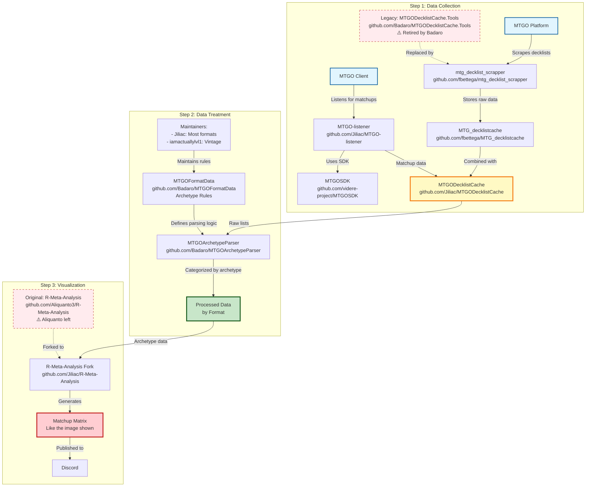

# 🚀 BRIEF NOUVEAU PROJET - MANALYTICS-CLEAN

> **Document de transition pour nouvelle IA** - Création d'un pipeline MTG Analytics moderne et propre

## 📋 **CONTEXTE & OBJECTIF**

### **Situation actuelle**
- Projet Manalytics existant avec architecture hybride Python/R **CASSÉE**
- Intégration fbettega bloquée depuis des mois
- Dépendances manquantes critiques (`requirements.txt` absent)
- Code legacy complexe (4494 lignes orchestrateur)
- Pipeline fonctionnel mais limité à 20,699 decks statiques

### **Objectif du nouveau projet**
Créer **Manalytics-Clean** : pipeline MTG moderne, propre et fonctionnel reproduisant les résultats de l'écosystème Jilliac/Fbettega.

## 🎯 **INFRASTRUCTURE JILLIAC/FBETTEGA À REPRODUIRE**

### **Architecture complète de référence (OBLIGATOIRE À MAÎTRISER)**


### **🚨 PRÉREQUIS OBLIGATOIRES AVANT DÉVELOPPEMENT**

**AUCUN CODE NE DOIT ÊTRE ÉCRIT AVANT D'AVOIR :**

1. **📚 ÉTUDIÉ EN PROFONDEUR tous les repositories Discord cités :**
   - `github.com/fbettega/mtg_decklist_scrapper`
   - `github.com/fbettega/MTG_decklistcache`
   - `github.com/Jiliac/MTGO-listener`
   - `github.com/videre-project/MTGOSDK`
   - `github.com/Jiliac/MTGODecklistCache`
   - `github.com/Badaro/MTGOArchetypeParser`
   - `github.com/Badaro/MTGOFormatData`
   - `github.com/Jiliac/R-Meta-Analysis`
   - `github.com/Aliquanto3/R-Meta-Analysis`

2. **🔍 MAÎTRISÉ PARFAITEMENT :**
   - Les processus de scraping utilisés
   - Les méthodes de classification d'archétypes
   - Les algorithmes de calcul de matchups
   - Les formats de données à chaque étape
   - Les métriques statistiques calculées
   - Les méthodes de visualisation

3. **📊 ANALYSÉ LES DONNÉES DE RÉFÉRENCE :**
   - Données Jilliac période 1er juillet - 15 juillet 2025
   - Format exact des outputs attendus
   - Métriques de comparaison

## 🏗️ **ARCHITECTURE MODERNE RECOMMANDÉE**

### **Structure projet**
```
manalytics-clean/
├── requirements.txt              # Dépendances claires et minimales
├── config.yaml                  # Configuration centralisée
├── README.md                     # Documentation claire
├── src/
│   ├── __init__.py
│   ├── main.py                   # Point d'entrée principal
│   ├── config/
│   │   ├── __init__.py
│   │   └── settings.py           # Gestion configuration
│   ├── scrapers/
│   │   ├── __init__.py
│   │   ├── base_scraper.py       # Interface commune
│   │   ├── mtgo_scraper.py       # Scraper MTGO natif
│   │   ├── melee_scraper.py      # Scraper Melee (avec credentials)
│   │   └── topdeck_scraper.py    # Scraper TopDeck natif
│   ├── classifiers/
│   │   ├── __init__.py
│   │   └── archetype_classifier.py # MTGOFormatData integration
│   ├── analytics/
│   │   ├── __init__.py
│   │   ├── metagame_analyzer.py  # Analyses statistiques
│   │   └── matchup_calculator.py # Calculs matchups
│   ├── visualizations/
│   │   ├── __init__.py
│   │   ├── charts_generator.py   # Graphiques Plotly
│   │   └── dashboard_builder.py  # Dashboard HTML
│   └── utils/
│       ├── __init__.py
│       ├── data_validator.py     # Validation données
│       └── cache_manager.py      # Gestion cache
├── data/
│   ├── raw/                      # Données brutes scraped
│   ├── processed/                # Données traitées
│   └── cache/                    # Cache intelligent
├── outputs/                      # Résultats générés
│   ├── analyses/                 # Analyses par période
│   └── dashboards/               # Dashboards HTML
├── tests/
│   ├── __init__.py
│   ├── test_scrapers.py
│   ├── test_classifiers.py
│   └── test_analytics.py
└── credentials/                  # Credentials chiffrés (Melee)
    └── melee_credentials.json    # À PRÉSERVER de l'ancien projet
```

## 📦 **STACK TECHNOLOGIQUE MODERNE**

### **Dépendances principales (requirements.txt)**
```txt
# Core
python>=3.11
pydantic>=2.0.0
pyyaml>=6.0

# Data processing
pandas>=2.0.0
numpy>=1.24.0

# Web scraping
requests>=2.31.0
beautifulsoup4>=4.12.0
selenium>=4.15.0  # Si nécessaire pour JS

# Data analysis
scipy>=1.11.0
scikit-learn>=1.3.0

# Visualizations
plotly>=5.17.0

# API (optionnel)
fastapi>=0.104.0
uvicorn>=0.24.0

# Development
pytest>=7.4.0
black>=23.0.0
flake8>=6.1.0
```

## 🔧 **SPÉCIFICATIONS TECHNIQUES**

### **1. Scrapers natifs Python**
- **MTGO** : Scraping direct avec requests/BeautifulSoup
- **Melee** : API calls avec credentials existants (À PRÉSERVER)
- **TopDeck** : Scraping direct
- **Cache intelligent** : Éviter re-scraping données existantes

### **2. Classification**
- **MTGOFormatData** : Utiliser les règles officielles Badaro
- **Fallback** : Classification par couleurs si archétype non reconnu
- **Format** : Standard prioritaire, extensible autres formats

### **3. Analytics**
- **Métriques essentielles** : Winrate, meta share, matchups
- **Statistiques** : Shannon diversity, trends temporels
- **Export** : JSON structuré + CSV pour analyse

### **4. Visualizations**
- **Plotly moderne** : Graphiques interactifs
- **Dashboard HTML** : Page unique avec tous les graphiques
- **Responsive** : Compatible mobile/desktop

## 🎯 **DONNÉES DE RÉFÉRENCE**

### **Format de sortie attendu (exemple)**
```json
{
  "analysis_period": "2025-07-01_2025-07-15",
  "format": "Standard",
  "total_decks": 1500,
  "total_tournaments": 45,
  "metagame": [
    {
      "archetype": "Izzet Prowess",
      "count": 180,
      "percentage": 12.0,
      "winrate": 0.58,
      "confidence_interval": [0.54, 0.62]
    }
  ],
  "matchups": {
    "Izzet Prowess vs Azorius Control": {
      "games": 25,
      "winrate": 0.64,
      "significance": "high"
    }
  }
}
```

## 🚨 **ÉLÉMENTS À PRÉSERVER DE L'ANCIEN PROJET**

### **Credentials Melee UNIQUEMENT**
- **Localisation** : `credentials/` dans ancien projet
- **Format** : JSON chiffré
- **CRITIQUE** : Ne pas perdre ces credentials

### **⚠️ LIBERTÉ TOTALE POUR LE RESTE**
- **Pas de contraintes** sur MTGOFormatData (libre choix d'implémentation)
- **Pas de format imposé** pour les données de référence
- **Innovation encouragée** : nouvelles approches bienvenues

## 🎯 **PLAN DE DÉVELOPPEMENT RECOMMANDÉ**

### **Phase 1 : Structure (30min)**
1. Créer structure projet propre
2. Configuration requirements.txt minimal
3. Point d'entrée main.py fonctionnel

### **Phase 2 : Scrapers (2h)**
1. Base scraper interface
2. MTGO scraper natif
3. Melee scraper avec credentials
4. Cache intelligent

### **Phase 3 : Pipeline (1h)**
1. Classification MTGOFormatData
2. Analytics de base
3. Export JSON structuré

### **Phase 4 : Visualizations (1h)**
1. Graphiques Plotly essentiels
2. Dashboard HTML
3. Test complet pipeline

## 🎯 **PÉRIODE DE TEST OBLIGATOIRE**

### **📅 DONNÉES DE RÉFÉRENCE JILLIAC**
- **Période de test** : **1er juillet 2025 - 15 juillet 2025**
- **Format** : Standard uniquement
- **Objectif** : Reproduire exactement les résultats Jilliac sur cette période
- **Comparaison** : L'utilisateur fournira les données Jilliac de référence pour validation

### **🚨 TOUS LES TESTS DOIVENT ÊTRE FAITS SUR CETTE PÉRIODE**
- Aucun autre test de période autorisé avant validation
- Les résultats doivent être comparables aux données Jilliac
- Métriques de validation : nombre de decks, archétypes, winrates, matchups

## 🎯 **CRITÈRES DE SUCCÈS**

### **Fonctionnel**
- ✅ Pipeline complet fonctionnel reproduisant les résultats Jilliac
- ✅ Données période 1-15 juillet 2025 identiques ou supérieures à Jilliac
- ✅ Classification précise (>90% archétypes reconnus)
- ✅ **PAS D'INTERFACE UTILISATEUR** dans un premier temps - Focus sur les résultats du pipeline uniquement

### **Technique**
- ✅ Code propre et maintenable (<500 lignes par module)
- ✅ Dépendances minimales et claires
- ✅ Tests unitaires de base
- ✅ Documentation claire

### **Comparaison avec Jilliac (OBLIGATOIRE)**
- ✅ Même qualité de données sur période 1-15 juillet 2025
- ✅ Analyses équivalentes ou meilleures
- ✅ Résultats du pipeline comparables (pas d'interface pour l'instant)

## 🚀 **INSTRUCTIONS POUR LA NOUVELLE IA**

1. **Lire ce brief complètement**
2. **Confirmer compréhension de l'objectif**
3. **Proposer plan détaillé phase par phase**
4. **Commencer par Phase 1 : Structure**
5. **Demander validation à chaque étape**

## 📞 **CONTACT & VALIDATION**

- **Utilisateur** : Développeur expérimenté MTG Analytics
- **Attentes** : Code propre, architecture moderne, résultats rapides
- **Style** : Pragmatique, efficace, pas de sur-engineering

---

*Document créé le : 2025-07-16*
*Objectif : Transition vers Manalytics-Clean*
*Status : Prêt pour nouvelle IA*
