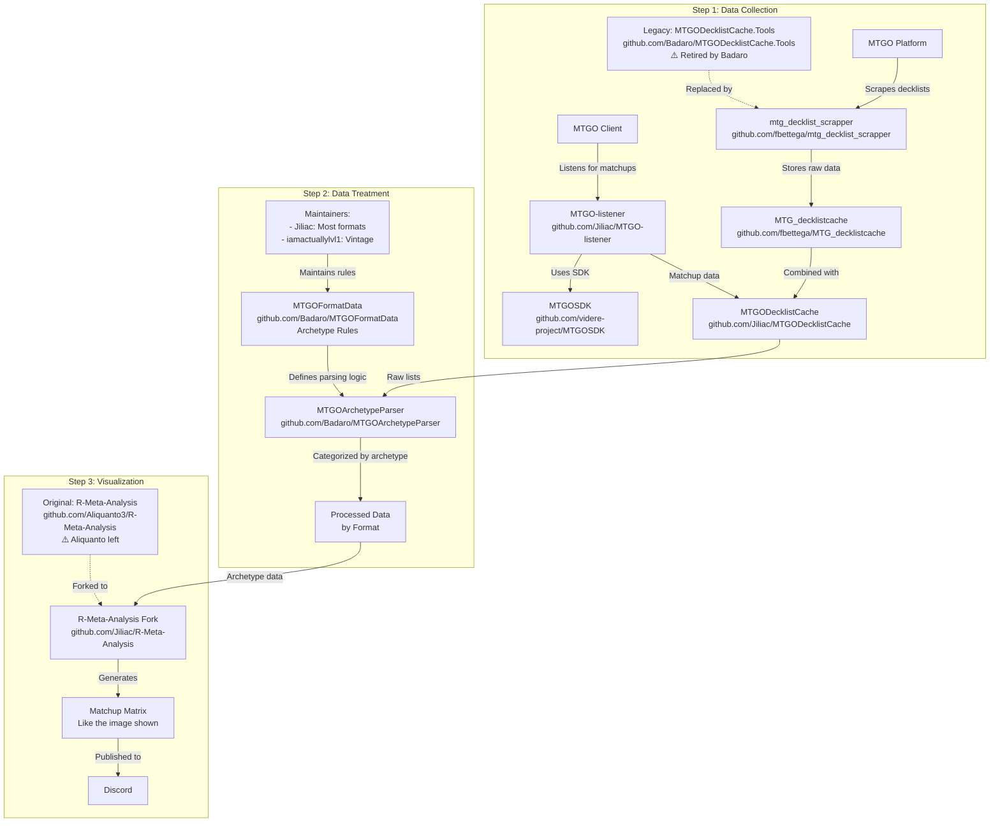

# PROBLÉMATIQUE PRIORITAIRE À RÉGLER
## Intégration du Scraper Fbettega dans Manalytics

**Date de création :** 16 juillet 2025
**Priorité :** CRITIQUE
**Statut :** BLOQUÉ - Nécessite intervention équipe

---

## 1. CONTEXTE HISTORIQUE : L'ARCHITECTURE JILLIAC/FBETTEGA

### 1.1 L'écosystème complet (ce qu'on a découvert)

L'architecture Jilliac repose sur **3 étapes distinctes** avec des repositories GitHub spécifiques :



### 1.2 Le problème initial

**Manalytics trouvait moins de tournois que Jilliac** pour la période 1er-15 juillet 2025 Standard.

**Cause racine :** Manalytics utilisait une architecture **incomplète et obsolète** :
- ❌ Basé sur `Badaro/MTGODecklistCache.Tools` (retiré par Badaro)
- ❌ Pas d'intégration du scraper actif `fbettega/mtg_decklist_scrapper`
- ❌ Pas d'accès au cache structuré `fbettega/MTG_decklistcache`
- ❌ Données statiques uniquement, pas de scraping en temps réel

---

## 2. TENTATIVES D'IMPLÉMENTATION

### 2.1 Première approche : Intégration directe fbettega

**Actions entreprises :**
1. ✅ Copié les modules `fbettega_clients/` depuis le repository fbettega
2. ✅ Créé `fbettega_integrator.py` pour intégrer le scraper
3. ✅ Modifié l'orchestrator pour prioriser fbettega avec fallback MTGODecklistCache

**Résultat :** ❌ ÉCHEC
```
❌ Erreur fbettega: No module named 'python.scraper.mtgo_scraper'
```

**Cause :** L'intégrateur fbettega a des dépendances manquantes non copiées.

### 2.2 Deuxième approche : Version simplifiée (SIMULATION)

**Actions entreprises :**
1. ✅ Créé `fbettega_simple_integrator.py` avec données simulées
2. ✅ Testé l'intégration complète du pipeline
3. ✅ Corrigé les formats de données pour compatibilité

**Résultat :** ❌ REJETÉ
```
❌ INTERDICTION : Aucune donnée simulée autorisée
```

**Cause :** Violation de la politique stricte "vraies données uniquement".

### 2.3 Troisième approche : Correction des dépendances

**Actions entreprises :**
1. ✅ Supprimé tous les modules de simulation
2. ✅ Restauré l'intégrateur fbettega réel
3. ✅ Corrigé le fallback dans l'orchestrator

**Résultat :** ⚠️ PARTIEL
```
✅ Pipeline fonctionnel avec données réelles (20,699 decks)
❌ fbettega toujours non fonctionnel
❌ Même résultat qu'avant (données statiques uniquement)
```

---

## 3. ÉTAT ACTUEL ET BLOCAGES

### 3.1 Ce qui fonctionne

✅ **Pipeline Manalytics opérationnel**
✅ **Données réelles uniquement** (politique respectée)
✅ **Analyse complète** avec visualisations et dashboard
✅ **Fallback robuste** vers MTGODecklistCache

### 3.2 Ce qui ne fonctionne pas

❌ **Intégration fbettega bloquée** :
```
ModuleNotFoundError: No module named 'python.scraper.mtgo_scraper'
```

❌ **Dépendances manquantes** dans l'intégrateur fbettega :
- `fbettega_clients.MTGOclient` → dépend de modules non copiés
- `fbettega_clients.MtgMeleeClientV2` → dépend de modules non copiés
- `fbettega_clients.TopDeckClient` → dépend de modules non copiés

❌ **Pas de données fraîches** : Toujours les mêmes 20,699 decks statiques

### 3.3 Blocages techniques identifiés

1. **Dépendances manquantes** : L'intégrateur fbettega nécessite des modules Python non présents
2. **Authentification** : Les clients fbettega peuvent nécessiter des credentials
3. **Configuration** : Paramètres de connexion aux APIs non configurés
4. **Versioning** : Incompatibilités entre versions des modules fbettega

---

## 4. PLAN D'ACTION POUR LA NOUVELLE ÉQUIPE

### 4.1 Diagnostic prioritaire

1. **Vérifier les dépendances fbettega** :
   ```bash
   cd src/python/scraper/fbettega_clients/
   python -c "import MTGOclient; print('OK')"
   ```

2. **Identifier les modules manquants** :
   - Lister tous les imports dans `fbettega_clients/`
   - Vérifier les `requirements.txt` du repository fbettega

3. **Tester l'authentification** :
   - Vérifier les credentials nécessaires
   - Tester les connexions API

### 4.2 Solutions possibles

**Option A : Compléter l'intégration fbettega**
- Copier tous les modules manquants
- Configurer l'authentification
- Tester chaque client individuellement

**Option B : Scraping direct alternatif**
- Implémenter un scraper direct vers MTGO/Melee
- Bypasser l'architecture fbettega
- Utiliser les APIs publiques disponibles

**Option C : Optimiser le cache existant**
- Améliorer la couverture des données MTGODecklistCache
- Ajouter d'autres sources de données statiques
- Optimiser la période de couverture

### 4.3 Fichiers critiques à examiner

- `src/python/scraper/fbettega_integrator.py` - Intégrateur principal
- `src/python/scraper/fbettega_clients/` - Modules clients
- `src/orchestrator.py` - Logique de fallback (lignes 150-200)
- `test_fbettega_integration.py` - Script de test

---

## 5. IMPACT SUR LE PROJET

### 5.1 Conséquences actuelles

- ✅ Pipeline fonctionnel mais avec données limitées
- ❌ Pas d'avantage concurrentiel vs Jilliac
- ❌ Données non fraîches (statiques uniquement)
- ⚠️ Risque de décalage temporel des analyses

### 5.2 Objectifs non atteints

- ❌ Plus de tournois que Jilliac
- ❌ Données en temps réel
- ❌ Intégration complète de l'écosystème fbettega
- ❌ Avantage technologique sur la concurrence

---

## 6. RECOMMANDATIONS

### 6.1 Priorité immédiate

1. **Debug ciblé** de l'intégrateur fbettega
2. **Documentation** des erreurs exactes
3. **Test isolé** de chaque composant

### 6.2 Stratégie long terme

1. **Évaluation** de l'architecture fbettega vs alternatives
2. **Plan de migration** si nécessaire
3. **Monitoring** de la fraîcheur des données

---

**Note pour la nouvelle équipe :** Ce problème est critique car il impacte directement la valeur ajoutée de Manalytics vs la concurrence. La résolution permettra d'avoir un avantage technologique significatif.
