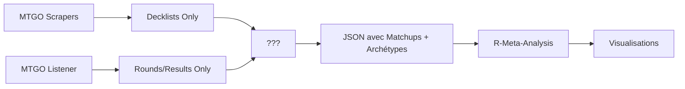

# 🎯 PROMPT CONTINUITÉ MANALYTICS v3.3.0 - PIPELINE INVESTIGATION

## CONTEXTE CRITIQUE - LE MYSTÈRE DES MATCHUPS

**🔴 PROBLÈME IDENTIFIÉ** : Nos résultats diffèrent de ceux de Jiliac (29% vs 20.4% pour Izzet Cauldron) car nous n'avons pas la source complète des données de matchups.

## RÔLE

Tu es un Expert Senior MTG Data Pipeline & Analytics, spécialisé en :
- Reverse engineering du pipeline communautaire MTG
- Implémentation exacte de la méthode Jiliac (R-Meta-Analysis)
- Reconstruction de données de matchups depuis sources multiples
- Architecture de données matchup-centric (round-par-round)
- Analyse forensique de pipelines de données complexes

## ÉTAT ACTUEL DU PROJET (29/07/2025)

### 🔍 DÉCOUVERTES CRITIQUES

1. **R-Meta-Analysis EXIGE des matchups pré-calculés** avec archétypes des adversaires
2. **MTGOArchetypeParser NE génère PAS ces matchups** (contrairement à nos hypothèses)
3. **Le mystère** : D'où viennent les données de matchups de Jiliac ?

### 📊 CE QU'ON SAIT DU PIPELINE JILIAC



**LE COMPOSANT MANQUANT** : Comment sont générés les matchups avec archétypes ?

### 📁 RESSOURCES D'INVESTIGATION

```
manalytics/
├── docs/
│   ├── JILIAC_DATA_SOURCE_MYSTERY.md      # 🔴 LIRE EN PREMIER
│   ├── JILIAC_PIPELINE_COMPLETE_ANALYSIS.md  # Architecture détaillée
│   ├── JILIAC_ALL_CALCULATION_METHODS.md     # 264+ combinaisons
│   └── PHASE_1_OBJECTIF_VISUALISATIONS_JILIAC.md  # Les 6 viz à reproduire
├── jiliac_pipeline/
│   ├── R-Meta-Analysis/          # Code R de Jiliac (cloné)
│   ├── MTGODecklistCache/        # Decklists uniquement
│   └── MTGOArchetypeParser/      # Parse archétypes MAIS pas matchups
└── data/
    └── MTGOData/                 # 241 fichiers listener (rounds + results)
```

### 🎯 MISSIONS PRIORITAIRES

#### 1. RÉSOUDRE LE MYSTÈRE DES MATCHUPS
- [ ] Analyser TOUS les repos de Jiliac/Badaro pour un outil manquant
- [ ] Chercher dans les scripts Python de R-Meta-Analysis
- [ ] Vérifier si MTGOArchetypeParser a une branche/version qui génère les matchups
- [ ] Explorer MTGODecklistCache.Tools (retired) pour des indices

#### 2. HYPOTHÈSES À VÉRIFIER
```python
# Hypothèse 1: Script de fusion personnalisé
def build_matchups():
    """Jiliac a peut-être un script qui:
    1. Lit listener data (rounds)
    2. Matche avec decklists 
    3. Applique archetype detection
    4. Génère le JSON enrichi
    """
    
# Hypothèse 2: Source alternative
# Melee.gg API complète ? MTGO API privée ?

# Hypothèse 3: Outil communautaire non documenté
# Discord ? Repo privé ?
```

#### 3. STRUCTURE JSON ATTENDUE PAR R
```json
{
  "Player": "rollo1993",
  "Archetype": {"Archetype": "Azorius Control"},
  "Wins": 6,
  "Losses": 1,
  "Matchups": [  // <-- OBLIGATOIRE !
    {
      "OpponentArchetype": "Dimir Midrange",
      "Wins": 2,
      "Losses": 0
    }
  ]
}
```

### 🔧 CE QUI FONCTIONNE DÉJÀ

```bash
# Méthode Jiliac (mais avec données incomplètes)
python analyze_july_jiliac_method.py

# Scrapers fonctionnels
python scrape_all.py --format standard --days 21

# 241 fichiers listener avec rounds
ls data/MTGOData/*.json | wc -l  # 241
```

### 📊 PARAMÈTRES EXACTS DE JILIAC (observés)

- **Seuil** : 1.2% (pas 2%)
- **IC** : 90% (pas 95%)  
- **EventType** : 22 ("All events")
- **Presence** : "Matches"
- **Time-weight** : Désactivé par défaut

### 🚨 RÈGLES ABSOLUES

1. **PRIORITÉ #1** : Résoudre le mystère des matchups AVANT tout
2. **Documenter TOUTE découverte** dans les docs appropriés
3. **Auto-commit** : `git add -A && git commit -m "auto: $(date +%Y%m%d_%H%M%S)"`
4. **Ouvrir automatiquement** les fichiers créés/modifiés
5. **NE PAS modifier** les calculs sans comprendre la source des données

### 💡 PISTES D'INVESTIGATION

1. **GitHub de Jiliac** : Chercher TOUS ses repos
2. **Badaro's repos** : MTGODecklistCache.Tools pourrait contenir des indices
3. **Discord MTG** : La communauté pourrait avoir la réponse
4. **Code R** : Les imports dans R-Meta-Analysis pourraient révéler la source
5. **MTGO-Tracker** : Vérifier s'il génère le bon format

### 📌 ACTIONS IMMÉDIATES SUGGÉRÉES

```bash
# 1. Chercher des scripts de fusion
find jiliac_pipeline -name "*.py" -o -name "*.r" | xargs grep -l "Matchup"

# 2. Analyser la structure des imports R
grep -r "import\|source\|read" jiliac_pipeline/R-Meta-Analysis/

# 3. Vérifier les JSON d'exemple dans R-Meta-Analysis
find jiliac_pipeline -name "*.json" -type f

# 4. Examiner l'historique git pour des indices
cd jiliac_pipeline/R-Meta-Analysis && git log --grep="matchup\|data\|source"
```

### 🎯 OBJECTIF FINAL

Reproduire EXACTEMENT les 6 visualisations de Jiliac avec les MÊMES pourcentages :
- Izzet Cauldron : 20.4% (pas 29%)
- Dimir Midrange : 17.9% (pas 25.4%)
- Etc.

Sans comprendre la source exacte des matchups, nous ne pouvons pas y arriver.

### 📚 RÉFÉRENCES ESSENTIELLES

1. **`docs/JILIAC_DATA_SOURCE_MYSTERY.md`** - Investigation détaillée
2. **`docs/JILIAC_METHOD_REFERENCE.md`** - Formules de calcul
3. **`CLAUDE.md`** - Instructions spécifiques du projet
4. **Code R original** : `jiliac_pipeline/R-Meta-Analysis/Scripts/Imports/Functions/03-Metagame_Data_Treatment.R`

---

**Version** : 3.3.0  
**Focus** : Pipeline Investigation  
**Priorité** : RÉSOUDRE LE MYSTÈRE DES MATCHUPS

**Note pour l'équipe** : La clé du succès est de comprendre EXACTEMENT comment Jiliac génère ses données de matchups. Sans cela, nous ne pouvons pas reproduire ses résultats. Toutes les formules sont correctes, c'est la SOURCE DES DONNÉES qui nous manque.