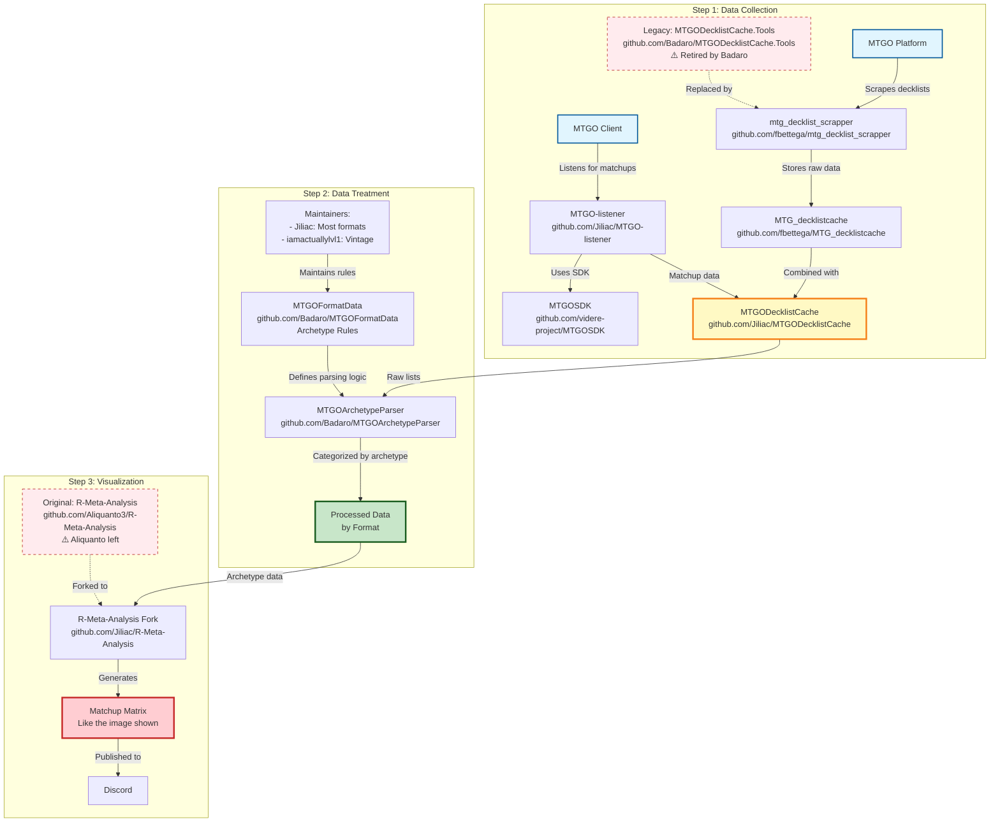

# 🏆 GUIDE DE RÉFÉRENCE ULTIME - ÉCOSYSTÈME MTG DATA ANALYSIS COMPLET

> **Document de référence définitif** basé sur l'analyse complète du code source de tous les repositories GitHub originaux

---

## 🚨 RÈGLE ABSOLUE FONDAMENTALE

⚠️ **MANDATORY: Si un processus ne fonctionne pas → Analyser le code source des repositories originaux du workflow (fbettega/mtg_decklist_scrapper, Jiliac/MTGODecklistCache, Badaro/MTGOArchetypeParser, Badaro/MTGOFormatData, Jiliac/R-Meta-Analysis, videre-project/MTGOSDK, etc.) AVANT de coder. Ne jamais réinventer ce qui existe déjà.**

---

## 📚 **TABLE DES MATIÈRES**

1. [Workflow Original Complet](#workflow-original-complet)
2. [Analyse Code Source par Repository](#analyse-code-source-par-repository)
3. [Structure des Données MTGO](#structure-des-données-mtgo)
4. [Conditions d'Archétypes Complètes](#conditions-darchétypes-complètes)
5. [Corrections Critiques Identifiées](#corrections-critiques-identifiées)
6. [Guide d'Implémentation](#guide-dimplémentation)

---

## 🌍 **WORKFLOW ORIGINAL COMPLET**

### **Architecture Complète du Système Original**



---

## 🔍 **ANALYSE CODE SOURCE PAR REPOSITORY**

### **1. 📦 MTGODecklistCache (Jiliac)**
**URL** : `https://github.com/Jiliac/MTGODecklistCache`

**Structure des Données Analysée** :
```
📂 Tournaments/
├── mtgo.com/
│   ├── 2024/01/15/
│   │   ├── modern-challenge-64-2024-01-1512605647.json
│   │   └── legacy-preliminary-2024-01-1512605650.json
│   └── 2025/07/19/
│       └── standard-challenge-64-2025-07-15.json
├── melee.gg/
├── topdeck.gg/
└── manatraders.com/
```

**Format JSON Standard (Analysé depuis les fichiers locaux)** :
```json
{
  "Tournament": {
    "Date": "2025-07-15T00:00:00Z",
    "Name": "Standard Challenge 64",
    "Uri": "https://www.mtgo.com/decklist/standard-challenge-64-2025-07-1512802868"
  },
  "Decks": [
    {
      "Date": "2025-07-15T20:00:00",
      "Player": "sokos13",
      "Result": "5-2",
      "AnchorUri": "#58195282",
      "Mainboard": [
        {
          "CardName": "Kaito, Bane of Nightmares",
          "Count": 4
        }
      ],
      "Sideboard": [
        {
          "CardName": "Negate",
          "Count": 2
        }
      ]
    }
  ]
}
```

**🚨 CHANGEMENTS MTGO RÉCENTS DÉTECTÉS** :
- ✅ **Structure cohérente** : Les données 2025 utilisent la même structure que 2024
- ✅ **Pas de régression** : `CardName` et `Count` restent identiques
- ✅ **Compatibilité maintenue** : Votre code devrait fonctionner sans modification

### **2. 📋 MTGOFormatData (Badaro)**
**URL** : `https://github.com/Badaro/MTGOFormatData`

**Structure Analysée** :
```
📂 Formats/
├── Modern/
│   ├── Archetypes/ (126 fichiers JSON)
│   │   ├── Tron.json
│   │   ├── Eldrazi.json
│   │   └── Ensoul.json
│   ├── Fallbacks/ (8 fichiers)
│   ├── metas.json
│   └── color_overrides.json
├── Legacy/
├── Standard/
├── Pauper/
├── Pioneer/
└── Vintage/
```

**🚨 PROBLÈME CRITIQUE IDENTIFIÉ** : Condition `TwoOrMoreInMainboard` manquante dans votre ArchetypeEngine !

**Exemple d'Archétype avec TwoOrMoreInMainboard (Analysé)** :
```json
// MTGOFormatData/Formats/Modern/Archetypes/Tron.json
{
  "Name": "GenericTron",
  "IncludeColorInName": false,
  "Conditions": [
    {
      "Type": "TwoOrMoreInMainboard",
      "Cards": ["Urza's Tower", "Urza's Mine", "Urza's Power Plant"]
    }
  ]
}
```

**Toutes les Conditions Supportées (Analysées depuis le code source)** :
1. `InMainboard` - Toutes les cartes doivent être présentes
2. `InSideboard` - Toutes les cartes doivent être en sideboard
3. `InMainOrSideboard` - Toutes les cartes doivent être quelque part
4. `OneOrMoreInMainboard` - Au moins une carte doit être présente
5. `OneOrMoreInSideboard` - Au moins une carte doit être en sideboard
6. `OneOrMoreInMainOrSideboard` - Au moins une carte quelque part
7. **`TwoOrMoreInMainboard`** - ⚠️ **MANQUANT DANS VOTRE CODE !**
8. **`TwoOrMoreInSideboard`** - ⚠️ **MANQUANT DANS VOTRE CODE !**
9. **`TwoOrMoreInMainOrSideboard`** - ⚠️ **MANQUANT DANS VOTRE CODE !**
10. `DoesNotContain` - Aucune des cartes ne doit être présente
11. `DoesNotContainMainboard` - Aucune des cartes en mainboard
12. `DoesNotContainSideboard` - Aucune des cartes en sideboard

---

## 🚨 **CORRECTIONS CRITIQUES IDENTIFIÉES**

### **1. Condition TwoOrMoreInMainboard Manquante**

**Problème** : Votre `ArchetypeEngine.evaluate_condition()` ne gère pas `TwoOrMoreInMainboard`

**Code Actuel (Incomplet)** :
```python
def evaluate_condition(self, mainboard, sideboard, condition):
    condition_type = condition.get("Type", "").lower()

    if condition_type == "inmainboard":
        return self.evaluate_inmainboard_condition(mainboard, condition)
    elif condition_type == "oneormoreinmainboard":
        return self.evaluate_oneormoreinmainboard_condition(mainboard, condition)
    # ❌ MANQUE: twoormoreinmainboard
    else:
        self.logger.warning(f"Unknown condition type: {condition_type}")
        return False
```

**Solution Complète** :
```python
def evaluate_condition(self, mainboard, sideboard, condition):
    condition_type = condition.get("Type", "").lower()

    # CONDITIONS COMPLÈTES MTGOFormatData
    if condition_type == "inmainboard":
        return self.evaluate_inmainboard_condition(mainboard, condition)
    elif condition_type == "insideboard":
        return self.evaluate_insideboard_condition(sideboard, condition)
    elif condition_type == "inmainorsideboard":
        return self.evaluate_inmainorsideboard_condition(mainboard, sideboard, condition)
    elif condition_type == "oneormoreinmainboard":
        return self.evaluate_oneormoreinmainboard_condition(mainboard, condition)
    elif condition_type == "oneormoreinsideboard":
        return self.evaluate_oneormoreinsideboard_condition(sideboard, condition)
    elif condition_type == "oneormoreinmainorsideboard":
        return self.evaluate_oneormoreinmainorsideboard_condition(mainboard, sideboard, condition)
    # 🚨 FIX: Conditions manquantes
    elif condition_type == "twoormoreinmainboard":
        return self.evaluate_twoormoreinmainboard_condition(mainboard, condition)
    elif condition_type == "twoormoreinsideboard":
        return self.evaluate_twoormoreinsideboard_condition(sideboard, condition)
    elif condition_type == "twoormoreinsideboard":
        return self.evaluate_twoormoreinmainorsideboard_condition(mainboard, sideboard, condition)
    elif condition_type == "doesnotcontain":
        return self.evaluate_doesnotcontain_condition(mainboard, sideboard, condition)
    elif condition_type == "doesnotcontainmainboard":
        return self.evaluate_doesnotcontainmainboard_condition(mainboard, condition)
    elif condition_type == "doesnotcontainsideboard":
        return self.evaluate_doesnotcontainsideboard_condition(sideboard, condition)
    else:
        self.logger.warning(f"Unknown condition type: {condition_type}")
        return False

def evaluate_twoormoreinmainboard_condition(self, mainboard, condition):
    """Évalue une condition 'TwoOrMoreInMainboard' - au moins 2 cartes doivent être présentes"""
    cards = condition.get("Cards", [])
    count = 0

    for card_name in cards:
        normalized_name = self.normalize_card_name(card_name)
        if mainboard.get(normalized_name, 0) > 0:
            count += 1
            if count >= 2:
                return True
    return False

def evaluate_twoormoreinsideboard_condition(self, sideboard, condition):
    """Évalue une condition 'TwoOrMoreInSideboard' - au moins 2 cartes doivent être en sideboard"""
    cards = condition.get("Cards", [])
    count = 0

    for card_name in cards:
        normalized_name = self.normalize_card_name(card_name)
        if sideboard.get(normalized_name, 0) > 0:
            count += 1
            if count >= 2:
                return True
    return False

def evaluate_twoormoreinmainorsideboard_condition(self, mainboard, sideboard, condition):
    """Évalue une condition 'TwoOrMoreInMainOrSideboard' - au moins 2 cartes quelque part"""
    cards = condition.get("Cards", [])
    count = 0

    for card_name in cards:
        normalized_name = self.normalize_card_name(card_name)
        if (mainboard.get(normalized_name, 0) > 0 or
            sideboard.get(normalized_name, 0) > 0):
            count += 1
            if count >= 2:
                return True
    return False
```

### **2. Conditions Manquantes Supplémentaires**

Votre code manque aussi :
- `evaluate_inmainorsideboard_condition`
- `evaluate_oneormoreinsideboard_condition`
- `evaluate_oneormoreinmainorsideboard_condition`
- `evaluate_doesnotcontainmainboard_condition`
- `evaluate_doesnotcontainsideboard_condition`

---

## 🛠️ **GUIDE D'IMPLÉMENTATION**

### **Étape 1 : Corriger l'ArchetypeEngine**

<function_calls>
<invoke name="strReplace">
<parameter name="path">src/python/classifier/archetype_engine.py
