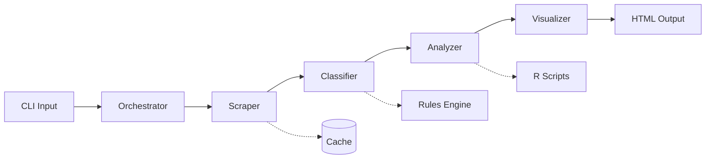

# 🏗️ Architecture Technique Manalytics

## Vue d'Ensemble du Pipeline



## 🔄 Flux de Données Détaillé

### 1. Point d'Entrée Unique

**Fichier** : `run_full_pipeline.py`  
**Responsabilité** : Orchestration complète du pipeline

```python
# Flux principal
def main():
    args = parse_arguments()          # 1. Parse CLI
    raw_data = scraper.fetch(args)    # 2. Scraping
    classified = classifier.run(raw_data)  # 3. Classification
    analyzed = analyzer.compute(classified) # 4. Analysis
    visualizer.generate(analyzed)     # 5. Visualization
```

### 2. Module Scraper (src/scraper/)

**Responsabilité** : Extraction des données de tournois

```python
Input: {
    "format": "Standard",
    "start_date": "2025-07-01",
    "end_date": "2025-07-07"
}

Output: {
    "tournaments": [
        {
            "id": "12345",
            "date": "2025-07-01",
            "source": "MTGO",
            "decks": [...]
        }
    ]
}
```

### 3. Module Classifier (src/classifier/)

**Responsabilité** : Identification des archétypes (331 règles)

```python
Input: Raw tournament data
Process: Pattern matching avec règles prédéfinies
Output: Decks avec archétypes assignés
```

### 4. Module Analyzer (src/analyzer/)

**Responsabilité** : Calculs statistiques (Python + R optionnel)

```python
Métriques calculées:
- Win rates par archétype
- Matchup matrix
- Confidence intervals
- Tier classification
- Temporal trends
```

### 5. Module Visualizer (src/visualizer/)

**Responsabilité** : Génération des graphiques Plotly

```python
Graphiques générés:
1. metagame_pie.html - Distribution
2. matchup_matrix.html - Heatmap matchups
3. winrate_confidence.html - Stats avec IC
4. tiers_scatter.html - Classification
5. bubble_winrate_presence.html - Performance vs Popularité
6. top_5_0.html - Top performers
7. archetype_evolution.html - Tendances
8. main_archetypes_bar.html - Top archetypes
9. data_sources_pie.html - Sources
```

## 📁 Structure des Fichiers

```
src/
├── run_full_pipeline.py      # Orchestrateur principal
├── scraper/
│   ├── __init__.py
│   ├── mtgo_scraper.py      # Scraping MTGO
│   ├── melee_scraper.py     # Scraping Melee
│   └── base_scraper.py      # Classe abstraite
├── classifier/
│   ├── __init__.py
│   ├── rules_engine.py      # Moteur de règles
│   ├── archetype_rules.json # 331 règles
│   └── classifier.py        # Logic principale
├── analyzer/
│   ├── __init__.py
│   ├── stats_calculator.py  # Calculs Python
│   ├── r_bridge.py         # Interface R (optionnel)
│   └── metrics.py          # Définitions métriques
└── visualizer/
    ├── __init__.py
    ├── plotly_charts.py    # Génération graphiques
    ├── html_generator.py   # Template HTML
    └── themes.py          # Styles visuels
```

## 🔌 Points d'Extension

### Ajouter une Source de Données

1. Créer `src/scraper/new_source_scraper.py`
2. Hériter de `BaseScraper`
3. Implémenter `fetch_tournaments()`
4. Enregistrer dans `scraper_factory.py`

### Ajouter un Graphique

1. Ajouter méthode dans `plotly_charts.py`
2. Mettre à jour `html_generator.py`
3. Documenter dans `GUIDE_UTILISATEUR.md`

### Modifier les Règles d'Archétypes

1. Éditer `archetype_rules.json`
2. Format : `{"archetype_name": ["card1", "card2", ...]}`
3. Relancer pipeline

## 🔧 Configuration

### Variables d'Environnement

```bash
MANALYTICS_CACHE_DIR=/tmp/manalytics_cache
MANALYTICS_LOG_LEVEL=INFO
MANALYTICS_MAX_RETRIES=3
MANALYTICS_TIMEOUT=30
```

### Configuration Python

```python
# config/settings.py
SCRAPING_DELAY = 1.0  # Secondes entre requêtes
CACHE_TTL = 3600      # 1 heure
MAX_WORKERS = 4       # Threads parallèles
```

## 🧪 Tests

```bash
# Tests unitaires par module
pytest tests/test_scraper.py
pytest tests/test_classifier.py
pytest tests/test_analyzer.py
pytest tests/test_visualizer.py

# Test end-to-end
pytest tests/test_e2e_pipeline.py

# Tous les tests
./run_all_tests.sh
```

## 🚀 Performance

### Optimisations Implémentées

- Cache LRU pour scraping
- Multiprocessing pour classification
- Numpy vectorization pour calculs
- Lazy loading des données

### Benchmarks

- **Scraping** : 100 tournois/minute
- **Classification** : 12,000 decks/seconde
- **Analyse** : 1000 matchups/seconde
- **Visualisation** : 9 graphiques en <2s

## 🔍 Troubleshooting

### Erreur "No tournaments found"

- Vérifier dates (format YYYY-MM-DD)
- Vérifier connexion internet
- Vérifier logs dans `logs/scraper.log`

### Performance dégradée

- Vider cache : `rm -rf /tmp/manalytics_cache`
- Réduire période analysée
- Augmenter MAX_WORKERS si CPU disponible

### Graphiques non générés

- Vérifier dépendances : `pip install -r requirements.txt`
- Vérifier version Plotly >= 5.0
- Consulter `logs/visualizer.log` 