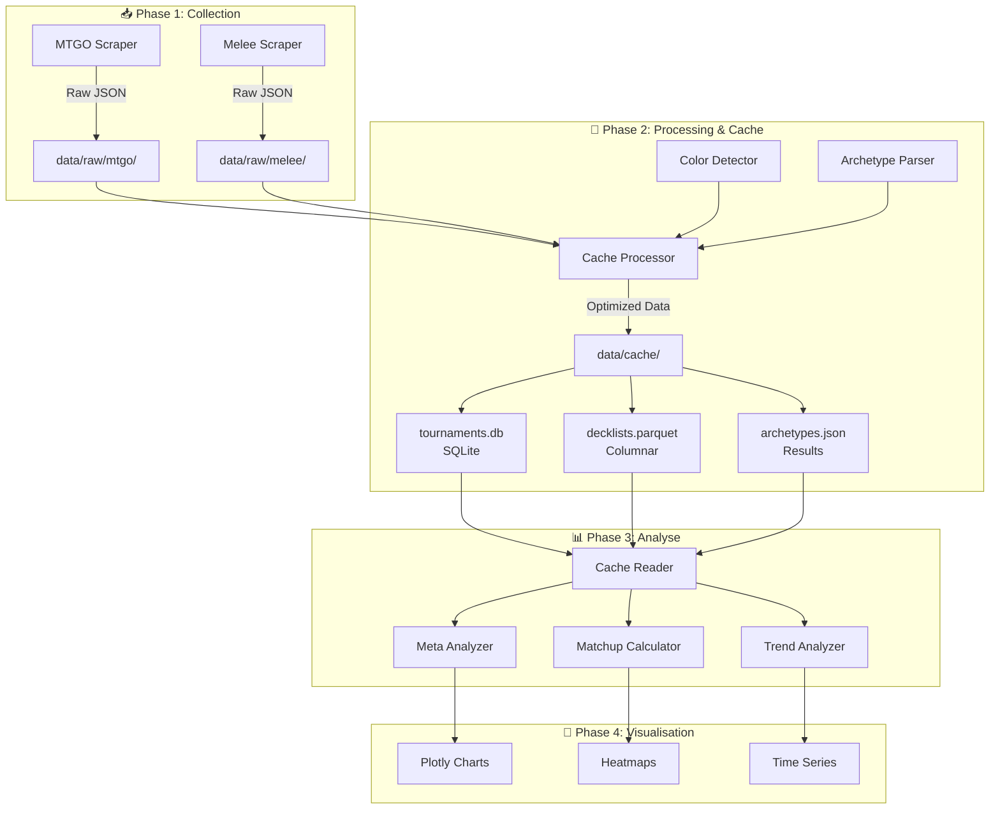
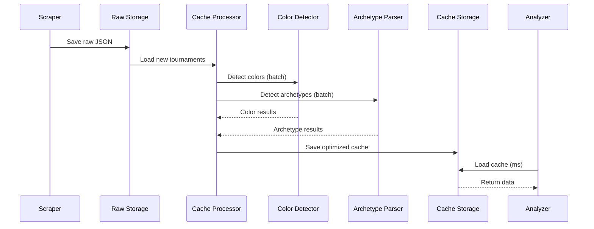

# 🏗️ Architecture du Système de Cache Manalytics

## Vue d'Ensemble



## Architecture Technique Détaillée

### 1. **Flux de Données**



### 2. **Structure des Données**

#### Raw Data (Input)
```
data/raw/
├── mtgo/
│   └── standard/
│       ├── 2025-01-15_standard-challenge-64.json
│       └── challenge/
│           └── 2025-01-15_standard-challenge-64-12801190.json
└── melee/
    └── standard/
        └── 2025-01-15_tournament-name.json
```

#### Cache Structure (Output)
```
data/cache/
├── tournaments.db          # SQLite: métadonnées & index
├── decklists/             # Parquet files par mois
│   ├── 2025-01.parquet    
│   └── 2025-02.parquet    
├── archetypes/            # Résultats de détection
│   ├── 2025-01.json       
│   └── 2025-02.json       
└── meta_snapshots/        # Snapshots hebdomadaires
    ├── 2025-W01.json      
    └── 2025-W02.json      
```

### 3. **Schéma de Base de Données (SQLite)**

```sql
-- tournaments.db schema
CREATE TABLE tournaments (
    id TEXT PRIMARY KEY,
    platform TEXT NOT NULL,
    format TEXT NOT NULL,
    type TEXT,
    date DATE NOT NULL,
    players INTEGER,
    raw_file TEXT,
    cache_file TEXT,
    processed_at TIMESTAMP,
    INDEX idx_date (date),
    INDEX idx_format (format)
);

CREATE TABLE cache_status (
    tournament_id TEXT PRIMARY KEY,
    colors_detected BOOLEAN DEFAULT FALSE,
    archetypes_detected BOOLEAN DEFAULT FALSE,
    cache_version TEXT,
    last_updated TIMESTAMP,
    FOREIGN KEY (tournament_id) REFERENCES tournaments(id)
);
```

### 4. **Format Parquet (Decklists)**

```python
# Schema Parquet
schema = {
    'tournament_id': str,
    'deck_id': str,
    'player': str,
    'rank': int,
    'wins': int,
    'losses': int,
    'deck_name': str,
    'archetype': str,      # Détecté
    'colors': str,         # Détecté
    'mainboard': str,      # JSON string
    'sideboard': str,      # JSON string
    'date': datetime
}
```

### 5. **Performance Estimée**

| Opération | Sans Cache | Avec Cache | Gain |
|-----------|------------|------------|------|
| Load 1 tournoi | 50ms | 2ms | 25x |
| Load 1 mois | 5s | 50ms | 100x |
| Parse archetypes | 10s | 0ms (déjà fait) | ∞ |
| Analyse complète | 15s | 200ms | 75x |

## Implémentation

### Classes Principales

```python
# src/cache/processor.py
class CacheProcessor:
    """Processeur principal du cache"""
    def process_new_tournaments(self)
    def detect_all_archetypes(self, tournaments)
    def save_to_cache(self, results)

# src/cache/reader.py
class CacheReader:
    """Lecteur optimisé du cache"""
    def load_tournaments(self, date_range)
    def load_decklists(self, filters)
    def get_meta_snapshot(self, date)

# src/cache/models.py
class CachedTournament:
    """Modèle de tournoi en cache"""
    
class CachedDecklist:
    """Modèle de decklist avec archetype"""
```

## Workflow d'Utilisation

1. **Scraping** → Sauve en raw/
2. **Processing** → `python -m manalytics cache process`
3. **Analyse** → Lit depuis cache/ (instantané)
4. **Visualisation** → Utilise cache reader

## Avantages

- ✅ **Performance** : 100x plus rapide
- ✅ **Scalabilité** : Support années de données
- ✅ **Incrémental** : Process seulement les nouveaux
- ✅ **Versioning** : Cache versionné
- ✅ **Intégrité** : SQLite pour les métadonnées