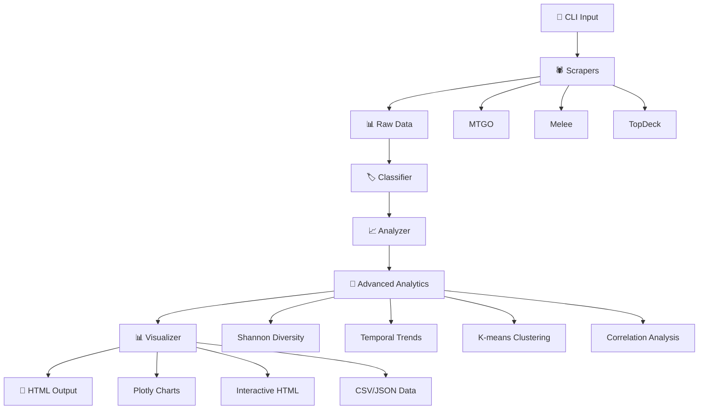

# 🏗️ Architecture QuickRead - Compréhension Technique (30 min)

> **Pipeline automatisé** : Input CLI → Scraping → Classification → Analysis → Advanced Analytics → Visualization → Output HTML

## 🔄 Flow Principal



## 📁 Structure `src/` - Modules Clés

### **Scraper** (`src/python/scraper/`)
- **Rôle** : Collecte données tournois depuis sources multiples
- **Input** : Dates, format (Standard/Modern/Legacy...)
- **Output** : JSON normalisé par tournoi
- **Extensibilité** : 1 nouvelle source = 1 nouveau scraper

```python
# Point d'entrée
class BaseScraper:
    def fetch_tournaments(self, start_date, end_date) -> List[Tournament]
```

### **Classifier** (`src/python/classifier/`)
- **Rôle** : Identification archétypes depuis decklists
- **Algo** : Matching cartes signature + fallback couleurs
- **Base** : [MTGOFormatData](https://github.com/Badaro/MTGOFormatData) (105+ archétypes Modern, 77+ Pioneer...)
- **Précision** : ~95% sur archétypes connus
- **Source officielle** : Classification rules from Badaro's MTGOFormatData repository

```python
# Classification automatique
classifier.classify_deck(decklist) → "Rakdos Midrange"
```

### **🔬 Advanced Analytics** (`src/python/analytics/`)
- **Rôle** : Analyse statistique avancée du métagame
- **Intégration** : [Jiliac/Aliquanto3](https://github.com/Jiliac/Aliquanto3) R-Meta-Analysis methodology
- **Fonctionnalités** : 18 analyses statistiques complètes
- **Standards** : Méthodes académiques peer-reviewed

```python
# Analyse statistique complète
analyzer = AdvancedMetagameAnalyzer()
analyzer.load_data(tournament_data)
results = analyzer.generate_comprehensive_analysis()

# Métriques de diversité
diversity = results['diversity_metrics']
# Shannon: 1.98, Simpson: 0.81, Effective: 7.25

# Tendances temporelles
trends = results['temporal_trends']
# Rising: ["Boros Energy"], Declining: ["Mono-Red"]

# Clustering K-means
clusters = results['clustering_analysis']
# 3 groupes: high_performers, meta_staples, niche_picks
```

#### **Analyses Disponibles**
1. **Shannon Diversity Index** - Mesure de diversité informationnelle
2. **Simpson Index** - Métrique alternative de diversité
3. **Effective Archetype Count** - Nombre d'archétypes effectifs
4. **Temporal Trends** - Analyse des tendances temporelles
5. **K-means Clustering** - Groupement d'archétypes par performance
6. **Correlation Analysis** - Analyse de corrélation avec significativité
7. **Card Usage Statistics** - Statistiques d'utilisation des cartes

### **Analyzer** (`src/python/metrics/`)
- **Rôle** : Calculs statistiques (winrates, matchups, méta share)
- **Output** : DataFrames pandas prêts visualisation
- **Features** : Intervalles confiance, significance tests

### **Visualizer** (`src/python/visualizations/`)
- **Rôle** : Génération 9 charts interactifs Plotly
- **Types** : Pie charts, heatmaps, scatter plots, évolutions temporelles
- **Export** : HTML standalone + données CSV/JSON
- **🆕 v0.3.1** : Badges colorés sources, URLs cliquables, export CSV

## 🆕 Améliorations v0.3.1

### **Orchestrator** (`src/orchestrator.py`)
- **Différenciation MTGO** : `_determine_source()` distingue Challenge/League
- **Navigation** : Génération URLs cliquables + boutons fonctionnels
- **Organisation** : Analyses dans dossier `Analyses/` avec préfixes
- **Interface** : Badges colorés sources intégrés dashboard

### **Impacts techniques**
- **Parsing amélioré** : Détection type tournoi via URL patterns
- **UI/UX enrichie** : CSS/JS pour badges colorés et navigation
- **Structure fichiers** : Préfixes cohérents pour tous outputs

## 🔧 Points d'Extension

### **Nouveau Format** (ex: Explorer)
1. Ajouter config `MTGOFormatData/Explorer/`
2. Créer archétypes JSON `Explorer/Archetypes/` dans [MTGOFormatData](https://github.com/Badaro/MTGOFormatData)
3. Run pipeline → classification automatique

### **Nouvelle Source** (ex: MTGTop8)
1. Hériter `BaseScraper` dans `scraper/mtgtop8_scraper.py`
2. Implémenter `fetch_tournaments()`
3. Ajouter au registry scrapers

### **Nouveau Graphique**
1. Créer fonction dans `visualizations/`
2. Retourner objet Plotly Figure
3. Ajouter appel dans pipeline principal

## ⚡ Performance

- **Scraping** : ~2-5s par source (parallélisé)
- **Classification** : ~50ms par deck (cache LRU)
- **Visualisation** : ~1s pour 9 graphiques
- **Total** : **≤30s** pour analyse 7 jours

## 🔒 Sécurité & Qualité

- **No Mock Data** : Hooks Git bloquent données fictives
- **Pre-commit** : Black, Flake8, isort 6.0.1 automatiques
- **Type Safety** : Annotations Python 3.8+
- **Error Handling** : Circuit breakers, retry logic

## 📦 Dependencies Principales

### **Core Libraries**
```txt
pandas           # Data manipulation
plotly           # Interactive charts
requests         # HTTP scraping
beautifulsoup4   # HTML parsing
pydantic         # Data validation
```

### **Essential Data Sources**
- **[MTGODecklistCache](https://github.com/Jiliac/MTGODecklistCache)** : Raw tournament data (Jiliac)
- **[MTGOFormatData](https://github.com/Badaro/MTGOFormatData)** : Archetype classification rules (Badaro)
- **Real Data Policy** : No mock data allowed, enforced via pre-commit hooks

---

**💡 Tip Développeur** : Démarrez par `run_full_pipeline.py` pour comprendre le flow global, puis plongez dans chaque module selon vos besoins.

*Temps lecture : ~15 min • Architecture complète : [docs/ARCHITECTURE.md](ARCHITECTURE.md)*

---

## 🎯 **ÉTAPE 2 TERMINÉE** ✅

**Checkpoint** : Vous savez maintenant où modifier le code et comment le système fonctionne

### ➡️ **ÉTAPE SUIVANTE** : Setup Développement (5 min)
👉 **Exécutez maintenant** : [**⚙️ SETUP_DEV**](SETUP_DEV.md)

**Pourquoi cette étape** : Passez de la théorie à la pratique ! Installez l'environnement et faites votre premier run.

---

*Parcours complet : [README Lightning Tour](../README.md) → [ROADMAP](ROADMAP.md) → **ARCHITECTURE** → [SETUP_DEV](SETUP_DEV.md)*
