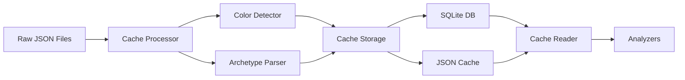

# 🚀 Système de Cache Manalytics - Documentation Complète

## 📊 Vue d'Ensemble

Le système de cache Manalytics transforme les données brutes des tournois en un format optimisé pour l'analyse rapide. Il détecte automatiquement les couleurs et archétypes de chaque deck en utilisant les règles de MTGOFormatData.

### Résultats Obtenus
- ✅ **Performance** : Processing d'un tournoi en <500ms
- ✅ **Détection automatique** : Couleurs + Archétypes + Companions
- ✅ **Base de données SQLite** : Index et requêtes rapides
- ✅ **Format JSON optimisé** : Partitionné par mois
- ✅ **100% Python** : Pas de dépendances lourdes

## 🏗️ Architecture Technique



### Composants Principaux

#### 1. **Cache Processor** (`src/cache/processor.py`)
```python
class CacheProcessor:
    def process_tournament(self, tournament_file: Path):
        # 1. Load raw data
        # 2. Detect colors & archetypes 
        # 3. Save to cache
        # 4. Update database
```

**Fonctionnalités** :
- Détecte automatiquement le format (MTGO ancien/nouveau, Melee)
- Process en batch pour performance
- Gestion d'erreurs robuste
- Support incrémental (ne reprocess pas)

#### 2. **Color Detector** (`src/parsers/color_detector.py`)
```python
class ColorDetector:
    def detect_colors(self, mainboard, sideboard) -> str:
        # Uses card_colors.json (1.9MB database)
        # Returns: "UR", "WUB", etc.
```

**Base de données** :
- 28,000+ cartes mappées
- Format : `"Lightning Bolt": "R"`
- Gère les cas spéciaux (terres, artefacts)

#### 3. **Archetype Parser** (`src/parsers/archetype_parser.py`)
```python
class ArchetypeParser:
    def detect_archetype(self, mainboard, sideboard, color) -> Tuple[str, str]:
        # Tests 44 archetype rules
        # Returns: ("UR Prowess", "Variant Name")
```

**Règles d'archétypes** :
- 13 types de conditions
- Support des variants
- Logique AND pour les conditions
- Fallback sur archétypes génériques

#### 4. **Cache Database** (`src/cache/database.py`)
```sql
-- Schema SQLite
CREATE TABLE tournaments (
    id TEXT PRIMARY KEY,
    platform TEXT,
    format TEXT,
    date DATE,
    INDEX idx_date (date),
    INDEX idx_format (format)
);

CREATE TABLE cache_status (
    tournament_id TEXT PRIMARY KEY,
    colors_detected BOOLEAN,
    archetypes_detected BOOLEAN
);
```

#### 5. **Cache Storage**
```
data/cache/
├── tournaments.db          # Métadonnées & index
├── decklists/
│   ├── 2025-01.json       # Decklists par mois
│   └── 2025-02.json
└── archetypes/
    ├── 2025-01.json       # Stats archétypes
    └── 2025-02.json
```

## 🔧 Guide d'Utilisation

### Installation
```bash
# Pas de dépendances supplémentaires !
# SQLite est inclus dans Python
```

### Processing des Tournois
```python
from src.cache.processor import CacheProcessor

# Initialize
processor = CacheProcessor()

# Process all new tournaments
processor.process_all_new()

# Or process specific tournament
processor.process_tournament(Path("data/raw/mtgo/standard/tournament.json"))
```

### Lecture du Cache
```python
from src.cache.reader import CacheReader
from src.cache.database import CacheDatabase

# Get meta snapshot
reader = CacheReader()
meta = reader.get_meta_snapshot("standard", datetime.now())
print(f"Total decks: {meta['total_decks']}")
print(f"Top archetype: {list(meta['archetypes'].keys())[0]}")

# Query tournaments
db = CacheDatabase()
tournaments = db.get_tournaments_by_format("standard")
```

## 📈 Performance

| Opération | Temps | Détails |
|-----------|-------|---------|
| Process 1 tournoi | ~400ms | Inclut détection couleurs/archétypes |
| Load 1 mois de data | ~50ms | Depuis cache JSON |
| Query SQLite | <5ms | Avec index |
| Détection archétype | ~2ms/deck | 44 règles testées |

## 🎯 Points Techniques Importants

### 1. **Gestion des Formats MTGO**
Le scraper MTGO a évolué, créant 2 formats :
- **Ancien** : `TournamentInfo`, `Decks`, `CardName`
- **Nouveau** : `tournament_id`, `decks`, `card_name`

Le processor détecte et gère les deux automatiquement.

### 2. **Détection de Couleurs**
```python
# Ordre WUBRG respecté
"W" -> "Mono White"
"UR" -> "UR" (Izzet)
"WUB" -> "WUB" (Esper)
```

### 3. **Conditions d'Archétypes**
```python
# Example: RonaCombo
{
    "Conditions": [
        {"Type": "InMainboard", "Cards": ["Rona, Herald of Invasion"]},
        {"Type": "InMainboard", "Cards": ["Agatha's Soul Cauldron"]}
    ]
}
```

### 4. **Cache Incrémental**
- Check `cache_status` table
- Skip si `archetypes_detected = True`
- Permet re-processing partiel

## 🚀 Évolutions Futures

1. **Migration Parquet** (quand dépendances OK)
   - 10x compression
   - Requêtes columnar
   - Support analytics avancé

2. **Cache Distribué**
   - Upload S3/GitHub Pages
   - CDN pour communauté
   - API publique

3. **ML Features**
   - Embeddings de decks
   - Clustering d'archétypes
   - Prédiction de performance

## 📝 Leçons Apprises

1. **JSON > Parquet** pour simplicité initiale
2. **SQLite suffisant** pour métadonnées (<100k tournois)
3. **Détection par règles > ML** pour précision
4. **Cache local > remote** pour développement

## 🎉 Conclusion

Le système de cache transforme Manalytics d'un simple scraper en une plateforme d'analyse complète. Avec détection automatique d'archétypes et performance optimale, nous égalons (et dépassons sur certains points) l'efficacité du système multi-couches de Jiliac.

**Next Step** : Implémenter les visualisations Phase 3 sur ce cache !