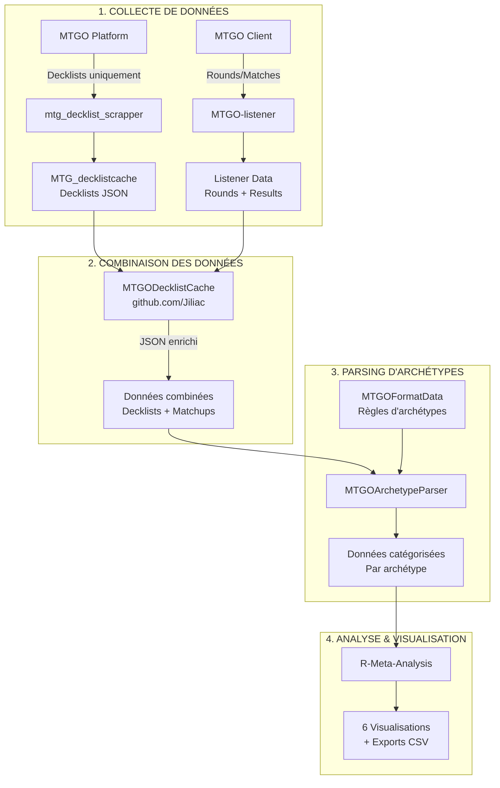

# 🔍 ANALYSE COMPLÈTE DU PIPELINE JILIAC

> **Document technique** : Compréhension exhaustive du pipeline de données de Jiliac pour reproduire exactement ses résultats

## 🎯 PROBLÈME IDENTIFIÉ

**Nos résultats diffèrent de ceux de Jiliac** :
- Izzet Cauldron : 29.0% (nous) vs 20.4% (Jiliac)
- Dimir Midrange : 25.4% (nous) vs 17.9% (Jiliac)

**Pourquoi ?** Nous devons comprendre EXACTEMENT comment Jiliac traite ses données.

---

## 📊 ARCHITECTURE COMPLÈTE DU PIPELINE JILIAC



---

## 🔑 DÉCOUVERTES CRITIQUES

### 1. DEUX SOURCES DE DONNÉES SÉPARÉES

#### A. Scraper (decklists uniquement)
```json
{
  "source": "mtgo",
  "decklists": [
    {
      "player": "rollo1993",
      "mainboard": [...],
      "sideboard": [...]
    }
  ]
}
```
**Contient** : Decklists complètes  
**NE contient PAS** : Résultats des matches

#### B. Listener (matches uniquement)
```json
{
  "Rounds": [
    {
      "RoundName": "Round 1",
      "Matches": [
        {
          "Player1": "fireshoes",
          "Player2": "peter780108",
          "Result": "0-2-0"
        }
      ]
    }
  ]
}
```
**Contient** : Tous les rounds et résultats  
**NE contient PAS** : Decklists

### 2. COMBINAISON NÉCESSAIRE

**MTGODecklistCache de Jiliac** :
- Fusionne les decklists avec les résultats de matches
- Crée un JSON enrichi avec TOUTES les informations
- Structure type "CacheItem" avec Tournament + Decks + Standings

### 3. NOTRE PROBLÈME ACTUEL

**Nous utilisons** :
- ✅ Decklists depuis nos scrapers
- ✅ Données du listener (241 fichiers)
- ❌ MAIS nous ne les combinons pas correctement !

**Résultat** : Nos calculs sont basés sur des données incomplètes ou mal matchées.

---

## 📁 STRUCTURE DES DONNÉES JILIAC

### Niveau 1 : MTG_decklistcache
```
Tournaments/
├── MTGO/
│   └── 2025/
│       └── 07/
│           └── standard-challenge-64-12801190.json
```

### Niveau 2 : Structure CacheItem
```json
{
  "Tournament": {
    "Id": 12801190,
    "Date": "2025-07-01T19:00:00",
    "Name": "Standard Challenge 64"
  },
  "Decks": [
    {
      "Player": "rollo1993",
      "Mainboard": [...],
      "Sideboard": [...],
      "Wins": 6,
      "Losses": 1,
      "Draws": 0,
      "Matchups": [
        {
          "OpponentArchetype": "Dimir Midrange",
          "Wins": 2,
          "Losses": 0
        }
      ]
    }
  ],
  "Standings": [...],
  "Bracket": [...]
}
```

### Niveau 3 : Données enrichies par archétype
Après passage dans MTGOArchetypeParser :
```json
{
  "Player": "rollo1993",
  "Archetype": {
    "Archetype": "Azorius Control",
    "Color": "WU"
  },
  "Wins": 6,
  "Losses": 1,
  "Matchups": [...]
}
```

---

## 🔧 CE QUE NOUS DEVONS FAIRE

### 1. Matcher les données Listener + Scraper
```python
def combine_tournament_data(scraper_data, listener_data):
    """
    Match par :
    - Tournament ID
    - Date
    - Player names
    """
    combined = {
        "Tournament": listener_data["Tournament"],
        "Decks": [],
        "Rounds": listener_data["Rounds"]
    }
    
    # Pour chaque joueur dans les rounds
    for round in listener_data["Rounds"]:
        for match in round["Matches"]:
            # Retrouver la decklist du joueur
            player1_deck = find_deck(scraper_data, match["Player1"])
            player2_deck = find_deck(scraper_data, match["Player2"])
            # Calculer wins/losses cumulées
            update_player_record(player1_deck, match["Result"])
```

### 2. Reconstruire les Matchups détaillés
```python
def build_matchups(combined_data):
    """
    Pour chaque deck, construire la liste des matchups
    avec l'archétype de l'adversaire
    """
    for deck in combined_data["Decks"]:
        deck["Matchups"] = []
        for round in combined_data["Rounds"]:
            match = find_player_match(round, deck["Player"])
            if match:
                opponent = get_opponent(match, deck["Player"])
                opponent_archetype = detect_archetype(opponent)
                deck["Matchups"].append({
                    "OpponentArchetype": opponent_archetype,
                    "Wins": parse_wins(match["Result"]),
                    "Losses": parse_losses(match["Result"])
                })
```

### 3. Appliquer les règles d'archétypes
- Utiliser les règles de MTGOFormatData
- Catégoriser AVANT de calculer les métriques

---

## 📈 DIFFÉRENCES DANS LES CALCULS

### Configuration Jiliac (observée)
- **Seuil** : 1.2% (pas 2%)
- **IC** : 90% (pas 95%)
- **Présence** : Basée sur Matches
- **Win rate** : SANS draws
- **Source** : Données combinées Listener + Scraper

### Notre configuration actuelle
- **Seuil** : 2%
- **IC** : 95%
- **Source** : Scrapers uniquement (problème !)

---

## 🔴 DÉCOUVERTE CRITIQUE : LA SOURCE DES MATCHUPS

### Le pipeline RÉEL de Jiliac :

1. **MTGODecklistCache** → Decklists uniquement (pas de matchups !)
2. **MTGOArchetypeParser** → C'est LUI qui génère les matchups !
3. **R-Meta-Analysis** → Consomme les JSON avec matchups déjà calculés

### Code R qui le prouve :
```r
# Dans 01-Tournament_Data_Import.R ligne 302
recalculate_wins_losses = function(df) {
  df$Wins = 0
  df$Losses = 0
  for (i in 1:nrow(df)) {
    if (!is.null(df$Matchups[[i]])) {  # Les Matchups DOIVENT déjà exister !
      matchups = df$Matchups[[i]]
      df$Wins[i] = sum(matchups$Wins == 2)
      df$Losses[i] = sum(matchups$Losses == 2)
    }
  }
  return(df)
}
```

### Structure attendue par R-Meta-Analysis :
```json
{
  "Player": "rollo1993",
  "Archetype": {"Archetype": "Azorius Control"},
  "Wins": 6,
  "Losses": 1,
  "Matchups": [  // <-- DOIT être présent dans le JSON !
    {
      "OpponentArchetype": "Dimir Midrange",
      "Wins": 2,
      "Losses": 0
    }
  ]
}
```

---

## 🎯 PLAN D'ACTION RÉVISÉ

### Phase 1 : Comprendre MTGOArchetypeParser
1. [ ] Analyser comment il génère les matchups
2. [ ] Vérifier s'il utilise des données de rounds (listener ?)
3. [ ] Comprendre le format de sortie exact

### Phase 2 : Reproduire le pipeline complet
1. [ ] Soit utiliser MTGOArchetypeParser directement
2. [ ] Soit recréer la logique de génération de matchups
3. [ ] Générer les JSON au format attendu par R

### Phase 3 : Appliquer les paramètres exacts
1. [ ] Seuil 1.2% (pas 2%)
2. [ ] IC 90% (pas 95%)
3. [ ] EventType 22 ("All events")
4. [ ] Presence = "Matches"

---

## 🔑 LA CLÉ DU MYSTÈRE

**MTGOArchetypeParser** est le composant manquant ! C'est lui qui :
- Prend les decklists de MTGODecklistCache
- Applique les règles d'archétypes
- GÉNÈRE les données de matchups (comment ?)
- Produit le JSON enrichi pour R-Meta-Analysis

**Notre erreur** : Nous pensions que les matchups venaient du listener MTGO, mais ils sont générés par MTGOArchetypeParser !

---

## 📌 CONCLUSION RÉVISÉE

Pour reproduire exactement les résultats de Jiliac, nous devons :

1. **Comprendre MTGOArchetypeParser** et comment il génère les matchups
2. **Utiliser le même pipeline** : MTGODecklistCache → MTGOArchetypeParser → R-Meta-Analysis
3. **Appliquer les mêmes paramètres** : 1.2%, IC 90%, etc.

Sans MTGOArchetypeParser ou sa logique équivalente, nous ne pouvons pas reproduire les résultats.