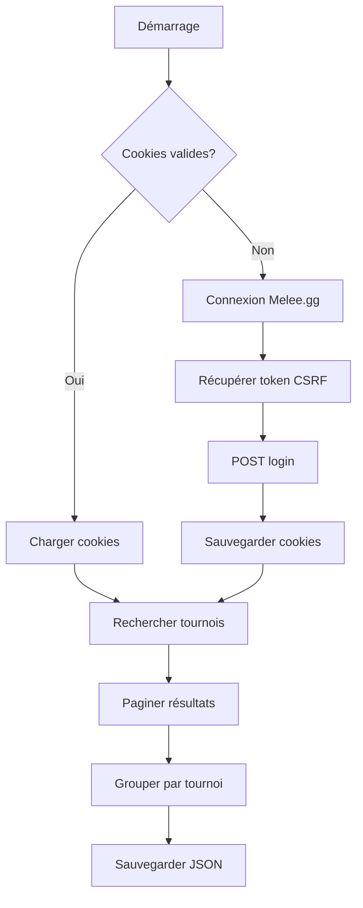

# 🎯 Guide Complet du Scraping Melee.gg

## 📋 Table des Matières
1. [Vue d'ensemble](#vue-densemble)
2. [Architecture du Scraper](#architecture-du-scraper)
3. [Processus d'Authentification](#processus-dauthentification)
4. [Scripts et Fichiers](#scripts-et-fichiers)
5. [Guide d'Utilisation](#guide-dutilisation)
6. [Dépannage](#dépannage)
7. [Points Techniques Importants](#points-techniques-importants)

## 🔍 Vue d'ensemble

Le scraper Melee.gg récupère les données de tournois Magic: The Gathering depuis la plateforme Melee.gg. Il utilise une authentification par cookies et peut récupérer des milliers de decklists.

### Résultats obtenus (25 juillet 2025)
- **15 tournois Standard** récupérés
- **5,362 decklists** au total
- Période : 30 derniers jours
- Tournoi majeur inclus : "Magic Spotlight: FINAL FANTASY" (2,286 decks!)

## 🏗️ Architecture du Scraper

### Composants Principaux

```
scrape_melee_working_v2.py
├── MtgMeleeClient (classe principale)
│   ├── ensure_authenticated()     # Gère l'authentification
│   ├── search_tournaments()       # Recherche les tournois
│   ├── get_deck()                # Récupère les détails d'un deck
│   └── _build_payload()          # Construit les requêtes API
│
└── main()                        # Orchestrateur principal
```

### Flux de Données



## 🔐 Processus d'Authentification

### 1. Vérification des Cookies
```python
# Les cookies sont valides pendant 21 jours
# Stockés dans: api_credentials/melee_cookies.json
{
    "cookies": {
        ".AspNet.ApplicationCookie": "...",
        "__RequestVerificationToken": "..."
    },
    "_timestamp": 1721875200.0
}
```

### 2. Authentification Complète
1. **GET** `https://melee.gg/Account/SignIn`
   - Récupère le token CSRF depuis le formulaire HTML
   
2. **POST** `https://melee.gg/Account/SignInPassword`
   - Headers AJAX requis
   - Payload : email, password, __RequestVerificationToken
   
3. **Vérification** : Cookie `.AspNet.ApplicationCookie` présent

### 3. Credentials
Fichier : `api_credentials/melee_login.json`
```json
{
  "login": "email@example.com",
  "mdp": "password"
}
```

## 📁 Scripts et Fichiers

### Scripts Principaux

#### 1. `scrape_melee_working_v2.py`
Le scraper principal fonctionnel. Basé sur le code original qui marchait.

**Caractéristiques** :
- Gestion automatique de l'authentification
- Pagination complète des résultats
- Sauvegarde par tournoi
- Gestion des erreurs robuste

#### 2. `test_melee_auth_simple.py`
Script de test pour vérifier l'authentification.

**Utilité** :
- Tester la connexion
- Vérifier les credentials
- Débugger les problèmes d'auth

### Fichiers de Configuration

```
api_credentials/
├── melee_login.json      # Credentials de connexion
└── melee_cookies.json    # Cookies sauvegardés (auto-généré)

data/raw/melee/standard/  # Dossier de sortie des tournois
```

## 🚀 Guide d'Utilisation

### Installation des Prérequis
```bash
# Installer les dépendances Python
pip install requests beautifulsoup4
```

### Utilisation Simple
```bash
# Scraper les tournois Standard des 30 derniers jours
python3 scrape_melee_working_v2.py
```

### Personnalisation
```python
# Dans scrape_melee_working_v2.py, modifier :

# Format à scraper
FORMAT = "Standard"  # Ou "Modern", "Legacy", etc.

# Période
end_date = datetime.now()
start_date = end_date - timedelta(days=30)  # Changer le nombre de jours

# Dossier de sortie
OUTPUT_DIR = f"data/raw/melee/{FORMAT.lower()}"
```

### Exemple de Sortie
```
🎯 Scraping Melee.gg - Format: Standard
📅 Période: 2025-06-25 à 2025-07-25

🔍 Recherche des tournois...
✅ Cookies valides chargés
Page 1: 50 entrées trouvées
Page 2: 50 entrées trouvées
...

📊 15 tournois Standard trouvés

📥 Traitement: Magic Spotlight: FINAL FANTASY
   2286 decks trouvés
   💾 Sauvegardé: 2025-06-27_Magic-Spotlight-FINAL-FANTASY.json
```

## 🔧 Dépannage

### Problèmes Courants

#### 1. Réponse Vide
**Symptôme** : "Réponse vide reçue"
**Solution** : Les cookies ont expiré, supprimer `melee_cookies.json`

#### 2. Réponse HTML au lieu de JSON
**Symptôme** : "<!DOCTYPE html>" dans la réponse
**Solution** : Le scraper va automatiquement se réauthentifier

#### 3. Erreur de Connexion
**Symptôme** : "Échec de connexion"
**Solutions** :
- Vérifier les credentials dans `melee_login.json`
- Vérifier la connexion internet
- Attendre quelques minutes (rate limiting)

### Debug Avancé
```bash
# Tester uniquement l'authentification
python3 test_melee_auth_simple.py

# Vérifier les cookies
cat api_credentials/melee_cookies.json | python -m json.tool
```

## ⚙️ Points Techniques Importants

### 1. Headers Critiques
```python
# Pour l'authentification (POST login)
"X-Requested-With": "XMLHttpRequest"
"Content-Type": "application/x-www-form-urlencoded; charset=UTF-8"

# Pour la recherche de tournois
"Accept": "application/json, text/javascript, */*; q=0.01"
```

### 2. Payload de Recherche
Le payload contient 15 colonnes de configuration pour DataTables :
- **Column 1** : Game = "MagicTheGathering" (filtrage obligatoire)
- **Column 6** : SortDate avec format "YYYY-MM-DD|YYYY-MM-DD"
- **Order** : Par date décroissante
- **Pagination** : 50 résultats par page

### 3. Gestion de la Pagination
```python
while True:
    # draw = numéro de requête (incrémenté)
    # start = offset (0, 50, 100...)
    # recordsFiltered = total de résultats
```

### 4. Structure des Données Récupérées
```json
{
  "TournamentId": 12345,
  "TournamentName": "Nom du Tournoi",
  "TournamentStartDate": "2025-07-20T00:00:00.000Z",
  "OrganizationName": "Organisateur",
  "FormatDescription": "Standard",
  "Decks": [
    {
      "DecklistId": "guid-unique",
      "PlayerName": "Joueur",
      "Rank": 1,
      "Wins": 5,
      "IsValid": true
    }
  ]
}
```

## 📝 Notes Importantes

1. **Rate Limiting** : Le scraper inclut un délai de 0.5s entre les pages
2. **Cookies** : Validité de 21 jours, réutilisés automatiquement
3. **Token CSRF** : Récupéré à chaque nouvelle session
4. **Formats** : Le scraper filtre par format (Standard, Modern, etc.)
5. **Doublons** : Gérés via un set de GUIDs uniques

## 🎉 Conclusion

Ce scraper est robuste et a fait ses preuves. Il peut récupérer des milliers de decklists de manière fiable. L'authentification par cookies permet de contourner les limitations et d'accéder à toutes les données publiques de Melee.gg.

**Dernière mise à jour** : 25 juillet 2025
**Testé et fonctionnel** : ✅