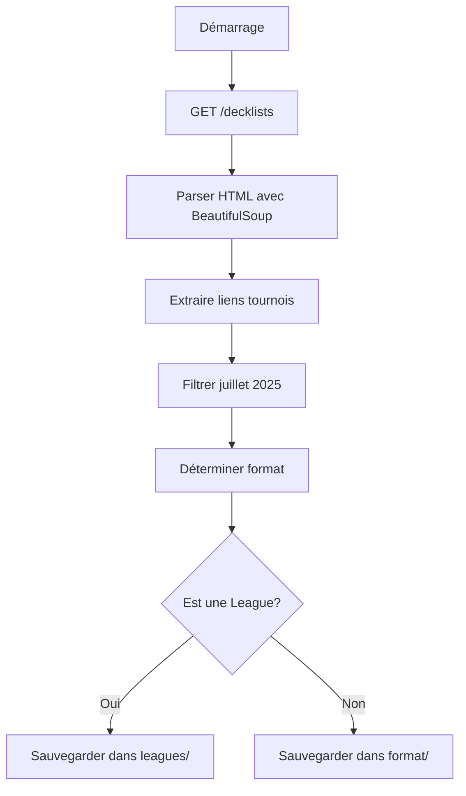

# 🎮 Guide Complet du Scraping MTGO

## 📋 Table des Matières
1. [Vue d'ensemble](#vue-densemble)
2. [Architecture du Scraper](#architecture-du-scraper)
3. [Processus de Scraping](#processus-de-scraping)
4. [Scripts et Fichiers](#scripts-et-fichiers)
5. [Guide d'Utilisation](#guide-dutilisation)
6. [Organisation des Données](#organisation-des-données)
7. [Points Techniques Importants](#points-techniques-importants)

## 🔍 Vue d'ensemble

Le scraper MTGO récupère les données de tournois Magic: The Gathering depuis le site officiel www.mtgo.com. Il parse les pages HTML pour extraire les informations des tournois et les organise par format.

### Résultats obtenus (25 juillet 2025)
- **358 tournois** trouvés pour juillet 2025
- **53 tournois Standard** 
- **Leagues séparées** dans des dossiers dédiés
- Challenges avec IDs uniques préservés

## 🏗️ Architecture du Scraper

### Composants Principaux

```
scrape_mtgo_standalone.py
├── MTGOScraper (classe principale)
│   ├── get_july_tournaments()     # Récupère les tournois de juillet
│   ├── save_tournaments()         # Sauvegarde les données
│   └── _get_format()             # Détermine le format
│
└── main()                        # Orchestrateur principal
```

### Flux de Données



## 🌐 Processus de Scraping

### 1. Récupération de la Page Principale
```python
url = "https://www.mtgo.com/decklists"
response = session.get(url)
```

### 2. Extraction des Tournois
- Parse tous les liens avec `/decklist/` dans l'URL
- Filtre ceux qui ne sont pas des redirections `/en/`
- Extrait le texte qui contient nom et date

### 3. Parsing des Dates
```python
# Format trouvé : "Tournament Name\nJuly 25 2025"
text = link.text.replace('\n', ' ').strip()
if 'July' in text and '2025' in text:
    # Extraction du jour et création date ISO
```

### 4. Organisation par Format
- Standard, Modern, Legacy, Pioneer, Pauper, Vintage
- Détection automatique basée sur le nom du tournoi
- **IMPORTANT** : Les leagues sont automatiquement détectées et placées dans `leagues/`

## 📁 Scripts et Fichiers

### Script Principal

#### `scrape_mtgo_standalone.py`
Le scraper autonome qui fonctionne sans dépendances complexes.

**Caractéristiques** :
- Aucune authentification requise (site public)
- Parse HTML simple avec BeautifulSoup
- Gestion automatique des formats
- Séparation des leagues

### Structure de Sortie

```
data/raw/mtgo/
├── standard/
│   ├── challenge/
│   │   ├── 20250701_Standard_Challenge_64_12843370.json
│   │   └── ...
│   ├── leagues/
│   │   ├── 2025-07-01_standard_league.json
│   │   └── ...
│   └── 20250711_Standard_RC_Qualifier_1112802761.json
├── modern/
│   ├── challenge/
│   └── leagues/
└── ...
```

## 🚀 Guide d'Utilisation

### Installation des Prérequis
```bash
# Installer les dépendances Python
pip install requests beautifulsoup4
```

### Utilisation Simple
```bash
# Scraper tous les tournois de juillet 2025
python3 scrape_mtgo_standalone.py
```

### Personnalisation
```python
# Dans scrape_mtgo_standalone.py :

# Pour changer la période (actuellement juillet 2025)
if 'July' in text and '2025' in text:
    # Modifier pour un autre mois/année

# Pour filtrer un format spécifique
# Ajouter après la ligne 69 :
if scraper._get_format(t['name']) != 'standard':
    continue
```

### Exemple de Sortie
```
🎯 Scraping MTGO tournaments for July 2025
==================================================
Fetching: https://www.mtgo.com/decklists
Found 1426 total tournament links
First 5 tournaments:
  - Standard League
  - Standard League
  - Modern Challenge 32
  - Legacy Challenge 32
  - Standard League

✅ Found 358 July 2025 tournaments

📊 Summary by format:
  standard: 53 tournaments
  modern: 71 tournaments
  legacy: 48 tournaments
  pioneer: 42 tournaments
  pauper: 48 tournaments
  vintage: 48 tournaments
  limited: 48 tournaments

✅ Saved 358 tournament files
```

## 📂 Organisation des Données

### 1. Détection des Leagues
```python
# Les leagues sont détectées par le nom
if 'league' in name_lower:
    # Sauvegardé dans format/leagues/
```

### 2. Détection des Challenges
```python
# Les challenges ont des patterns spécifiques
if 'challenge' in name_lower and tournament_id.isdigit():
    # Sauvegardé dans format/challenge/
```

### 3. Structure JSON Sauvegardée
```json
{
  "source": "mtgo",
  "format": "standard",
  "name": "Standard Challenge 64",
  "date": "2025-07-01",
  "url": "https://www.mtgo.com/decklist/standard-challenge-64-2025-07-0112843370",
  "tournament_id": "12843370",
  "scraped_at": "2025-07-25T10:30:00.123456"
}
```

## ⚙️ Points Techniques Importants

### 1. IDs de Tournois MTGO
- **JAMAIS séquentiels** - Écarts de 5, 10, 17 entre tournois du même jour
- **Uniques par tournoi** - Préservés dans le nom de fichier
- **Pattern Challenge** : `{date}_{format}_challenge_{size}_{id}.json`

### 2. Parsing HTML
```python
# Structure HTML typique
<a href="/decklist/standard-challenge-64-2025-07-0112843370">
    Standard Challenge 64
    July 1 2025
</a>
```

### 3. Gestion des Formats
- Détection basée sur le nom (case insensitive)
- Format "other" pour les non reconnus
- Duel Commander géré spécialement

### 4. Performance
- Un seul GET request principal
- Pas de rate limiting nécessaire
- Traitement local rapide

## 📝 Notes Importantes

1. **Pas d'authentification** : MTGO est public, contrairement à Melee
2. **IDs préservés** : Critiques pour l'unicité des tournois
3. **Leagues séparées** : Requête explicite de l'utilisateur respectée
4. **Date multi-ligne** : Gérée avec `.replace('\n', ' ')`
5. **358 tournois** : Volume important pour juillet 2025

## ⚠️ Leçons Apprises

### NE JAMAIS :
- Deviner ou générer des IDs MTGO
- Mélanger leagues et tournois réguliers
- Ignorer le format du tournoi

### TOUJOURS :
- Parser la page officielle pour les vrais IDs
- Séparer les leagues dans leurs dossiers
- Préserver l'ID original dans le nom de fichier

## 🎉 Conclusion

Ce scraper MTGO est simple, efficace et ne nécessite aucune authentification. Il a successfully récupéré 358 tournois de juillet 2025 avec une organisation claire par format et une séparation appropriée des leagues.

**Dernière mise à jour** : 25 juillet 2025
**Testé et fonctionnel** : ✅