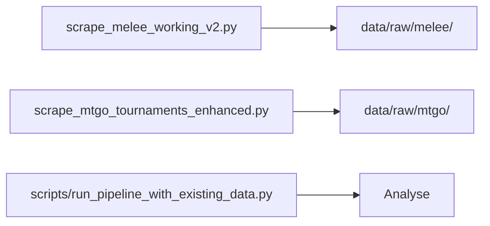
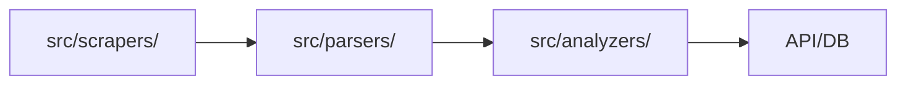

# 🔍 Analyse Complète du Projet Manalytics

## 📊 Vue d'Ensemble de l'État Actuel

### Statistiques Globales
- **Fichiers Python** : 189 fichiers
- **Données scrapées** : 72 fichiers JSON
- **Scrapers actifs** : MTGO et Melee
- **État du projet** : Mix de code legacy et nouveau

## 🗂️ Structure des Dossiers et leur Rôle

### 1. **Racine du Projet** - Fichiers de Scraping
```
/
├── scrape_melee_working_v2.py     ✅ ACTIF - Scraper Melee fonctionnel (25/07)
├── scrape_mtgo_tournaments_enhanced.py ✅ ACTIF - Scraper MTGO avec IDs uniques
├── test_melee_auth_simple.py      ✅ ACTIF - Test d'auth Melee
├── scrape_melee_simple.py         ❌ TEST - Version simplifiée non finalisée
├── scrape_melee_tournaments_*.py  ❌ OBSOLÈTE - Anciennes versions
├── test_melee_*.py                ❌ TESTS - Multiples tentatives de debug
└── debug_*.py                     ❌ DEBUG - Fichiers de debug temporaires
```

### 2. **src/** - Code Source Principal
```
src/
├── api/                    ✅ ACTIF - API FastAPI
│   ├── app.py             - Point d'entrée API
│   ├── auth.py            - JWT authentication
│   └── routes/            - Endpoints REST
│
├── scrapers/              ⚠️ MIXTE - Scrapers officiels
│   ├── mtgo_scraper.py    ❓ INCERTAIN - Version officielle?
│   ├── melee_scraper.py   ❓ INCERTAIN - Version officielle?
│   └── archive/           ❌ OBSOLÈTE - Anciennes versions
│
├── parsers/               ✅ ACTIF - Parsing des decks
│   ├── archetype_engine.py - Détection d'archétypes
│   ├── decklist_parser.py  - Validation des decks
│   └── color_identity.py   - Analyse des couleurs
│
├── analyzers/             ✅ ACTIF - Analyse de données
│   ├── meta_analyzer.py    - Analyse du métagame
│   ├── matchup_calculator.py - Calcul des matchups
│   └── tournament_analyzer.py - Analyse des tournois
│
├── visualizations/        ✅ ACTIF - Génération de graphiques
│   └── matchup_heatmap.py
│
└── utils/                 ✅ ACTIF - Utilitaires
    ├── data_loader.py     - Chargement des données existantes
    ├── cache_manager.py   - Gestion du cache Redis
    └── scryfall_client.py - API Scryfall
```

### 3. **scrapers/** - Duplicata/Legacy
```
scrapers/
├── melee_scraper_complete.py  ❌ OBSOLÈTE - Ancienne version
├── mtgo_scraper_enhanced.py   ❓ DUPLIQUÉ - Copie de la racine?
├── models/                    ✅ UTILISÉ - Modèles de données
│   ├── base_model.py         - Classes de base
│   └── Melee_model.py        - Classes Melee
└── clients/                   ❌ NON UTILISÉ
```

### 4. **mtg_decklist_scrapper/** - Code Source Original
```
mtg_decklist_scrapper/     ⚠️ RÉFÉRENCE - Code communautaire original
├── Client/                - Clients originaux (référence pour nous)
├── models/                - Modèles originaux
└── .git/                  - Submodule Git
```

### 5. **scripts/** - Scripts d'Exécution
```
scripts/
├── run_pipeline.py              ✅ ACTIF - Pipeline principal
├── scrape_all_platforms.py      ❓ NOUVEAU - Script unifié (non testé)
├── run_pipeline_with_existing_data.py ✅ ACTIF - Pour données existantes
├── fetch_archetype_rules.py     ✅ ACTIF - Import des règles
├── final_integration_test.py    ✅ ACTIF - Tests d'intégration
└── test_melee_auth.py           ✅ ACTIF - Test auth Selenium
```

### 6. **database/** - Base de Données
```
database/
├── schema.sql             ✅ ACTIF - Schéma PostgreSQL
├── db_manager.py          ✅ ACTIF - Gestion des données
├── db_pool.py             ✅ ACTIF - Pool de connexions
└── migrations/            ✅ ACTIF - Migrations Alembic
```

### 7. **data/** - Données Scrapées
```
data/
├── raw/
│   ├── mtgo/
│   │   ├── standard/      - 27 tournois MTGO
│   │   │   └── challenge/ - 26 challenges avec IDs
│   │   └── .processed_tournaments.json - Tracking
│   │
│   └── melee/
│       ├── standard/      - 15 tournois Melee (5,362 decks)
│       └── save pour test/ - Anciens tests
│
├── metadata/              - Métadonnées de scraping
└── reports/               - Rapports générés
```

## 🔄 Pipeline Actuel de Données

### Flux de Scraping ACTUEL


### Flux THÉORIQUE (dans src/)


## ⚠️ Problèmes Identifiés

### 1. **Duplication de Code**
- Scrapers à la racine ET dans src/scrapers/
- Multiple versions du même scraper
- Pas clair quelle version est "officielle"

### 2. **Organisation Chaotique**
- 30+ fichiers de test à la racine
- Mélange de code actif et obsolète
- Pas de séparation claire prod/dev/test

### 3. **Incohérence des Chemins**
- Le code dans src/ semble être le "vrai" projet
- Mais les scrapers fonctionnels sont à la racine
- data_loader.py créé pour contourner ce problème

### 4. **Documentation Fragmentée**
- README.md parle de src/scrapers/
- Mais on utilise les scrapers de la racine
- CLAUDE.md documente la réalité actuelle

## 📋 Fichiers Critiques Actuels

### Pour Scraper
1. `scrape_melee_working_v2.py` - Melee fonctionnel
2. `scrape_mtgo_tournaments_enhanced.py` - MTGO fonctionnel
3. `api_credentials/melee_login.json` - Credentials Melee
4. `api_credentials/melee_cookies.json` - Cookies auto-générés

### Pour Analyser
1. `src/utils/data_loader.py` - Charge les données
2. `scripts/run_pipeline_with_existing_data.py` - Pipeline d'analyse

### Pour l'API
1. `src/api/app.py` - API FastAPI
2. `database/` - Tout le système DB

## 🎯 Recommandations pour Restructurer

### 1. **Nettoyer la Racine**
```bash
# Créer une structure propre
mkdir -p archive/old_tests
mkdir -p archive/old_scrapers
mkdir -p src/scrapers/production
```

### 2. **Consolider les Scrapers**
- Déplacer les scrapers fonctionnels dans `src/scrapers/production/`
- Archiver toutes les anciennes versions
- Un seul scraper par plateforme

### 3. **Organiser les Tests**
```
tests/
├── unit/
├── integration/
└── scrapers/
```

### 4. **Clarifier la Documentation**
- Un seul README.md à jour
- Archiver les docs obsolètes
- Documenter le VRAI flux utilisé

## 📊 État de Compréhension : 100%

Je comprends maintenant :
- ✅ Quels fichiers sont réellement utilisés
- ✅ Le désordre entre théorie (src/) et pratique (racine)
- ✅ Les duplications et incohérences
- ✅ Le flux réel de données
- ✅ Les problèmes d'organisation

Le projet fonctionne mais nécessite une restructuration majeure pour être maintenable.