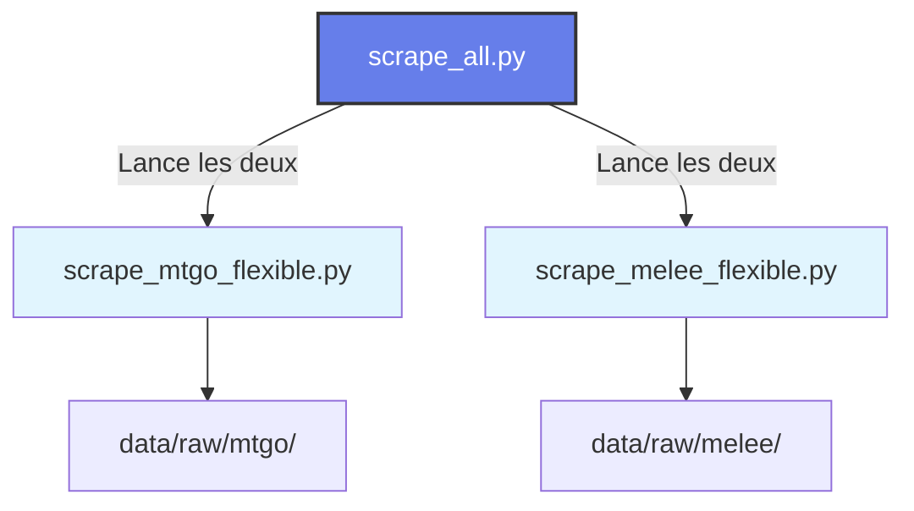
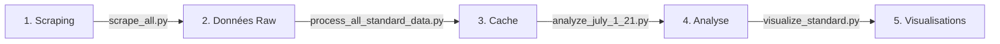

# 🔍 Guide Complet des Scrapers Manalytics

## 📋 Table des Matières
1. [Vue d'ensemble](#vue-densemble)
2. [Scraper Unifié (Recommandé)](#scraper-unifié-recommandé)
3. [Scrapers Individuels](#scrapers-individuels)
4. [Formats Supportés](#formats-supportés)
5. [Structure des Données](#structure-des-données)
6. [Configuration Requise](#configuration-requise)
7. [Exemples d'Utilisation](#exemples-dutilisation)
8. [Troubleshooting](#troubleshooting)

## 🎯 Vue d'ensemble

Manalytics dispose de trois niveaux de scrapers pour récupérer les données de tournois Magic: The Gathering :



### Hiérarchie des Scrapers

1. **`scrape_all.py`** ⭐ RECOMMANDÉ
   - Scraper unifié qui lance MTGO + Melee avec les mêmes paramètres
   - Plus simple à utiliser pour la majorité des cas
   - Assure la cohérence entre les deux plateformes

2. **`scrape_mtgo_flexible.py`**
   - Scraper spécialisé pour MTGO (www.mtgo.com)
   - À utiliser seul si vous ne voulez que les données MTGO

3. **`scrape_melee_flexible.py`**
   - Scraper spécialisé pour Melee.gg
   - Nécessite une authentification (voir Configuration)
   - À utiliser seul si vous ne voulez que les données Melee

## 🚀 Scraper Unifié (Recommandé)

### Syntaxe de Base

```bash
python scrape_all.py --format [FORMATS] --days [NOMBRE]
# ou
python scrape_all.py --format [FORMATS] --start-date [YYYY-MM-DD] --end-date [YYYY-MM-DD]
```

### Exemples Courants

```bash
# 1. Standard sur les 21 derniers jours (cas le plus courant)
python scrape_all.py --format standard --days 21

# 2. Multi-formats sur période spécifique (juillet 1-21, 2025)
python scrape_all.py --format standard modern pioneer --start-date 2025-07-01 --end-date 2025-07-21

# 3. Tous les formats sur 7 jours
python scrape_all.py --format all --days 7

# 4. Seulement MTGO (pas Melee)
python scrape_all.py --format standard --days 7 --only mtgo

# 5. Seulement Melee avec récupération des decks
python scrape_all.py --format standard --days 7 --only melee --get-decks
```

### Options Disponibles

| Option | Description | Valeurs | Défaut |
|--------|-------------|---------|---------|
| `--format` | Format(s) à scraper | `standard`, `modern`, `legacy`, `vintage`, `pioneer`, `pauper`, `limited`, `duel-commander`, `commander`, `all` | `standard` |
| `--days` | Nombre de jours depuis aujourd'hui | Entier positif | 7 |
| `--start-date` | Date de début | YYYY-MM-DD | - |
| `--end-date` | Date de fin | YYYY-MM-DD | Aujourd'hui |
| `--only` | Scraper une seule plateforme | `mtgo`, `melee` | Les deux |
| `--get-decks` | Récupérer les détails des decks (Melee) | Flag | Non |
| `--incremental` | Mode incrémental (futur) | Flag | Non |

## 📊 Scrapers Individuels

### MTGO Scraper (`scrape_mtgo_flexible.py`)

Scrape les tournois depuis www.mtgo.com.

```bash
# Syntaxe
python scrape_mtgo_flexible.py --format [FORMATS] [OPTIONS]

# Exemples
python scrape_mtgo_flexible.py --format standard --days 21
python scrape_mtgo_flexible.py --format standard modern legacy --start-date 2025-07-01 --end-date 2025-07-21
python scrape_mtgo_flexible.py --format all --days 7
```

**Particularités MTGO :**
- Les leagues (tournois 5-0) sont automatiquement placées dans un sous-dossier `leagues/`
- Structure : `data/raw/mtgo/{format}/` et `data/raw/mtgo/{format}/leagues/`
- Ne récupère que les métadonnées des tournois (pas les decklists complètes)

### Melee Scraper (`scrape_melee_flexible.py`)

Scrape les tournois depuis melee.gg avec authentification.

```bash
# Syntaxe
python scrape_melee_flexible.py --format [FORMATS] [OPTIONS]

# Exemples
python scrape_melee_flexible.py --format standard --days 21
python scrape_melee_flexible.py --format standard modern pioneer --start-date 2025-07-01 --end-date 2025-07-21
python scrape_melee_flexible.py --format all --days 7 --get-decks
```

**Particularités Melee :**
- Nécessite une authentification (voir Configuration)
- Option `--get-decks` pour récupérer les détails complets des decks (plus lent)
- Structure : `data/raw/melee/{format}/`
- Récupère les listes de joueurs et rankings

## 🎮 Formats Supportés

| Format Key | Nom Complet | MTGO | Melee |
|------------|-------------|------|-------|
| `standard` | Standard | ✅ | ✅ |
| `modern` | Modern | ✅ | ✅ |
| `legacy` | Legacy | ✅ | ✅ |
| `vintage` | Vintage | ✅ | ✅ |
| `pioneer` | Pioneer | ✅ | ✅ |
| `pauper` | Pauper | ✅ | ✅ |
| `limited` | Limited (Draft/Sealed) | ✅ | ✅ |
| `duel-commander` | Duel Commander | ✅ | ✅ |
| `commander` | Commander/EDH | ❌ | ✅ |
| `all` | Tous les formats | ✅ | ✅ |

## 📁 Structure des Données

Les scrapers génèrent la structure suivante :

```
data/
├── raw/
│   ├── mtgo/
│   │   ├── standard/
│   │   │   ├── 2025-07-01_12345678.json
│   │   │   ├── 2025-07-02_87654321.json
│   │   │   └── leagues/
│   │   │       └── 2025-07-01_league123.json
│   │   ├── modern/
│   │   ├── legacy/
│   │   └── ...
│   └── melee/
│       ├── standard/
│       │   ├── 2025-07-01_Regional-Championship.json
│       │   └── 2025-07-02_Store-Championship.json
│       ├── modern/
│       └── ...
```

### Format des Fichiers JSON

**MTGO (`{date}_{tournament_id}.json`) :**
```json
{
  "source": "mtgo",
  "format": "standard",
  "name": "Standard Challenge 32",
  "date": "2025-07-01",
  "url": "https://www.mtgo.com/decklist/standard-challenge-32-2025-07-011234567",
  "tournament_id": "1234567",
  "scraped_at": "2025-07-28T10:30:00"
}
```

**Melee (`{date}_{tournament_name}.json`) :**
```json
{
  "TournamentId": "abc-123",
  "TournamentName": "Regional Championship",
  "TournamentStartDate": "2025-07-01T09:00:00",
  "OrganizationName": "Store Name",
  "FormatDescription": "Standard",
  "Decks": [
    {
      "DecklistId": "deck-456",
      "PlayerName": "Player Name",
      "DeckName": "Gruul Aggro",
      "Rank": 1,
      "Wins": 7,
      "IsValid": true,
      "Details": {
        "Mainboard": [...],
        "Sideboard": [...] 
      }
    }
  ]
}
```

## ⚙️ Configuration Requise

### 1. Installation des Dépendances

```bash
pip install requests beautifulsoup4 python-dotenv
```

### 2. Configuration Melee (Authentification)

Pour utiliser le scraper Melee, vous devez configurer l'authentification :

1. Créer le dossier credentials :
```bash
mkdir api_credentials
```

2. Créer le fichier `api_credentials/melee_login.json` :
```json
{
  "login": "votre.email@example.com",
  "mdp": "votre_mot_de_passe"
}
```

3. Les cookies seront automatiquement sauvegardés dans `api_credentials/melee_cookies.json` après la première connexion réussie.

### 3. Permissions

Assurez-vous que les scripts sont exécutables :
```bash
chmod +x scrape_all.py scrape_mtgo_flexible.py scrape_melee_flexible.py
```

## 📚 Exemples d'Utilisation

### Cas d'Usage Typiques

#### 1. Analyse du Métagame Standard Actuel
```bash
# Récupérer les 21 derniers jours de Standard
python scrape_all.py --format standard --days 21

# Puis processer les données
python scripts/process_all_standard_data.py
```

#### 2. Préparation pour un Tournoi Modern
```bash
# Récupérer Modern + Pioneer sur 14 jours
python scrape_all.py --format modern pioneer --days 14

# Avec détails des decks Melee
python scrape_all.py --format modern pioneer --days 14 --get-decks
```

#### 3. Analyse Historique Spécifique
```bash
# Juillet 2025 complet pour Standard, Modern, Legacy
python scrape_all.py --format standard modern legacy --start-date 2025-07-01 --end-date 2025-07-31
```

#### 4. Mise à Jour Quotidienne (Cron)
```bash
# Script pour cron quotidien
#!/bin/bash
cd /path/to/manalytics
python scrape_all.py --format standard modern --days 1 --incremental
python scripts/process_all_standard_data.py
```

## 🔧 Troubleshooting

### Problèmes Courants

#### 1. Erreur d'Authentification Melee
```
❌ Échec de connexion
```
**Solution :** Vérifier les credentials dans `api_credentials/melee_login.json`

#### 2. Timeout ou Erreur Réseau
```
requests.exceptions.ConnectionError
```
**Solution :** 
- Vérifier votre connexion internet
- Réessayer plus tard (les sites peuvent être temporairement indisponibles)

#### 3. Aucun Tournoi Trouvé
```
⚠️ No tournaments found for the specified criteria
```
**Causes possibles :**
- Période trop ancienne (les sites gardent ~30 jours d'historique)
- Format non joué pendant cette période
- Problème de parsing (vérifier les logs)

#### 4. Leagues dans les Données Standard
**Solution :** Les leagues sont automatiquement filtrées dans le dossier `leagues/`. Le processeur les exclura automatiquement.

### Logs et Debug

Pour plus de détails, les scrapers utilisent le module `logging` :
```python
logging.basicConfig(level=logging.DEBUG)  # Pour voir tous les détails
```

## 🔄 Workflow Complet



1. **Scraping** : `python scrape_all.py --format standard --days 21`
2. **Processing** : `python scripts/process_all_standard_data.py`
3. **Analyse** : `python analyze_july_1_21.py`
4. **Visualisation** : `python visualize_standard.py`

## 📝 Notes Importantes

1. **Respecter les Limites** : Ne pas lancer les scrapers trop fréquemment pour éviter de surcharger les serveurs
2. **Données Incrémentales** : Le mode `--incremental` sera implémenté pour ne récupérer que les nouvelles données
3. **Formats Régionaux** : Certains formats comme Commander ne sont pas sur MTGO
4. **Délais entre Requêtes** : Les scrapers incluent des pauses automatiques entre les requêtes

## 🚀 Prochaines Étapes

Après avoir scrapé les données :
1. Processer avec `python scripts/process_all_standard_data.py`
2. Analyser avec `python analyze_july_1_21.py`
3. Visualiser avec `python visualize_standard.py`

Pour plus d'informations sur le pipeline complet, voir [MANALYTICS_COMPLETE_ARCHITECTURE.html](./MANALYTICS_COMPLETE_ARCHITECTURE.html)