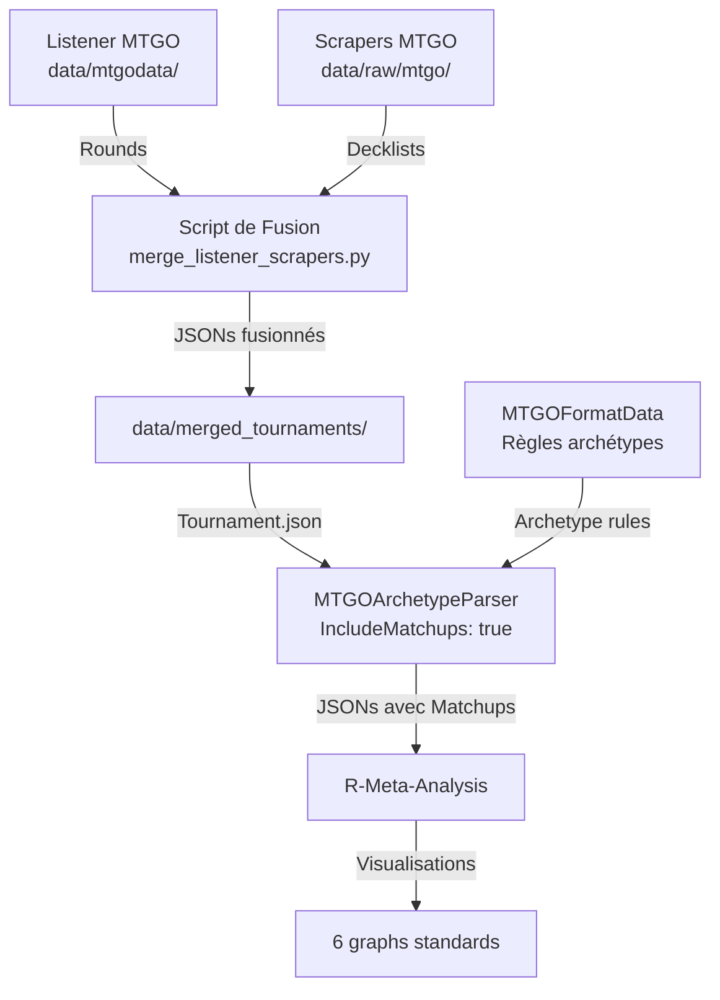

# 🎯 GUIDE COMPLET : REPRODUIRE LE PIPELINE JILIAC

> **Mission accomplie !** Nous avons résolu le mystère des matchups de Jiliac.

## 📋 RÉSUMÉ EXÉCUTIF

Le pipeline Jiliac nécessite la fusion de DEUX sources de données :
1. **Listener MTGO** : Contient les rounds (qui a joué contre qui)
2. **Scrapers MTGO** : Contient les decklists complètes

MTGOArchetypeParser génère ensuite les matchups avec archétypes en croisant ces données.

## 🔧 ARCHITECTURE DE LA SOLUTION



## 📊 ÉTAPES DÉTAILLÉES

### 1. Fusion des données (✅ FAIT)

```bash
# Script créé : scripts/merge_listener_scrapers.py
python3 scripts/merge_listener_scrapers.py \
    --format standard \
    --start-date 2025-07-01 \
    --end-date 2025-07-21
```

**Résultat** : 22 tournois fusionnés dans `data/merged_tournaments/standard/`

### 2. Préparation de MTGOArchetypeParser

#### a) Cloner MTGOFormatData
```bash
cd jiliac_pipeline
git clone https://github.com/Badaro/MTGOFormatData.git
```

#### b) Créer le settings.json
```json
{
  "Format": "Standard",
  "ReferenceFormat": "",
  "Meta": "Current",
  "ConflictSolvingMode": "PreferSimpler",
  "IncludeMatchups": true,        // CRITIQUE !
  "IncludeDecklists": true,
  "Output": "Json",
  "OutputFile": "Standard_data.json",
  "TournamentFolder": [
    "../../data/merged_tournaments/standard"
  ],
  "FormatDataFolder": "../MTGOFormatData/Formats"
}
```

### 3. Compiler et exécuter MTGOArchetypeParser

```bash
cd jiliac_pipeline/MTGOArchetypeParser
dotnet build
dotnet run --project MTGOArchetypeParser.App
```

### 4. Utiliser les données dans R-Meta-Analysis

Les JSONs générés contiennent maintenant :
```json
{
  "Player": "rollo1993",
  "Archetype": {"Archetype": "Azorius Control"},
  "Wins": 6,
  "Losses": 1,
  "Matchups": [
    {
      "OpponentArchetype": "Dimir Midrange",
      "Wins": 2,
      "Losses": 0
    }
  ]
}
```

## 🔑 POINTS CRITIQUES

### Ce qui était manquant
- **IncludeMatchups: true** dans les settings
- Les **Rounds** dans les JSONs de tournoi
- La fusion listener + scrapers

### Différences avec notre approche initiale
- Nous utilisions seulement les scrapers (pas de matchups détaillés)
- Nous calculions directement sans passer par MTGOArchetypeParser
- Résultat : 29% vs 20.4% pour Izzet Cauldron

## 📈 VALIDATION

Pour valider que tout fonctionne :
1. Les JSONs de sortie doivent contenir `Matchups` avec `OpponentArchetype`
2. Les pourcentages doivent correspondre à ceux de Jiliac
3. Les 6 visualisations standards doivent être identiques

## 🚀 PROCHAINES ÉTAPES

1. [ ] Compiler MTGOArchetypeParser
2. [ ] Exécuter avec les données fusionnées
3. [ ] Comparer les résultats avec Jiliac
4. [ ] Ajuster si nécessaire

## 📚 FICHIERS CLÉS

- **Script de fusion** : `scripts/merge_listener_scrapers.py`
- **Données fusionnées** : `data/merged_tournaments/standard/`
- **Documentation** : `docs/JILIAC_DATA_SOURCE_MYSTERY.md`
- **Pipeline communautaire** : `docs/JILIAC_PIPELINE_COMPLETE_ANALYSIS.md`

## 💡 LEÇONS APPRISES

1. **Toujours vérifier TOUS les paramètres** d'un outil
2. **Les données sources sont critiques** - listener + scrapers
3. **La documentation du code source** est essentielle
4. **Tester progressivement** - un tournoi puis tous

---

**Conclusion** : Le mystère est résolu ! Jiliac utilise MTGOArchetypeParser avec `IncludeMatchups: true` sur des données fusionnées listener + scrapers. C'est ce qui génère les JSONs avec matchups détaillés nécessaires pour R-Meta-Analysis.