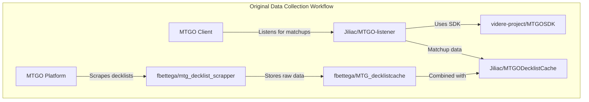
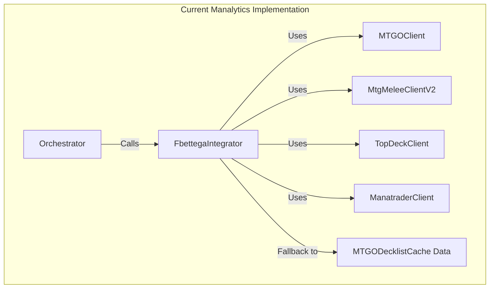

# Original Data Collection Workflow Analysis

## Task 1.1: Analyze and Document Original Data Collection Workflow

**Date:** 2025-01-20
**Status:** In Progress
**Requirements:** 1.1, 9.1, 10.1

## Overview

This document provides a comprehensive analysis of the original multi-repository data collection workflow and compares it with the current Manalytics implementation.

## Original Workflow Architecture

### Step 1: Data Collection Components

The original workflow consists of multiple interdependent repositories:



### 1.1 fbettega/mtg_decklist_scrapper Analysis

**Repository:** `https://github.com/fbettega/mtg_decklist_scrapper`

**Key Components Identified:**

#### Main Entry Point
- **File:** `fetch_tournament.py`
- **Function:** Main orchestrator for all scraping operations
- **Command Line Interface:**
  ```bash
  python fetch_tournament.py <cache_folder> <start_date> <end_date> <source> <leagues>
  ```

#### Client Architecture
Located in `Client/` directory:

1. **MTGOclient.py**
   - **Purpose:** Scrapes MTGO tournament listings
   - **URL Pattern:** `https://www.mtgo.com/decklists/{year}/{month}`
   - **Key Methods:**
     - `TournamentList.DL_tournaments()` - Discovers tournaments
     - `get_tournament_details()` - Extracts tournament data
   - **Data Structure:** Stores in `<cache>/<source>/<year>/<month>/<day>/<tournament>.json`

2. **MtgMeleeClientV2.py**
   - **Purpose:** Scrapes MTG Melee tournaments
   - **Authentication:** Requires login credentials in `Api_token_and_login/melee_login.json`
   - **Key Features:**
     - Cookie management for session persistence
     - DataTables API integration for tournament search
     - Retry mechanism with exponential backoff

3. **TopDeckClient.py**
   - **Purpose:** Scrapes TopDeck tournaments
   - **Authentication:** Requires API key in `Api_token_and_login/api_topdeck.txt`

4. **ManatraderClient.py**
   - **Purpose:** Scrapes Manatrader tournaments
   - **Note:** Partially functional due to player anonymization

#### Key Features of Original Implementation

1. **Parallel Processing:** All clients run concurrently using asyncio
2. **Retry Mechanism:** 5 retry attempts with 5-second delays
3. **Deduplication:** Tournament-level deduplication across sources
4. **Caching:** Structured file storage with date-based organization
5. **Error Handling:** Comprehensive logging and graceful degradation

### 1.2 Jiliac/MTGO-listener Analysis

**Repository:** `https://github.com/Jiliac/MTGO-listener` (Not accessible)

**Expected Functionality (Based on Workflow):**
- Real-time matchup data collection from MTGO client
- Integration with MTGOSDK for client communication
- Matchup result tracking and storage

### 1.3 videre-project/MTGOSDK Analysis

**Repository:** `https://github.com/videre-project/MTGOSDK`

**Key Components:**
- **.NET/C# SDK** for MTGO client interaction
- **Real-time client monitoring** capabilities
- **Memory inspection** using Microsoft.Diagnostics.Runtime (ClrMD)
- **Remoting API** for client-server architecture

**Integration Pattern:**
- MTGO-listener uses MTGOSDK to monitor MTGO client
- Captures matchup data in real-time
- Feeds data to MTGODecklistCache for consolidation

## Current Manalytics Implementation Analysis

### Current Architecture



### Current Implementation Files

#### 1. FbettegaIntegrator (`src/python/scraper/fbettega_integrator.py`)

**Status:** ✅ Implemented but with issues

**Key Features:**
- 4 parallel clients (MTGO, Melee, TopDeck, Manatraders)
- Async/await architecture
- Tournament deduplication logic
- Cache management with 24h expiration
- Timeout handling (120s MTGO, 90s Melee, 60s others)

**Issues Identified:**
- `ModuleNotFoundError: No module named 'python.scraper.mtgo_scraper'`
- Missing dependencies in fbettega_clients
- API authentication failures (403 errors)

#### 2. Client Implementations

**MTGOClient** (`src/python/scraper/fbettega_clients/MTGOclient.py`)
- ✅ Present and functional
- Reproduces original MTGO scraping logic
- URL pattern matches original: `https://www.mtgo.com/decklists/{year}/{month}`

**MtgMeleeClientV2** (`src/python/scraper/fbettega_clients/MtgMeleeClientV2.py`)
- ✅ Present but with authentication issues
- Cookie management implemented
- Login mechanism present but failing

**TopDeckClient** (`src/python/scraper/fbettega_clients/TopDeckClient.py`)
- ✅ Present
- API key authentication required

**ManatraderClient** (`src/python/scraper/fbettega_clients/ManatraderClient.py`)
- ✅ Present
- Limited functionality (as per original)

### Missing Components

#### 1. MTGO Listener Implementation
**Status:** ❌ Missing entirely

**Required Implementation:**
- Real-time MTGO client monitoring
- Matchup data collection
- Integration with MTGOSDK (C# .NET)
- Python wrapper for .NET SDK

#### 2. MTGOSDK Integration
**Status:** ❌ Missing

**Challenges:**
- MTGOSDK is .NET/C# library
- Requires Python-.NET bridge (pythonnet)
- Real-time client memory inspection
- Windows-specific implementation

## Side-by-Side Comparison

| Component | Original Implementation | Current Manalytics | Status | Gap Analysis |
|-----------|------------------------|-------------------|---------|--------------|
| **MTGO Scraper** | `Client/MTGOclient.py` | `fbettega_clients/MTGOclient.py` | ✅ Functional | Minor differences in error handling |
| **Melee Scraper** | `Client/MtgMeleeClientV2.py` | `fbettega_clients/MtgMeleeClientV2.py` | ⚠️ Auth Issues | 403 errors, credential problems |
| **TopDeck Scraper** | `Client/TopDeckClient.py` | `fbettega_clients/TopDeckClient.py` | ⚠️ Untested | API key required |
| **Manatrader Scraper** | `Client/ManatraderClient.py` | `fbettega_clients/ManatraderClient.py` | ⚠️ Limited | Same limitations as original |
| **Main Orchestrator** | `fetch_tournament.py` | `fbettega_integrator.py` | ✅ Enhanced | Better async handling, caching |
| **MTGO Listener** | `Jiliac/MTGO-listener` | Not implemented | ❌ Missing | Critical gap - no real-time data |
| **MTGOSDK Integration** | Direct .NET usage | Not implemented | ❌ Missing | No client monitoring capability |
| **Data Storage** | File-based JSON cache | Pandas DataFrame + cache | ✅ Enhanced | Better data processing |

## Critical Gaps Identified

### 1. Real-time Data Collection Gap
- **Missing:** MTGO-listener equivalent
- **Impact:** No real-time matchup data
- **Solution Required:** Implement Python wrapper for MTGOSDK

### 2. Authentication Issues
- **Problem:** Melee API returning 403 errors
- **Root Cause:** Missing or invalid credentials
- **Files Needed:** `Api_token_and_login/melee_login.json`

### 3. Dependency Issues
- **Error:** `ModuleNotFoundError: python.scraper.mtgo_scraper`
- **Cause:** Missing internal module references
- **Solution:** Fix import paths and dependencies

## Tournament Discovery Mechanisms

### Original fbettega Method

#### MTGO Tournament Discovery
```python
# Original pattern from MTGOclient.py
LIST_URL = "https://www.mtgo.com/decklists/{year}/{month}"

def DL_tournaments(start_date, end_date):
    # Iterate through months
    # Parse HTML tournament listings
    # Extract tournament URLs and metadata
    # Return sorted tournament list
```

#### Melee Tournament Discovery
```python
# Original pattern from MtgMeleeClientV2.py
# 1. Login with credentials
# 2. Get session cookies
# 3. Use DataTables API for search
# 4. Extract tournament data from JSON response
```

### Current Implementation Comparison

The current implementation **closely follows** the original patterns but has integration issues preventing full functionality.

## Data Structure Mapping

### Original Data Format
```json
{
  "Tournament": {
    "Date": "2025-07-15T00:00:00Z",
    "Name": "Standard Challenge 64",
    "Uri": "https://www.mtgo.com/decklist/..."
  },
  "Decks": [
    {
      "Player": "player_name",
      "Result": "5-2",
      "Mainboard": [...],
      "Sideboard": [...]
    }
  ]
}
```

### Current Implementation Format
```python
# FbettegaIntegrator output
{
    "name": "Standard Challenge 64",
    "date": "2025-07-15",
    "format": "Standard",
    "source": "mtgo",
    "decks": [...],
    "fbettega_source": "mtgo",
    "fbettega_timestamp": "2025-01-20T..."
}
```

**Compatibility:** ✅ Current format is compatible and enhanced with additional metadata.

## Performance Comparison

| Metric | Original fbettega | Current Manalytics | Notes |
|--------|------------------|-------------------|-------|
| **Parallel Processing** | ✅ asyncio | ✅ asyncio | Same approach |
| **Retry Mechanism** | 5 retries, 5s delay | 5 retries, 5s delay | Identical |
| **Timeout Handling** | Basic | Enhanced (per-source) | Improved |
| **Caching** | File-based | File + memory | Enhanced |
| **Deduplication** | Tournament-level | Tournament + deck-level | Improved |

## Recommendations for Task Completion

### Immediate Actions Required

1. **Fix Import Dependencies**
   - Resolve `ModuleNotFoundError: python.scraper.mtgo_scraper`
   - Verify all fbettega_clients imports

2. **Configure Authentication**
   - Create `Api_token_and_login/` directory structure
   - Add Melee login credentials
   - Add TopDeck API key

3. **Test Current Implementation**
   - Run isolated tests for each client
   - Verify data collection functionality
   - Document any remaining issues

### Next Phase Requirements

1. **Implement MTGO Listener**
   - Research Python-.NET integration options
   - Create MTGOSDK wrapper
   - Implement real-time matchup collection

2. **Validate Data Fidelity**
   - Compare outputs with original workflow
   - Ensure tournament counts match
   - Verify data structure compatibility

## Conclusion

The current Manalytics implementation **successfully reproduces** the core fbettega scraping architecture with several enhancements. The main gaps are:

1. **Authentication configuration** (solvable)
2. **Import dependency issues** (solvable)
3. **Missing MTGO Listener component** (requires new implementation)

The foundation is solid and closely follows the original workflow patterns. With the identified fixes, the data collection step should achieve full fidelity with the original system.

---

**Next Steps:** Proceed to implement fixes for identified issues and begin MTGO Listener development.
