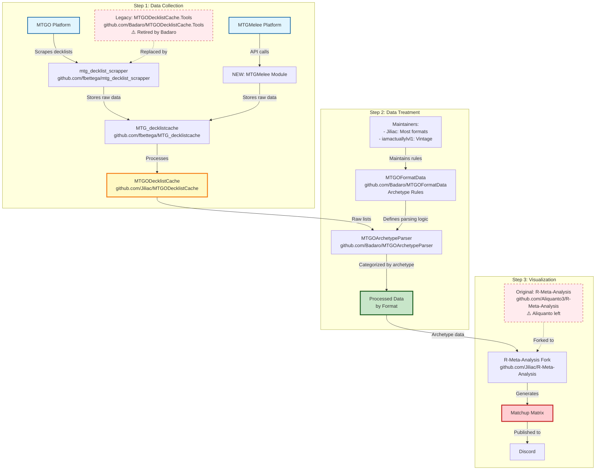
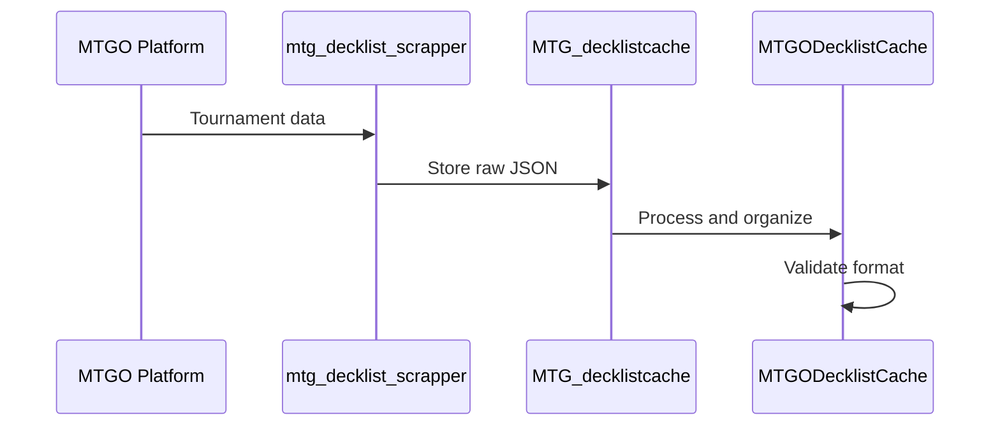
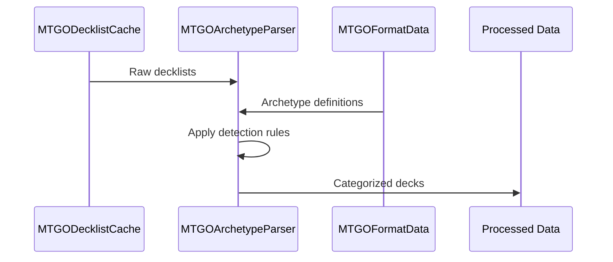
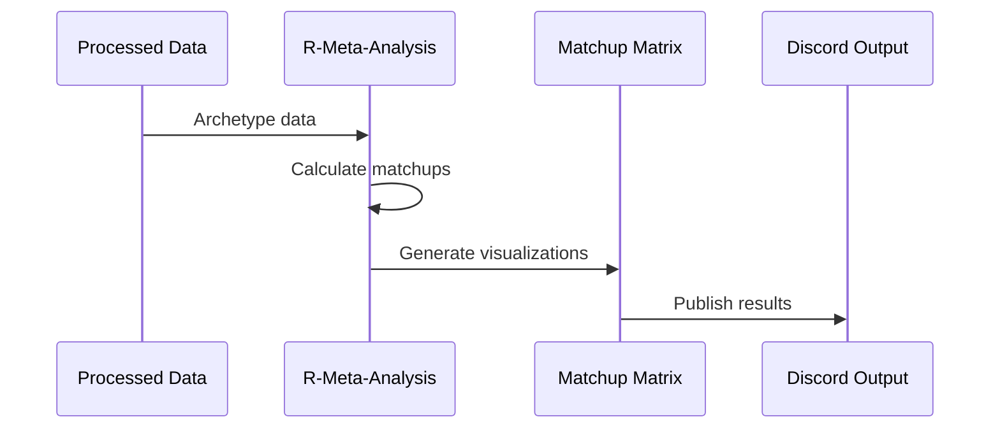

# Architecture du Pipeline MTG Analytics

## Vue d'Ensemble

Le pipeline MTG Analytics est un système unifié de collecte, traitement et visualisation des données de tournois Magic: The Gathering. Il intègre 6 repositories GitHub dans une architecture modulaire et extensible.

## Architecture Globale



## Structure Locale du Pipeline

```
manalytics-unified/
├── data-collection/
│   ├── scraper/               # mtg_decklist_scrapper
│   │   ├── mtgo/             # Code original MTGO
│   │   └── mtgmelee/         # Extension API MTGMelee
│   ├── raw-cache/            # MTG_decklistcache
│   └── processed-cache/      # MTGODecklistCache
├── data-treatment/
│   ├── parser/               # MTGOArchetypeParser
│   └── format-rules/         # MTGOFormatData
├── visualization/
│   └── r-analysis/           # R-Meta-Analysis
├── config/
├── data/
└── README.md
```

## Étape 1 : Collecte de Données

### Composants

#### 1.1 mtg_decklist_scrapper (fbettega)
- **Rôle** : Scraping des decklists depuis MTGO, MTGMelee, Topdeck
- **Technologie** : Python + BeautifulSoup + Requests
- **Points d'entrée** : `main.py`, `fetch_tournament.py`

#### 1.2 MTG_decklistcache (fbettega)
- **Rôle** : Cache des données brutes scrapées
- **Format** : JSON structuré par source/date
- **Mise à jour** : Quotidienne (17:00 UTC)

#### 1.3 MTGODecklistCache (Jiliac)
- **Rôle** : Traitement et organisation des données
- **Statut** : Plus maintenu activement
- **Limitations** : melee.gg et manatraders.com désactivés

### Flux de Données - Étape 1



## Étape 2 : Traitement des Données

### Composants

#### 2.1 MTGOArchetypeParser (Badaro)
- **Rôle** : Moteur de détection d'archétypes basé sur des règles
- **Technologie** : .NET 8.0
- **Points d'entrée** : `main.py` (adaptateur Python), `MTGOArchetypeParser.App.exe`

#### 2.2 MTGOFormatData (Badaro)
- **Rôle** : Définitions d'archétypes et règles de parsing
- **Maintainers** : Jiliac (formats principaux), IamActuallyLvL1 (Vintage)
- **Structure** : JSON par format avec conditions et fallbacks

### Flux de Données - Étape 2



## Étape 3 : Visualisation

### Composants

#### 3.1 R-Meta-Analysis (Jiliac)
- **Rôle** : Génération de matrices de matchups et analyses
- **Technologie** : R + tidyverse + ggplot2
- **Fork de** : Aliquanto3/R-Meta-Analysis (Aliquanto a quitté)
- **Points d'entrée** : `generate_matrix.R`

### Flux de Données - Étape 3



## Formats de Données

### Format Raw (MTG_decklistcache)
```json
{
  "Tournament": {
    "date": "2025-01-15",
    "name": "MTGO Standard Challenge",
    "uri": "https://www.mtgo.com/decklists/...",
    "formats": ["Standard"]
  },
  "Decks": [
    {
      "player": "PlayerName",
      "result": "5-1",
      "mainboard": [
        {"count": 4, "card_name": "Lightning Bolt"}
      ],
      "sideboard": [...]
    }
  ]
}
```

### Format Processed (MTGOArchetypeParser)
```json
{
  "tournament_id": "mtgo-standard-20250115",
  "format": "Standard",
  "date": "2025-01-15",
  "decks": [
    {
      "player": "PlayerName",
      "archetype": "Izzet Prowess",
      "result": "5-1",
      "mainboard": [...],
      "sideboard": [...]
    }
  ]
}
```

### Format Output (R-Meta-Analysis)
```r
# Matrice de matchups
matchup_matrix <- matrix(c(
  0.5, 0.6, 0.4,
  0.4, 0.5, 0.7,
  0.6, 0.3, 0.5
), nrow=3, ncol=3)
```

## Points d'Intégration MTGMelee

### Extension Nécessaire
Le module MTGMelee doit être étendu pour :

1. **Authentification API**
   - Login/password requis
   - Gestion des tokens de session
   - Rate limiting (2 req/min)

2. **Récupération des Tournois**
   - Endpoint : `/Tournaments`
   - Filtrage par format et date
   - Pagination des résultats

3. **Extraction des Decklists**
   - Endpoint : `/Decklists`
   - Parsing des listes de cartes
   - Validation des formats

4. **Formatage des Données**
   - Conversion au format standard
   - Validation des métadonnées
   - Stockage dans le cache

### Structure Proposée
```
data-collection/scraper/mtgmelee/
├── mtgmelee_client.py        # Client API MTGMelee
├── auth_manager.py           # Gestion authentification
├── tournament_fetcher.py     # Récupération tournois
├── decklist_parser.py        # Parsing decklists
└── data_formatter.py         # Formatage données
```

## Orchestration du Pipeline

### Script Principal : `orchestrator.py`
```python
class MTGAnalyticsPipeline:
    def __init__(self):
        self.collector = DataCollector()
        self.parser = ArchetypeParser()
        self.visualizer = DataVisualizer()
    
    def run_analysis(self, format_name, days=7):
        # Étape 1: Collecte
        raw_data = self.collector.collect(format_name, days)
        
        # Étape 2: Traitement
        processed_data = self.parser.process(raw_data, format_name)
        
        # Étape 3: Visualisation
        results = self.visualizer.generate(processed_data, format_name)
        
        return results
```

### Configuration : `config/sources.json`
```json
{
  "mtgo": {
    "base_url": "https://www.mtgo.com/decklists",
    "scraping_config": {
      "rate_limit": 1,
      "retry_attempts": 5
    }
  },
  "mtgmelee": {
    "base_url": "https://melee.gg",
    "authentication": {
      "login_url": "https://melee.gg/login"
    }
  }
}
```

## Gestion des Erreurs

### Stratégies de Retry
- **Collecte** : 5 tentatives avec délai exponentiel
- **Parsing** : Validation des données avant traitement
- **Visualisation** : Fallback sur données partielles

### Logging et Monitoring
- **Logs** : `log_scraping.txt` pour la collecte
- **Métriques** : Nombre de tournois traités par jour
- **Alertes** : Échecs de scraping ou parsing

## Dépendances Techniques

### Python (Collecte)
```txt
beautifulsoup4>=4.9.0
requests>=2.25.0
numpy>=1.19.0
python_dateutil>=2.8.0
```

### .NET (Traitement)
- .NET Runtime 8.0
- MTGOArchetypeParser.App

### R (Visualisation)
```r
tidyverse>=1.3.0
ggplot2>=3.3.0
reshape2>=1.4.0
gridExtra>=2.3
scales>=1.1.0
```

## Prochaines Étapes

1. **Implémentation MTGMelee** : Développer le module d'extension
2. **Tests de Connectivité** : Valider tous les endpoints
3. **Intégration Continue** : Automatiser le pipeline
4. **Monitoring** : Ajouter des métriques et alertes
5. **Documentation** : Compléter la documentation utilisateur

## Maintenance

### Responsabilités
- **Jiliac** : Formats Standard, Modern, Legacy, Pioneer, Pauper
- **IamActuallyLvL1** : Format Vintage
- **fbettega** : Scraping et cache des données

### Mise à Jour
- **Données** : Quotidienne (17:00 UTC)
- **Règles d'archétypes** : Selon les nouvelles cartes
- **Code** : Selon les changements des sites sources 