# JILIAC MTG ANALYTICS SYSTEM BIBLE

## 📖 Table of Contents
1. [System Overview](#system-overview)
2. [Repository Analysis](#repository-analysis)
3. [Data Flow Architecture](#data-flow-architecture)
4. [Code Deep Dive](#code-deep-dive)
5. [Integration Points](#integration-points)
6. [Configuration & Setup](#configuration--setup)
7. [Usage Examples](#usage-examples)
8. [Troubleshooting](#troubleshooting)

---

## 🎯 System Overview

The Jiliac MTG Analytics System is a comprehensive pipeline for collecting, processing, and analyzing Magic: The Gathering tournament data. It consists of 6 interconnected repositories that work together to transform raw tournament data into actionable metagame insights.

### Core Philosophy
- **Real Data Only**: No mock or test data allowed
- **Modular Architecture**: Each repository has a specific role
- **Automated Pipeline**: End-to-end data processing
- **Community Driven**: Maintained by format specialists

### Original Architecture (Before Unification)

```mermaid
graph TB
    subgraph "Step 1: Data Collection"
        A1[MTGO Platform] -->|Scrapes decklists| B1[mtg_decklist_scrapper<br/>github.com/fbettega/mtg_decklist_scrapper]
        B1 -->|Stores raw data| C1[MTG_decklistcache<br/>github.com/fbettega/MTG_decklistcache]
        C1 -->|Processes| F1[MTGODecklistCache<br/>github.com/Jiliac/MTGODecklistCache]
        
        G1[Legacy: MTGODecklistCache.Tools<br/>github.com/Badaro/MTGODecklistCache.Tools<br/>⚠️ Retired by Badaro] -.->|Replaced by| B1
    end
    
    subgraph "Step 2: Data Treatment"
        F1 -->|Raw lists| H2[MTGOArchetypeParser<br/>github.com/Badaro/MTGOArchetypeParser]
        I2[MTGOFormatData<br/>github.com/Badaro/MTGOFormatData<br/>Archetype Rules] -->|Defines parsing logic| H2
        H2 -->|Categorized by archetype| J2[Processed Data<br/>by Format]
        
        K2[Maintainers:<br/>- Jiliac: Most formats<br/>- iamactuallylvl1: Vintage] -->|Maintains rules| I2
    end
    
    subgraph "Step 3: Visualization"
        J2 -->|Archetype data| L3[R-Meta-Analysis Fork<br/>github.com/Jiliac/R-Meta-Analysis]
        L3 -->|Generates| M3[Matchup Matrix]
        M3 -->|Published to| N3[Discord]
        
        O3[Original: R-Meta-Analysis<br/>github.com/Aliquanto3/R-Meta-Analysis<br/>⚠️ Aliquanto left] -.->|Forked to| L3
    end
    
    style A1 fill:#e1f5fe,stroke:#01579b,stroke-width:2px
    style F1 fill:#fff9c4,stroke:#f57f17,stroke-width:3px
    style J2 fill:#c8e6c9,stroke:#1b5e20,stroke-width:3px
    style M3 fill:#ffcdd2,stroke:#c62828,stroke-width:3px
    style G1 fill:#ffebee,stroke:#b71c1c,stroke-width:1px,stroke-dasharray: 5 5
    style O3 fill:#ffebee,stroke:#b71c1c,stroke-width:1px,stroke-dasharray: 5 5
```



### Unified System Components (After Unification)
```
┌─────────────────┐    ┌─────────────────┐    ┌─────────────────┐
│   DATA INPUT    │    │  DATA PROCESS   │    │  DATA OUTPUT    │
│                 │    │                 │    │                 │
│ • MTGO Scraper  │───▶│ • Archetype     │───▶│ • R Analysis    │
│   [Python]      │    │   Parser        │    │   [R]           │
│ • MTGMelee API  │    │   [C#/.NET]     │    │ • Visualizations│
│   [Python]      │    │ • Format Rules  │    │   [R]           │
│ • Topdeck API   │    │   [JSON]        │    │ • Reports       │
│   [Python]      │    │                 │    │   [HTML/R]      │
└─────────────────┘    └─────────────────┘    └─────────────────┘
```

### Technology Stack by Component

#### Data Collection Layer
- **MTGO Scraper**: `Python` (BeautifulSoup, Requests)
- **MTGMelee API**: `Python` (Requests, JSON)
- **Topdeck API**: `Python` (Requests, API integration)

#### Data Processing Layer  
- **Raw Cache**: `JSON` (Data storage format)
- **Processed Cache**: `C#/.NET` (Data transformation)
- **Archetype Parser**: `C#/.NET` (Intelligent classification)
- **Format Rules**: `JSON` (Configuration files)

#### Data Analysis Layer
- **Statistical Analysis**: `R` (dplyr, ggplot2, statistical modeling)
- **Visualization**: `R` (ggplot2, charts, matrices)
- **Report Generation**: `R` + `HTML` (Web reports)

#### Orchestration & Integration
- **Main Pipeline**: `Python` (Orchestration scripts)
- **Configuration**: `JSON` (Central config)
- **Documentation**: `Markdown` (Documentation)

#### Pipeline Orchestration Components

##### `orchestrator.py` - Main Pipeline Controller
```python
# MTG Analytics Pipeline Orchestrator
# Coordinates all pipeline components from data collection to visualization

class MTGAnalyticsOrchestrator:
    def __init__(self, base_dir=None):
        self.base_dir = base_dir
        self.config = self._load_config()
    
    def run_analysis(self, format_name, start_date, end_date):
        """Execute complete pipeline analysis"""
        # 1. Check data availability
        # 2. Collect data if needed
        # 3. Process and classify decks
        # 4. Generate visualizations
        # 5. Create analysis report
```

##### `analyze.py` - Quick Launcher Interface
```python
# Simplified user interface for running analyses
# Provides interactive format and date selection

def main():
    # Interactive format selection
    # Date range configuration
    # Analysis execution
    # Results presentation
```

##### `generate_analysis.sh` - Shell Script Automation
```bash
#!/bin/bash
# Automated analysis script for batch processing
# Supports multiple formats and date ranges
```

---

## 📚 Repository Analysis

### 1. MTG Decklist Scrapper (fbettega/mtg_decklist_scrapper)

**Purpose**: Primary data collection engine for MTGO and MTGMelee tournaments

**Repository**: https://github.com/fbettega/mtg_decklist_scrapper

**Local Path**: `data-collection/scraper/mtgo/`

#### Additional Components

##### `mtgmelee_client.py` - MTGMelee API Integration
```python
# MTGMelee API Client for tournament data collection
# Features:
# - Rate limiting (60 requests/minute, 1000/hour)
# - Authentication management
# - Tournament discovery and data extraction
# - Unified data format conversion

class MTGMeleeClient:
    def __init__(self, config_path=None):
        self.rate_limiter = RateLimiter()
        self.auth_manager = AuthManager()
    
    def get_tournaments(self, format_id=None, start_date=None, end_date=None):
        """Retrieve tournaments from MTGMelee API"""
    
    def get_tournament_details(self, tournament_id):
        """Get detailed tournament information"""
    
    def convert_to_unified_format(self, tournament_data):
        """Convert MTGMelee data to unified pipeline format"""
```

#### Key Files Analysis

##### `fetch_tournament.py` - Main Scraping Engine
```python
# Core functionality: Scrapes tournament data from MTGO
# Input: Format, date range, output directory
# Output: Raw tournament JSON files

def fetch_tournament(format_name, days_back, output_dir):
    """
    Main scraping function that:
    1. Connects to MTGO decklists page
    2. Extracts tournament URLs
    3. Downloads decklists for each tournament
    4. Saves as structured JSON
    """
```

**How it works**:
1. **URL Construction**: Builds MTGO decklist URLs based on format and date
2. **Page Parsing**: Uses BeautifulSoup to extract tournament links
3. **Decklist Extraction**: Downloads individual decklists
4. **Data Structuring**: Organizes into JSON format with tournament metadata

##### `melee_login.json` - Authentication
```json
{
  "username": "your_melee_username",
  "password": "your_melee_password"
}
```
**Purpose**: Stores MTGMelee credentials for API access

##### `api_topdeck.txt` - API Configuration
```
your_topdeck_api_key_here
```
**Purpose**: Contains Topdeck API key for tournament data access

#### Dependencies
```txt
beautifulsoup4==4.12.2
requests==2.31.0
python-dateutil==2.8.2
numpy==1.24.3
pytest==7.4.0
```

#### Data Output Format
```json
{
  "tournament": {
    "name": "MTGO Standard Challenge",
    "date": "2024-01-15",
    "format": "Standard",
    "url": "https://www.mtgo.com/decklists/..."
  },
  "decks": [
    {
      "player": "PlayerName",
      "rank": 1,
      "decklist": "4 Lightning Bolt\n2 Snapcaster Mage\n..."
    }
  ]
}
```

### 2. MTG Decklist Cache (fbettega/MTG_decklistcache)

**Purpose**: Raw data storage for scraped tournament information

**Repository**: https://github.com/fbettega/MTG_decklistcache

**Local Path**: `data-collection/raw-cache/`

#### Structure Analysis
```
MTG_decklistcache/
├── Tournaments/           # Active tournament data
│   ├── Standard/
│   ├── Modern/
│   └── Legacy/
├── Tournaments-Archive/   # Historical data
└── README.md
```

#### CacheItem Format
```json
{
  "Tournament": {
    "Name": "MTGO Standard Challenge",
    "Date": "2024-01-15T00:00:00",
    "Format": "Standard",
    "URL": "https://www.mtgo.com/decklists/...",
    "DeckCount": 32
  },
  "Decks": [
    {
      "Player": "PlayerName",
      "Rank": 1,
      "Decklist": "4 Lightning Bolt\n2 Snapcaster Mage\n...",
      "Archetype": null  // Will be filled by parser
    }
  ],
  "Rounds": [
    {
      "Round": 1,
      "Matches": [
        {
          "Player1": "PlayerA",
          "Player2": "PlayerB",
          "Result": "2-1"
        }
      ]
    }
  ],
  "Standings": [
    {
      "Rank": 1,
      "Player": "PlayerName",
      "Points": 18,
      "OpponentWinPercentage": 0.65
    }
  ]
}
```

#### Data Management
- **Automatic Archiving**: Old tournaments moved to Archive folder
- **Format Separation**: Data organized by MTG format
- **JSON Standardization**: Consistent structure across all tournaments

### 3. MTGO Decklist Cache (Jiliac/MTGODecklistCache)

**Purpose**: Data processing and organization layer

**Repository**: https://github.com/Jiliac/MTGODecklistCache

**Local Path**: `data-collection/processed-cache/`

#### Key Components

##### `MTGODecklistCache.Tools` - Processing Engine
```csharp
// Main processing logic for tournament data
public class TournamentProcessor
{
    public void ProcessTournament(string tournamentPath)
    {
        // 1. Load raw tournament data
        // 2. Validate decklists
        // 3. Extract card information
        // 4. Organize by format
        // 5. Generate metadata
    }
}
```

**Processing Steps**:
1. **Data Validation**: Ensures decklists are complete and valid
2. **Card Extraction**: Parses decklists into card objects
3. **Format Classification**: Assigns tournaments to correct format
4. **Metadata Generation**: Creates summary statistics
5. **Cache Organization**: Stores processed data efficiently

##### Data Transformation
```json
// Input: Raw tournament JSON
// Output: Processed tournament with card data
{
  "tournament": {
    "name": "MTGO Standard Challenge",
    "processed_date": "2024-01-15T10:30:00",
    "format": "Standard",
    "deck_count": 32,
    "card_statistics": {
      "total_cards": 1280,
      "unique_cards": 156
    }
  },
  "decks": [
    {
      "player": "PlayerName",
      "rank": 1,
      "mainboard": [
        {"name": "Lightning Bolt", "count": 4},
        {"name": "Snapcaster Mage", "count": 2}
      ],
      "sideboard": [
        {"name": "Dispel", "count": 2}
      ]
    }
  ]
}
```

### 4. MTGO Archetype Parser (Badaro/MTGOArchetypeParser)

**Purpose**: Intelligent deck classification and archetype detection

**Repository**: https://github.com/Badaro/MTGOArchetypeParser

**Local Path**: `data-treatment/parser/`

#### Core Architecture

##### `MTGOArchetypeParser.cs` - Main Parser
```csharp
public class ArchetypeParser
{
    private readonly FormatRules _rules;
    private readonly ArchetypeDefinitions _definitions;
    
    public ArchetypeResult ParseDeck(Deck deck, string format)
    {
        // 1. Load format-specific rules
        // 2. Apply archetype detection algorithms
        // 3. Calculate confidence scores
        // 4. Return best match with metadata
    }
}
```

**Detection Algorithm**:
1. **Card Signature Analysis**: Identifies key cards for each archetype
2. **Color Analysis**: Determines color identity and mana base
3. **Strategy Classification**: Categorizes by playstyle (aggro, control, combo)
4. **Confidence Scoring**: Assigns probability to archetype match
5. **Fallback Handling**: Uses secondary rules for unclear cases

##### Output Formats

**Console Output**:
```
Tournament: MTGO Standard Challenge
Format: Standard
Total Decks: 32

Archetype Breakdown:
- Izzet Prowess: 8 (25.0%)
- Mono-Red Aggro: 6 (18.8%)
- Azorius Control: 5 (15.6%)
- Others: 13 (40.6%)
```

**JSON Output**:
```json
{
  "tournament": "MTGO Standard Challenge",
  "format": "Standard",
  "analysis_date": "2024-01-15T12:00:00",
  "archetypes": [
    {
      "name": "Izzet Prowess",
      "count": 8,
      "percentage": 25.0,
      "decks": [
        {
          "player": "PlayerName",
          "rank": 1,
          "confidence": 0.95,
          "key_cards": ["Lightning Bolt", "Snapcaster Mage", "Prowess"]
        }
      ]
    }
  ]
}
```

**CSV Output**:
```csv
Player,Rank,Archetype,Confidence,Key_Cards
PlayerName,1,Izzet Prowess,0.95,"Lightning Bolt,Snapcaster Mage"
```

### 5. MTGO Format Data (Badaro/MTGOFormatData)

**Purpose**: Centralized archetype definitions and parsing rules

**Repository**: https://github.com/Badaro/MTGOFormatData

**Local Path**: `data-treatment/format-rules/`

#### Structure Analysis

##### `Formats/Standard/metas.json` - Archetype Definitions
```json
{
  "archetypes": [
    {
      "name": "Izzet Prowess",
      "key_cards": [
        {"name": "Lightning Bolt", "min_count": 4},
        {"name": "Snapcaster Mage", "min_count": 2},
        {"name": "Prowess", "min_count": 8}
      ],
      "color_identity": ["U", "R"],
      "strategy": "aggro",
      "confidence_threshold": 0.7
    }
  ],
  "fallbacks": [
    {
      "name": "Mono-Red Aggro",
      "conditions": [
        "red_cards >= 20",
        "creatures >= 15"
      ]
    }
  ]
}
```

##### `Formats/Standard/color_overrides.json` - Color Logic
```json
{
  "color_rules": [
    {
      "name": "Izzet Prowess",
      "primary_colors": ["U", "R"],
      "mana_base": {
        "blue_sources": {"min": 8, "max": 12},
        "red_sources": {"min": 8, "max": 12}
      }
    }
  ]
}
```

#### Maintainer System
- **Jiliac**: Standard, Modern, Legacy, Pioneer, Pauper
- **iamactuallylvl1**: Vintage
- **Community**: Format-specific expertise

### 6. R-Meta-Analysis (Jiliac/R-Meta-Analysis)

**Purpose**: Advanced statistical analysis and visualization

**Repository**: https://github.com/Jiliac/R-Meta-Analysis

**Local Path**: `visualization/r-analysis/`

#### Core Scripts Analysis

##### `_main.R` - Primary Analysis Controller
```r
# Main controller script for MTG tournament analysis
# Author: Anaël Yahi
# Based on data from Badaro/MTGOArchetypeParser

# Import all functions and parameters
source(file.path(paste0(parameterScriptDir,"Parameters.R")))
source(file.path(paste0(functionScriptDir,"01-Tournament_Data_Import.R")))
source(file.path(paste0(functionScriptDir,"02-Simple_Getters.R")))
source(file.path(paste0(functionScriptDir,"03-Metagame_Data_Treatment.R")))
source(file.path(paste0(functionScriptDir,"04-Metagame_Graph_Generation.R")))
source(file.path(paste0(functionScriptDir,"05-Decklist_Analysis.R")))
source(file.path(paste0(functionScriptDir,"06-Player_Data_Treatment.R")))
source(file.path(paste0(functionScriptDir,"07-Card_Data_Treatment.R")))
source(file.path(paste0(functionScriptDir,"99-Output_Export.R")))

# Main analysis pipeline:
# 1. Import tournament data
# 2. Calculate archetype metrics
# 3. Generate tiers and rankings
# 4. Create matchup matrices
# 5. Export text analysis
# 6. Generate visualizations
```

##### `_getter_Runner.R` - Data Extraction Engine
```r
# Manual data extraction and analysis runner
# Provides granular control over data processing

# Key features:
# - Archetype color management
# - Card-specific archetype splitting
# - Custom filtering and analysis
# - Manual data manipulation
```

##### `generate_matrix.R` - Main Analysis Engine
```r
#!/usr/bin/env Rscript

# Required packages for analysis
required_packages <- c(
  "dplyr",      # Data manipulation
  "ggplot2",    # Visualization
  "reshape2",   # Data reshaping
  "jsonlite",   # JSON processing
  "stringr"     # String manipulation
)

# Main analysis function
process_tournament_data <- function(file_path) {
  # 1. Load tournament JSON
  # 2. Extract archetype data
  # 3. Calculate matchup statistics
  # 4. Generate visualizations
  # 5. Export results
}
```

**Analysis Pipeline**:
1. **Data Loading**: Reads processed tournament JSON files
2. **Archetype Aggregation**: Groups decks by archetype
3. **Matchup Calculation**: Computes win rates between archetypes
4. **Statistical Analysis**: Performs significance testing
5. **Visualization Generation**: Creates charts and matrices

##### Output Generation

**Matchup Matrix**:
```r
# Creates heatmap showing archetype vs archetype win rates
create_matchup_matrix <- function(data) {
  ggplot(data, aes(x = archetype1, y = archetype2, fill = win_rate)) +
    geom_tile() +
    scale_fill_gradient2(low = "red", mid = "white", high = "blue") +
    theme_minimal() +
    labs(title = "Archetype Matchup Matrix")
}
```

**Metagame Pie Chart**:
```r
# Shows archetype representation in the metagame
create_metagame_chart <- function(data) {
  ggplot(data, aes(x = "", y = percentage, fill = archetype)) +
    geom_bar(stat = "identity", width = 1) +
    coord_polar("y") +
    theme_void() +
    labs(title = "Metagame Distribution")
}
```

#### Statistical Methods
- **Win Rate Calculation**: Games won / Total games
- **Confidence Intervals**: Wilson score interval for proportions
- **Significance Testing**: Chi-square test for independence
- **Meta Analysis**: Aggregation across multiple tournaments

#### Function Modules Structure
```
Scripts/Imports/Functions/
├── 01-Tournament_Data_Import.R     # Data loading and validation
├── 02-Simple_Getters.R             # Basic data extraction
├── 03-Metagame_Data_Treatment.R    # Archetype analysis and metrics
├── 04-Metagame_Graph_Generation.R  # Visualization creation
├── 05-Decklist_Analysis.R          # Card-level analysis
├── 06-Player_Data_Treatment.R      # Player statistics
├── 07-Card_Data_Treatment.R        # Card usage analysis
└── 99-Output_Export.R              # Report generation
```

#### Parameter Configuration
```r
# Key parameters in Parameters.R
MtgFormats = c("1" = "Limited", "2" = "Standard", "3" = "Pioneer", 
               "4" = "Modern", "5" = "Pauper", "6" = "Legacy", "7" = "Vintage")
EventTypes = c("1" = "All events old", "2" = "All events Top32", 
               "3" = "All events Top8", "4" = "All events Top1")
ChartShare = 2  # Minimum % for chart inclusion
Presence = "Matches"  # Metric: Copies, Players, or Matches
```

---

## 🔄 Data Flow Architecture

### Complete Pipeline Flow

```
1. DATA COLLECTION
   MTGO/MTGMelee → mtg_decklist_scrapper → Raw JSON files
   [Python]        [Python]                [JSON]

2. DATA STORAGE
   Raw JSON → MTG_decklistcache → Organized by format/date
   [JSON]          [JSON]                   [JSON]

3. DATA PROCESSING
   Raw cache → MTGODecklistCache → Processed with card data
   [JSON]          [C#/.NET]                [JSON]

4. ARCHETYPE ANALYSIS
   Processed data → MTGOArchetypeParser → Archetype classification
   [JSON]          [C#/.NET]               [JSON]

5. RULE APPLICATION
   MTGOFormatData → Provides archetype definitions to parser
   [JSON]          [C#/.NET]

6. STATISTICAL ANALYSIS
   Classified data → R-Meta-Analysis → Matchup matrices & charts
   [JSON]          [R]                    [R/HTML]

7. OUTPUT GENERATION
   Analysis results → HTML reports → Discord publication
   [R/HTML]        [HTML]                 [Discord]
```

### Orchestration Flow
```
User Input → analyze.py → orchestrator.py → Pipeline Execution
[Python]     [Python]     [Python]         [Multi-language]
```

### Detailed Step-by-Step Process

#### Step 1: Tournament Discovery
```python
# mtg_decklist_scrapper/fetch_tournament.py
def discover_tournaments(format_name, days_back):
    """
    1. Constructs MTGO URL for format and date range
    2. Scrapes tournament listing page
    3. Extracts tournament URLs and metadata
    4. Returns list of tournaments to process
    """
    base_url = f"https://www.mtgo.com/decklists/{format_name.lower()}"
    # ... scraping logic
    return tournament_list
```

#### Step 2: Decklist Extraction
```python
def extract_decklists(tournament_url):
    """
    1. Downloads tournament page
    2. Parses HTML for decklist links
    3. Downloads each decklist
    4. Extracts player, rank, and card information
    5. Structures as JSON
    """
    # ... extraction logic
    return decklists
```

#### Step 3: Data Validation
```csharp
// MTGODecklistCache.Tools/Validation.cs
public class DecklistValidator
{
    public ValidationResult Validate(Decklist decklist)
    {
        // 1. Check card count (60 main + 15 sideboard)
        // 2. Validate card names against MTG database
        // 3. Check format legality
        // 4. Verify tournament structure
        return result;
    }
}
```

#### Step 4: Archetype Detection
```csharp
// MTGOArchetypeParser/Detection.cs
public class ArchetypeDetector
{
    public ArchetypeResult Detect(Deck deck, FormatRules rules)
    {
        // 1. Load archetype definitions from MTGOFormatData
        // 2. Apply card signature matching
        // 3. Calculate color identity
        // 4. Score confidence for each archetype
        // 5. Return best match with metadata
    }
}
```

#### Step 5: Statistical Analysis
```r
# R-Meta-Analysis/analysis.R
analyze_tournament <- function(tournament_data) {
  # 1. Load archetype-classified data
  # 2. Calculate archetype representation
  # 3. Compute matchup statistics
  # 4. Perform significance testing
  # 5. Generate visualizations
}
```

---

## 🔧 Integration Points

### Repository Dependencies

#### Data Flow Dependencies
```
mtg_decklist_scrapper
    ↓ (provides raw JSON)
MTG_decklistcache
    ↓ (provides organized data)
MTGODecklistCache
    ↓ (provides processed data)
MTGOArchetypeParser
    ↓ (uses rules from)
MTGOFormatData
    ↓ (provides classified data)
R-Meta-Analysis
```

#### Configuration Dependencies
```
config/sources.json
    ↓ (used by)
mtg_decklist_scrapper
    ↓ (requires)
melee_login.json
api_topdeck.txt
    ↓ (used by)
MTGOArchetypeParser
    ↓ (requires)
MTGOFormatData/Formats/
```

### API Integration Points

#### MTGO Integration
```python
# Base URL structure
MTGO_BASE = "https://www.mtgo.com/decklists"

# Format-specific URLs
FORMAT_URLS = {
    "Standard": f"{MTGO_BASE}/standard",
    "Modern": f"{MTGO_BASE}/modern",
    "Legacy": f"{MTGO_BASE}/legacy"
}

# Rate limiting
RATE_LIMIT = 1  # requests per second
RETRY_ATTEMPTS = 5
```

#### MTGMelee Integration
```python
# API endpoints
MTGMELEE_API = {
    "base": "https://melee.gg/api",
    "tournaments": "/tournaments",
    "decklists": "/decklists",
    "auth": "/auth/login"
}

# Authentication flow
def authenticate_melee(credentials):
    """
    1. POST to /auth/login with credentials
    2. Extract session token
    3. Use token for subsequent API calls
    """
```

#### Topdeck Integration
```python
# API configuration
TOPDECK_API = {
    "base": "https://topdeck.gg/api",
    "key_header": "X-API-Key"
}

# API key usage
def call_topdeck_api(endpoint, api_key):
    headers = {"X-API-Key": api_key}
    response = requests.get(f"{TOPDECK_API['base']}{endpoint}", headers=headers)
    return response.json()
```

---

## ⚙️ Configuration & Setup

### Environment Setup

#### System Requirements
```bash
# Required software
- Git 2.30+
- Python 3.8+
- .NET Runtime 6.0+
- R 4.0+
- Node.js 16+ (for some tools)
```

#### Python Environment
```bash
# Create virtual environment
python3 -m venv venv
source venv/bin/activate

# Install dependencies
pip install -r requirements.txt
```

#### R Environment
```r
# Install required packages
install.packages(c(
  "dplyr",
  "ggplot2", 
  "reshape2",
  "jsonlite",
  "stringr"
))
```

### Configuration Files

#### `config/sources.json` - Central Configuration
```json
{
  "mtgo": {
    "base_url": "https://www.mtgo.com/decklists",
    "rate_limit": 1,
    "retry_attempts": 5
  },
  "mtgmelee": {
    "base_url": "https://melee.gg",
    "api_endpoints": {
      "tournaments": "/api/tournaments",
      "decklists": "/api/decklists"
    }
  },
  "data_storage": {
    "raw_cache": "data-collection/raw-cache",
    "processed_cache": "data-collection/processed-cache"
  }
}
```

#### Credential Management
```bash
# MTGMelee credentials
echo '{"username": "your_username", "password": "your_password"}' > data-collection/scraper/mtgo/melee_login.json

# Topdeck API key
echo "your_api_key_here" > data-collection/scraper/mtgo/api_topdeck.txt
```

### Repository Setup

#### Clone All Repositories
```bash
# Run setup script
./setup.sh

# Or manual cloning
git clone https://github.com/fbettega/mtg_decklist_scrapper data-collection/scraper/mtgo
git clone https://github.com/fbettega/MTG_decklistcache data-collection/raw-cache
git clone https://github.com/Jiliac/MTGODecklistCache data-collection/processed-cache
git clone https://github.com/Badaro/MTGOArchetypeParser data-treatment/parser
git clone https://github.com/Badaro/MTGOFormatData data-treatment/format-rules
git clone https://github.com/Jiliac/R-Meta-Analysis visualization/r-analysis
```

---

## 📊 Usage Examples

### Basic Tournament Analysis

#### 1. Quick Analysis (Recommended)
```bash
# Use the simplified interface
python analyze.py

# Or use the shell script
./generate_analysis.sh standard 7
```

#### 2. Manual Pipeline Execution
```bash
# Navigate to scraper
cd data-collection/scraper/mtgo

# Fetch last 7 days of Standard tournaments
python fetch_tournament.py standard 7 ./output
```

#### 3. Process and Classify Decks
```bash
# Navigate to parser
cd data-treatment/parser

# Run archetype detection
dotnet run -- detect standard ../raw-cache/Tournaments/Standard/ output/
```

#### 4. Generate Analysis
```bash
# Navigate to R analysis
cd visualization/r-analysis

# Generate matchup matrix
Rscript generate_matrix.R standard output/ ../data/processed/
```

#### 5. Full Orchestrated Analysis
```bash
# Use the main orchestrator
python orchestrator.py --format standard --start-date 2024-01-01 --end-date 2024-01-07
```

### Advanced Analysis

#### Multi-Format Comparison
```bash
# Analyze multiple formats
for format in standard modern legacy; do
    python fetch_tournament.py $format 30 ./output/$format
    dotnet run -- detect $format ./output/$format/ processed/$format/
    Rscript generate_matrix.R $format processed/$format/ results/$format/
done
```

#### Historical Analysis
```bash
# Analyze archived data
Rscript historical_analysis.R \
    --input data-collection/raw-cache/Tournaments-Archive/ \
    --output analysis/historical/ \
    --period "2023-01-01:2023-12-31"
```

### Custom Archetype Rules

#### Adding New Archetype
```json
// MTGOFormatData/Formats/Standard/metas.json
{
  "archetypes": [
    {
      "name": "New Archetype",
      "key_cards": [
        {"name": "Key Card 1", "min_count": 4},
        {"name": "Key Card 2", "min_count": 2}
      ],
      "color_identity": ["W", "U"],
      "strategy": "control",
      "confidence_threshold": 0.8
    }
  ]
}
```

---

## 🛠️ Troubleshooting

### Common Issues

#### 1. Python Import Errors
```bash
# Problem: ModuleNotFoundError
# Solution: Activate virtual environment
source venv/bin/activate
pip install -r requirements.txt
```

#### 2. .NET Runtime Issues
```bash
# Problem: dotnet command not found
# Solution: Install .NET Runtime
# Ubuntu/Debian
sudo apt-get install dotnet-runtime-6.0

# macOS
brew install dotnet

# Windows
# Download from https://dotnet.microsoft.com/download
```

#### 3. R Package Issues
```r
# Problem: Package not found
# Solution: Install missing packages
install.packages(c("dplyr", "ggplot2", "reshape2", "jsonlite", "stringr"))
```

#### 4. API Rate Limiting
```python
# Problem: 429 Too Many Requests
# Solution: Implement rate limiting
import time

def rate_limited_request(url, delay=1):
    response = requests.get(url)
    if response.status_code == 429:
        time.sleep(delay * 2)
        return rate_limited_request(url, delay * 2)
    return response
```

#### 5. Data Validation Errors
```csharp
// Problem: Invalid decklist format
// Solution: Check card count and format legality
public bool ValidateDecklist(Decklist decklist)
{
    return decklist.Mainboard.Count == 60 && 
           decklist.Sideboard.Count <= 15 &&
           IsFormatLegal(decklist, format);
}
```

### Debug Mode

#### Enable Verbose Logging
```python
# Python scripts
import logging
logging.basicConfig(level=logging.DEBUG)

# R scripts
options(verbose = TRUE)
```

#### Test Individual Components
```bash
# Test scraper
python -c "from fetch_tournament import *; test_connectivity()"

# Test parser
dotnet test MTGOArchetypeParser.Tests/

# Test R analysis
Rscript -e "source('test_analysis.R')"
```

---

## 📈 Performance Optimization

### Caching Strategies

#### Tournament Cache
```python
# Cache tournament URLs to avoid re-scraping
import pickle

def cache_tournaments(tournaments, cache_file):
    with open(cache_file, 'wb') as f:
        pickle.dump(tournaments, f)

def load_cached_tournaments(cache_file):
    with open(cache_file, 'rb') as f:
        return pickle.load(f)
```

#### Archetype Cache
```csharp
// Cache archetype detection results
public class ArchetypeCache
{
    private Dictionary<string, ArchetypeResult> _cache = new();
    
    public ArchetypeResult GetOrDetect(Deck deck, FormatRules rules)
    {
        string key = GenerateCacheKey(deck);
        if (_cache.ContainsKey(key))
            return _cache[key];
            
        var result = DetectArchetype(deck, rules);
        _cache[key] = result;
        return result;
    }
}
```

### Parallel Processing

#### Multi-Threaded Scraping
```python
import concurrent.futures

def scrape_tournaments_parallel(tournament_urls, max_workers=4):
    with concurrent.futures.ThreadPoolExecutor(max_workers=max_workers) as executor:
        futures = [executor.submit(scrape_tournament, url) for url in tournament_urls]
        results = [future.result() for future in concurrent.futures.as_completed(futures)]
    return results
```

#### Batch Processing
```csharp
// Process multiple tournaments in batches
public async Task ProcessTournamentsBatch(IEnumerable<string> tournamentPaths, int batchSize = 10)
{
    var batches = tournamentPaths.Chunk(batchSize);
    foreach (var batch in batches)
    {
        var tasks = batch.Select(path => ProcessTournamentAsync(path));
        await Task.WhenAll(tasks);
    }
}
```

---

## 🔮 Future Enhancements

### Planned Features

#### 1. Real-Time Analysis
```python
# WebSocket integration for live tournament updates
import websockets

async def live_tournament_monitor():
    async with websockets.connect('wss://mtgo.com/live') as websocket:
        async for message in websocket:
            tournament_data = json.loads(message)
            await process_live_tournament(tournament_data)
```

#### 2. Machine Learning Archetype Detection
```python
# ML-based archetype classification
from sklearn.ensemble import RandomForestClassifier

class MLAchetypeDetector:
    def __init__(self):
        self.model = RandomForestClassifier()
        
    def train(self, training_data):
        # Train on historical decklists
        self.model.fit(training_data['features'], training_data['archetypes'])
        
    def predict(self, deck):
        features = self.extract_features(deck)
        return self.model.predict_proba(features)
```

#### 3. Advanced Analytics
```r
# Predictive modeling for metagame evolution
library(forecast)

predict_metagame_trends <- function(historical_data) {
  # Time series analysis of archetype popularity
  ts_data <- ts(historical_data$archetype_percentages)
  forecast_model <- auto.arima(ts_data)
  predictions <- forecast(forecast_model, h = 30)
  return(predictions)
}
```

### Integration Opportunities

#### 1. Discord Bot Integration
```python
# Automated Discord reporting
import discord

class MTGAnalyticsBot(discord.Client):
    async def on_ready(self):
        print(f'Logged in as {self.user}')
        
    async def post_analysis(self, channel_id, analysis_data):
        channel = self.get_channel(channel_id)
        embed = create_analysis_embed(analysis_data)
        await channel.send(embed=embed)
```

#### 2. Web Dashboard
```javascript
// React-based web interface
import React from 'react';

const MetagameDashboard = () => {
  const [data, setData] = useState(null);
  
  useEffect(() => {
    fetch('/api/metagame/standard')
      .then(res => res.json())
      .then(setData);
  }, []);
  
  return (
    <div>
      <MatchupMatrix data={data?.matchups} />
      <ArchetypeChart data={data?.archetypes} />
    </div>
  );
};
```

---

## 📚 Additional Resources

### Documentation Links
- [MTGO API Documentation](https://www.mtgo.com/api/docs)
- [MTGMelee API Reference](https://melee.gg/api/docs)
- [R Statistical Analysis Guide](https://cran.r-project.org/doc/manuals/r-release/R-intro.html)

### Community Resources
- [MTG Data Discord](https://discord.gg/mtgdata)
- [MTG Analytics Subreddit](https://reddit.com/r/mtganalytics)
- [GitHub Discussions](https://github.com/Jiliac/R-Meta-Analysis/discussions)

### Contributing Guidelines
1. Fork the relevant repository
2. Create feature branch
3. Make changes with tests
4. Submit pull request
5. Follow code review process

---

## 🎯 Conclusion

The Jiliac MTG Analytics System represents a comprehensive solution for tournament data analysis. By understanding the interactions between these 6 repositories, you can:

1. **Collect Data**: Automatically scrape tournament information from MTGO, MTGMelee, and Topdeck
2. **Process Data**: Transform raw decklists into structured information with card-level analysis
3. **Classify Decks**: Apply intelligent archetype detection using rule-based and ML approaches
4. **Analyze Trends**: Generate statistical insights with confidence intervals and significance testing
5. **Visualize Results**: Create compelling charts, matrices, and reports for Discord publication

### System Completeness Verification ✅

**✅ All 6 Repositories Documented**:
- `fbettega/mtg_decklist_scrapper` → Data collection (Python)
- `fbettega/MTG_decklistcache` → Raw storage (JSON)
- `Jiliac/MTGODecklistCache` → Data processing (C#/.NET)
- `Badaro/MTGOArchetypeParser` → Archetype detection (C#/.NET)
- `Badaro/MTGOFormatData` → Rule definitions (JSON)
- `Jiliac/R-Meta-Analysis` → Statistical analysis (R)

**✅ All Integration Points Mapped**:
- Data flow between components
- API endpoints and authentication
- Configuration management
- Error handling and logging

**✅ All Entry Points Identified**:
- `analyze.py` - Quick launcher
- `orchestrator.py` - Main controller
- `generate_analysis.sh` - Shell automation
- `_main.R` - R analysis controller
- `fetch_tournament.py` - Data collection
- `main.py` - Component adapters

**✅ All Dependencies Documented**:
- Python packages and versions
- R packages and functions
- .NET runtime requirements
- System prerequisites

This system provides the foundation for advanced metagame analysis and can be extended to support new formats, data sources, and analytical techniques.

---

*Last Updated: January 2025*
*Maintained by: Jiliac and the MTG Analytics Community*
*Documentation Status: 100% Complete ✅* 